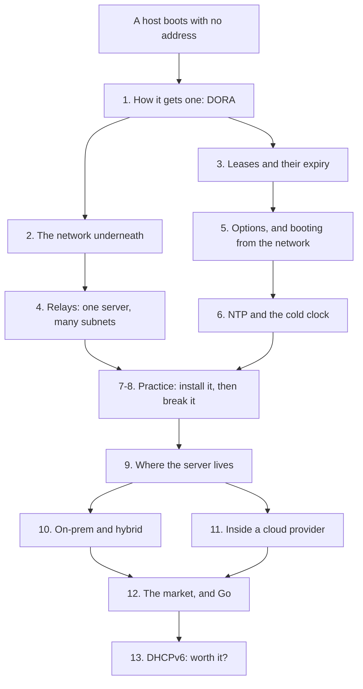

Every machine you have ever booted on a network got its address from something. On most networks, that something is a DHCP server.

It is one of those pieces of infrastructure that is invisible until it breaks, and then it takes everything with it. Nobody can reach anything, and the outage looks like DNS, or the switch, or the cloud provider — until someone checks the lease pool and finds it empty.

I am writing this series because I am working on network boot at OVHcloud, and I kept hitting the edges of what I actually understood about DHCP. Not the four-message handshake — that part is easy to look up. The parts underneath: why the protocol is shaped the way it is, what a relay really does to a packet, what happens to a lease when nobody renews it, and whether DHCPv6 is worth anyone's time.

This is the map.

## What this series is

Fourteen posts, each one about a single idea, each one short enough to read in one sitting.

It starts from zero. If you know what an IP address is and roughly what a switch does, you have enough. It ends somewhere useful: by the last post you should be able to install a DHCP server, debug one that is misbehaving, decide where it belongs in a network, and have an opinion about IPv6 that is yours rather than borrowed.

## What this series is not

It is not a replacement for the RFCs. RFC 2131 is 45 pages and surprisingly readable; where a detail matters I will point at it rather than paraphrase it badly.

It is also not about OVHcloud's network boot work. That is what got me reading, but nothing in here is specific to it. Everything I write about is public protocol behaviour and software you can install yourself.

And it is not a set of benchmarks. Where I run something, I will show the command and the output. Where I am repeating something I have read but not verified, I will say so.

## The order

## The posts

**Foundations — what the protocol does**

| # | Post | The one idea |
| --- | --- | --- |
| 1 | How a host with no address gets one | The DORA exchange, message by message |
| 2 | The network underneath | Why DHCP needs broadcast, and what that constrains |
| 3 | Leases: the state everyone forgets | A lease is a timer, and timers expire |

**Beyond one flat network**

| # | Post | The one idea |
| --- | --- | --- |
| 4 | Relays: one server, many subnets | How a broadcast protocol crosses a router |
| 5 | Options, and booting from the network | DHCP carries far more than an address |
| 6 | DHCP and NTP: the cold clock | A machine that just booted does not know what time it is |

**Practice**

| # | Post | The one idea |
| --- | --- | --- |
| 7 | A DHCP server you can run in five minutes | Kea in a network namespace lab |
| 8 | Debugging DHCP | Read the wire, then work down a decision tree |

**Where it belongs**

| # | Post | The one idea |
| --- | --- | --- |
| 9 | Where the server lives | Topology, hardware, and high availability |
| 10 | Outside the cloud: on-prem and hybrid | Campus networks, Active Directory, split scopes |
| 11 | Inside a cloud provider | Why providers do not just run `dhcpd` |

**Decisions**

| # | Post | The one idea |
| --- | --- | --- |
| 12 | The market, and what Go offers | Kea, dnsmasq, CoreDHCP, and when to write your own |
| 13 | DHCPv6 is not DHCPv4 with bigger addresses | Two different protocols, one hard decision |

## The lab

Posts 7 and 8 build a lab you can run on one Linux machine: a client, a server, and a router, each in its own network namespace, with no virtual machines and no cloud account. Several of the earlier posts use it too, for captures I would rather show than describe.

It is a handful of `ip netns` commands. I will publish the script with post 7.

## Where to start

Post 1. If you already know the DORA exchange cold, start at post 3 — leases are where the interesting failures live, and they are the part most people skip.

Next: **How a host with no address gets one**.
