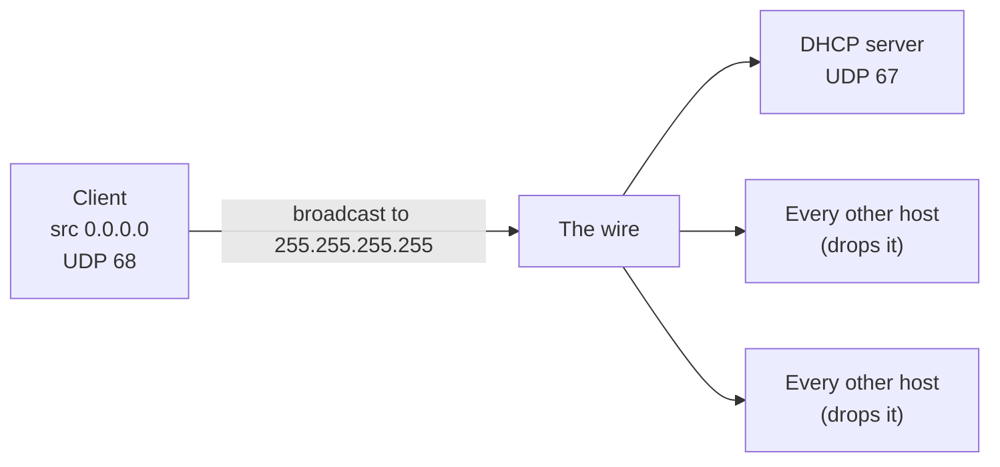
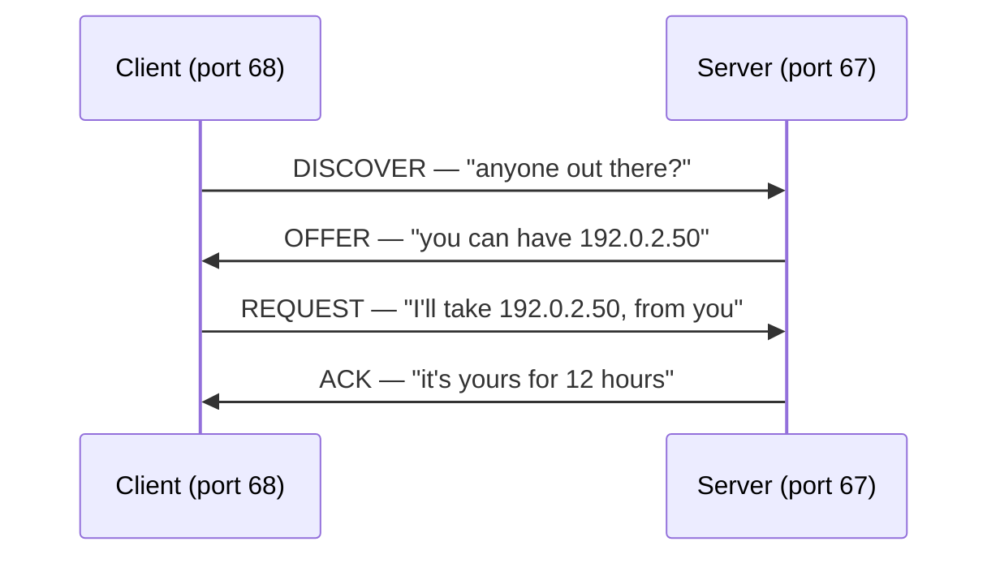

A machine powers on. Its network card works. It is plugged into a switch that works. And it cannot send a single useful packet, because it has no IP address.

To get an address it has to ask a server. To ask a server it needs to send a packet. To send a packet to a specific server it needs to know the server's address and have a source address of its own. It has neither.

That is the problem DHCP exists to solve, and the shape of the protocol follows directly from it.

This post is the four-message exchange that solves it. [Post 2](/blog/dhcp-02-the-network-underneath) is the layer underneath that makes it possible.

## The escape hatch

The trick is that the machine does not need a real address to send one specific kind of packet.

It sends from `0.0.0.0` — the "this host, this network" address, which means *I do not have one yet* — to `255.255.255.255`, the limited broadcast address, which means *everyone on this wire*. No routing, no addressing, no prior knowledge. Every host in the broadcast domain receives it, and the one listening on UDP port 67 answers.

So DHCP is not a normal client/server protocol. The client starts by shouting.



Everything else in DHCP is a consequence of that first design choice. Post 2 goes into why it has to be this way.

## DORA

Four messages: **D**iscover, **O**ffer, **R**equest, **A**ck.



Two round trips for something that looks like it should take one. The reason is the third message, and it is the part worth understanding.

### DISCOVER

The client broadcasts: *I need an address.*

It includes its MAC address, a randomly generated transaction ID so it can recognise the reply, and usually a list of the options it would like — subnet mask, router, DNS, and so on. It may also suggest an address it had before.

### OFFER

Any server that can serve this client broadcasts back: *here is an address you could have.*

The offer is not a commitment the client can rely on yet, but most servers do tentatively reserve the address so they do not offer the same one twice in the next few seconds.

### REQUEST

This is the message people skip, and it is the one that makes the protocol work.

The client broadcasts: *I am taking 192.0.2.50, offered by server X.*

Two things are happening at once.

It is **accepting** one offer. On a network with two DHCP servers, the client will get two OFFERs and must pick one. The REQUEST names the chosen server in option 54, so the other server sees the message, notices it was not chosen, and releases the address it had tentatively held.

It is also **broadcast on purpose**, even though the client now knows the server's address and could unicast. Broadcasting is what lets the losing server hear the outcome.

### ACK

The server commits: *yours, for this long.* The lease is now written to the server's database, and the client configures its interface.

If something changed between OFFER and REQUEST — the address got taken, the client moved to a different subnet — the server sends a **NAK** instead, and the client starts over from DISCOVER.

## What is actually in the packet

A DHCP message is a BOOTP message with options bolted on. That history explains most of the odd field names.

| Field | What it holds |
| --- | --- |
| `op` | 1 for a request, 2 for a reply |
| `xid` | Transaction ID — how the client matches a reply to its request |
| `ciaddr` | Client address, only filled in once the client already has one |
| `yiaddr` | "Your" address — the address the server is handing out |
| `siaddr` | Next server, used for network boot |
| `giaddr` | Gateway — set by a relay, empty otherwise. [Post 4](/blog/dhcp-04-relays) |
| `chaddr` | Client hardware address, normally the MAC |
| `options` | Everything else, including which of the four messages this is |

The header is fixed-size and mostly empty on any given message. The interesting content is in the options, which is why [post 5](/blog/dhcp-05-options-and-netboot) is entirely about them.

Two details that matter when you are reading a capture:

**The magic cookie.** The options section starts with the four bytes `63 82 53 63`. If you are staring at a hex dump trying to find where options begin, that is the marker.

**Option 53 is the message type.** DISCOVER and REQUEST are the same packet structure; what distinguishes them is one option carrying a number from 1 to 8. There is no "message type" field in the header, because BOOTP did not need one.

| Option 53 value | Message |
| --- | --- |
| 1 | DISCOVER |
| 2 | OFFER |
| 3 | REQUEST |
| 4 | DECLINE |
| 5 | ACK |
| 6 | NAK |
| 7 | RELEASE |
| 8 | INFORM |

DECLINE, RELEASE and INFORM are the ones nobody draws in the diagram. DECLINE says *this address is already in use, I probed it*. RELEASE says *I am done with it, take it back*. INFORM says *I have an address already, but tell me the DNS servers*.

## Seeing it

On a Linux host, with one interface and `tcpdump` installed:

```bash
tcpdump -i eth0 -n -vv port 67 or port 68
```

Then force the client to start over. With `dhclient`:

```bash
dhclient -r eth0 && dhclient eth0
```

You will see four packets. If you see DISCOVER repeated with no OFFER, the server never heard you or never answered — [post 8](/blog/dhcp-08-debugging) is the decision tree for that.

I am showing the command rather than pasted output on purpose: the output depends on your client, your server and your options, and a capture from my lab would not match yours. Run it on a network you own and read your own.

## Why two round trips is the right answer

It is tempting to look at DORA and think one request and one reply would do.

It would, on a network with exactly one DHCP server that never fails. The moment there are two — for redundancy, or by accident when someone plugs in a home router — you need a way for the client to choose and for the loser to find out. A two-message protocol has nowhere to put that.

The cost is one extra round trip at boot, on a network where the client is doing nothing else anyway. The protocol is from 1993 and this part of it has aged well.

## What to take away

The client broadcasts because it has no address. It broadcasts the REQUEST as well, so that servers it did not choose can free what they held. Everything meaningful travels in options, not header fields.

The next post is the layer that makes the broadcast work, and the reason a DHCP server usually cannot be more than one router hop away from its clients.

Next: **[The network underneath DHCP](/blog/dhcp-02-the-network-underneath)**.
