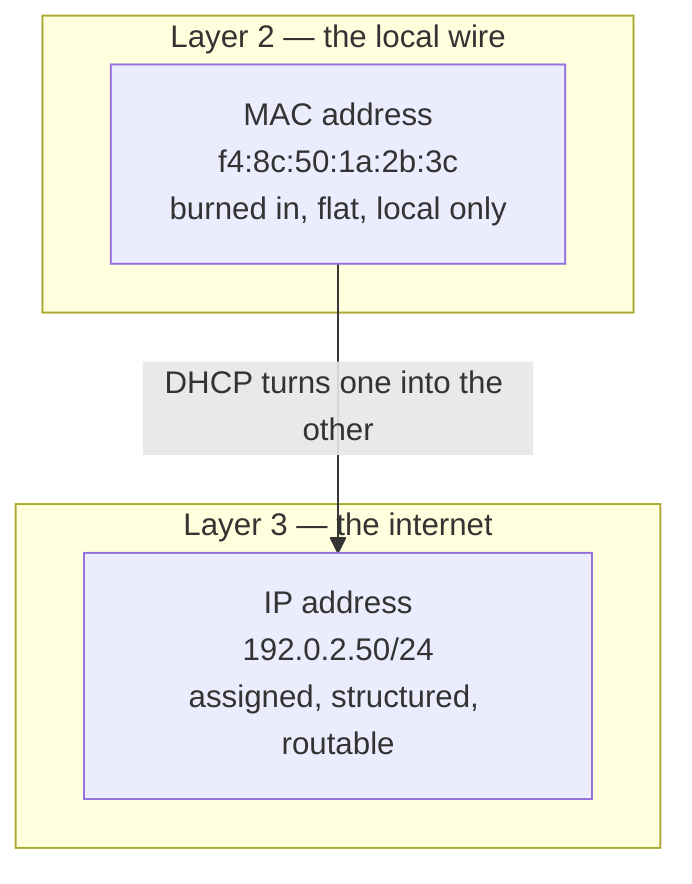
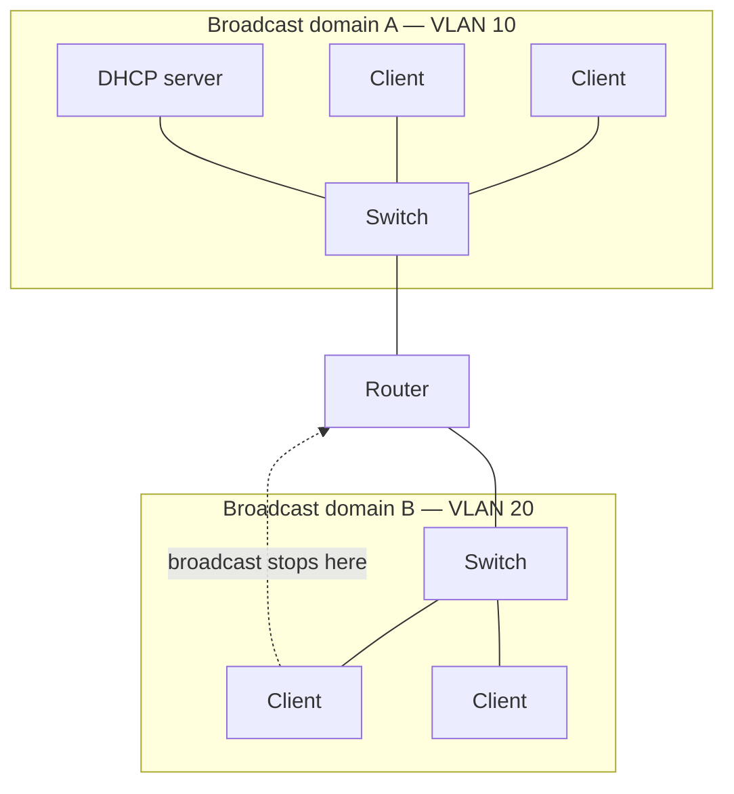
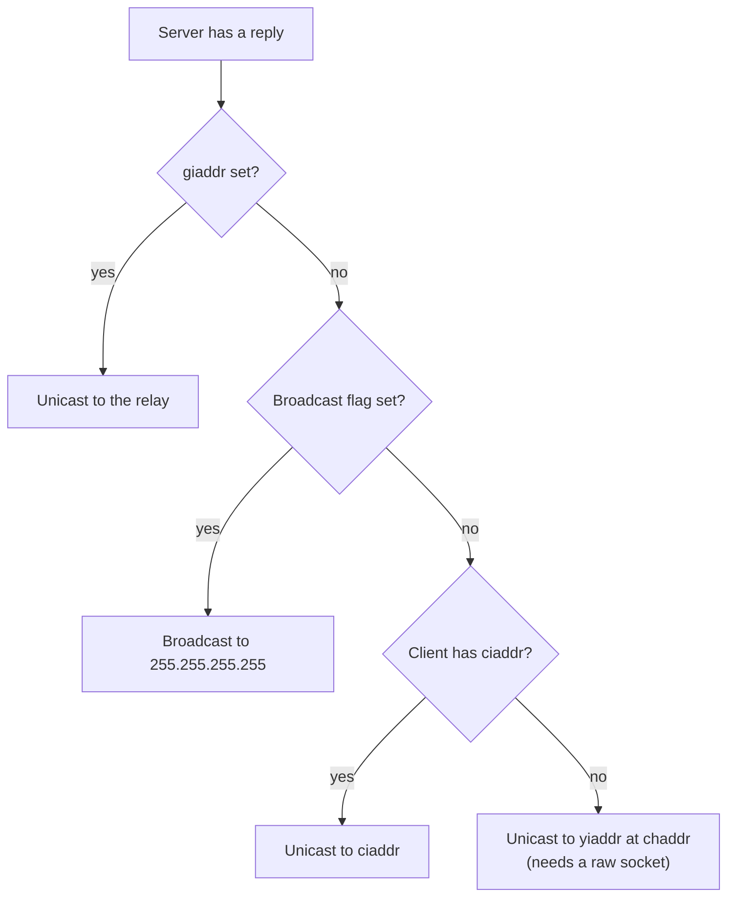

[Post 1](/blog/dhcp-01-how-a-host-gets-an-ip) said the client broadcasts because it has no address. That is true, and it is also the sentence people nod at without asking what it costs.

It costs a lot. Broadcast is the reason DHCP cannot cross a router on its own, the reason you need relays, and the reason a DHCP outage is bounded to one part of the network rather than all of it.

This post is the layer underneath. It is the minimum networking you need for the rest of the series, and no more.

## Two addresses for the same machine

Your machine has at least two addresses, and they do different jobs.

The **MAC address** is burned into the network card. It is 48 bits, it identifies the card on the local wire, and it has no structure that says anything about where the machine is. `f4:8c:50:1a:2b:3c` tells you a manufacturer and nothing else.

The **IP address** is assigned, not burned in. It is structured: `192.0.2.50/24` says *host 50 on network 192.0.2.0*. That structure is what makes routing possible — a router can look at a destination and know which direction to send it without knowing the specific host.

DHCP's entire job is that arrow. The client shows up knowing only its MAC, and leaves with an IP.

Which means DHCP has to work at layer 2, because layer 3 is what it is there to set up.

## What a broadcast domain is

A **broadcast domain** is the set of machines that receive a frame addressed to `ff:ff:ff:ff:ff:ff`.

A switch forwards broadcast frames out every port. So everything plugged into one switch — or into a set of switches wired together — is in one broadcast domain. Add VLANs and each VLAN is its own broadcast domain, even on the same physical switch.

A **router** does not forward broadcasts. That is the whole point of a router: it is the boundary.

The client in VLAN 20 broadcasts a DISCOVER. The switch floods it to every port in VLAN 20. It reaches the router. The router drops it.

That is why a plain DHCP server only serves the network it is sitting on. Getting past that boundary is [post 4](/blog/dhcp-04-relays).

## The ports, and why there are two

DHCP runs over UDP. Server on **port 67**, client on **port 68**.

Two fixed ports is unusual — most protocols have a fixed server port and an ephemeral client port picked at random. DHCP cannot do that, for a reason that follows from everything above.

The server's reply is often a **broadcast**, because the client does not have an address yet and cannot be unicast to. A broadcast reaches every host in the domain. If the client port were random, every host would have to accept the packet and figure out whether it was theirs. With a fixed port 68, every host that is not currently doing DHCP has nothing listening there and the kernel discards the packet cheaply.

It also means a client can receive a reply before it has configured anything, which is exactly the situation it is in.

UDP rather than TCP is the same logic taken further. A TCP handshake requires both endpoints to have addresses. There is nothing to hand-shake with.

## Why the reply is sometimes broadcast and sometimes not

Reading a capture, you will see server replies going to a broadcast address in some cases and to a specific address in others. Both are correct.

The client sets a **broadcast flag** in the DISCOVER — one bit in the header — to say *I cannot accept a unicast reply yet, please broadcast*. Some IP stacks cannot receive a unicast packet addressed to an IP they have not configured yet, so they set the flag. Others can, by accepting the frame at the MAC layer, and leave it clear.

That last branch is the strange one. The server sends a packet to an IP address the client does not have configured yet, by writing the MAC address directly into the frame. It cannot use the normal socket API for that, because the kernel would try to ARP for an address nobody owns. DHCP servers use raw sockets or `AF_PACKET` to do it.

This is worth knowing because it is a real source of bugs. If your DHCP server is behind something that rewrites frames — some bridges, some virtual switches, some firewalls — that packet can vanish while everything else works.

## The practical consequences

Three things follow, and they shape every design decision later in the series.

**A DHCP server serves broadcast domains, not networks.** One server on one VLAN serves that VLAN. Serving fifty VLANs from one server means fifty relays, or a server with a leg in each — [post 9](/blog/dhcp-09-where-it-lives).

**A DHCP failure is bounded.** If the server for VLAN 20 dies, VLAN 10 is fine. This is genuinely useful: it means the blast radius of a DHCP problem is a network segment, and it is why "nobody in the building can get an address" and "nobody on this floor can" are different diagnoses.

**Anyone on the wire can answer.** There is no authentication in DHCP. A machine in the broadcast domain that replies faster than your server wins, and the client believes it. That is a rogue DHCP server, it is usually somebody's home router plugged in the wrong way round, and it is why switches have a feature called DHCP snooping that drops server messages arriving on ports that should only have clients.

## What to take away

DHCP works below IP because it exists to configure IP. That forces broadcast, which forces a fixed client port, and which stops the whole thing at the first router.

Everything from here is either working within that constraint or working around it.

Next: **[Leases: the state everyone forgets](/blog/dhcp-03-leases)**.
