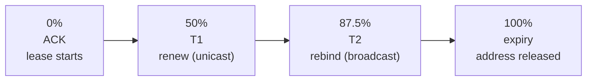
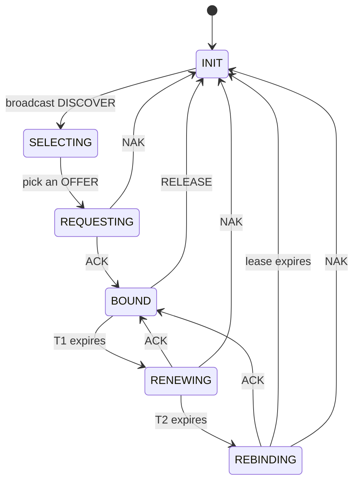
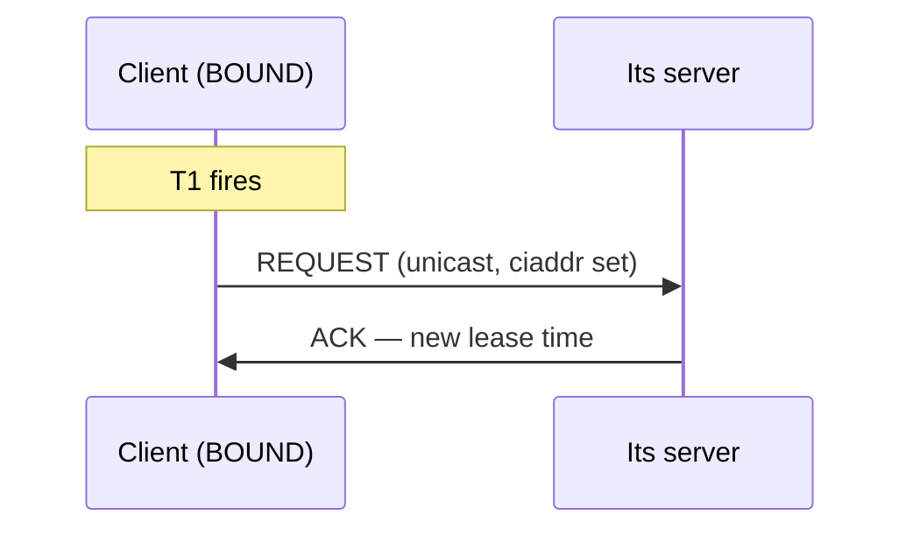

The four-message exchange is the part everyone learns. It is also the part that almost never breaks.

What breaks is what happens afterwards: the hours and days during which a client holds an address, tries to keep it, and eventually loses it. A DHCP server is not really an address handout service. It is a distributed lock manager with a timer, and the address is what the lock is on.

This post is that timer.

## An address is a loan

When the server sends an ACK, it includes option 51: the lease time, in seconds. A typical value is anywhere from a few minutes to several days.

The lease is a promise in one direction only. The server promises not to give this address to anybody else for that long. The client promises nothing — it can vanish, and often does.

That asymmetry is the whole design. The server cannot tell the difference between a laptop that went to sleep, a laptop that left the building, and a VM that was destroyed. So it does not try. It waits for the timer.

## Three timers, not one

The lease time is the one people know. There are two more inside it, and they are where the behaviour lives.

| Timer | Option | Default | What happens |
| --- | --- | --- | --- |
| T1, renewal | 58 | 50% of lease | Client tries to renew, unicast to its server |
| T2, rebinding | 59 | 87.5% of lease | Client gives up on that server, broadcasts to any |
| Lease time | 51 | — | Client must stop using the address |



On a 12-hour lease: the client is happy for 6 hours, tries to renew at 6 hours, and if that fails keeps trying. At 10.5 hours it stops trusting its own server and shouts at the whole network. At 12 hours it must drop the address and go back to DISCOVER.

The half-and-seven-eighths split is not arbitrary. It gives the client two independent chances — one against its own server, one against any server — with plenty of retries in between. A client whose server reboots for five minutes never notices.

## The client state machine



Two paths back to `INIT` are worth pointing at.

**Lease expiry from REBINDING.** The client tried its server, then tried everyone, and nobody answered for the last 12.5% of the lease. It must stop using the address. In practice this is what a long DHCP outage looks like to users: everything is fine, everything is fine, and then over the course of an afternoon machines start dropping off in the order their leases were issued.

**NAK.** The server actively says no. The most common cause is a client that moved: it wakes up in a different VLAN and asks to renew an address that does not belong to that subnet. The server, correctly, refuses, and the client starts over.

## Renewal does not use DORA

This surprises people. A renewal is two messages, not four.



No DISCOVER, no OFFER. The client already knows which address it wants and which server has it, so it asks that server directly. The `ciaddr` field is filled in this time, which is how the server knows this is a renewal rather than a new client.

This is also why renewals are cheap. On a network of ten thousand clients with 12-hour leases, you are not doing ten thousand DORAs a day — you are doing two unicast packets per client per six hours, spread out.

## Where the state actually lives

The server has to remember every lease across restarts, or it will hand out addresses that are already in use.

| Server | Where leases live |
| --- | --- |
| ISC Kea | Memfile (a CSV on disk), or MySQL / PostgreSQL |
| dnsmasq | A single text file, typically `/var/lib/misc/dnsmasq.leases` |
| systemd-networkd | JSON under `/var/lib/systemd/network/` |
| Windows Server | A Jet database |

The memfile and text-file options are append-mostly logs that get compacted periodically. They are fast and they are a single point of failure. The database options exist so that two servers can share state — which is what high availability needs, and which is [post 9](/blog/dhcp-09-where-it-lives).

A thing worth knowing before you need it: if you lose the lease database and restart, the server has no idea what it has handed out. Most servers will then offer addresses that clients are actively using. The client is supposed to detect this — it ARPs for the address before accepting it, and sends a DECLINE if someone answers — but not every client does, and the result is a duplicate-address outage that looks like a hardware fault.

## The pool is a resource, and it runs out

A scope of `192.0.2.100` to `192.0.2.200` is 101 addresses. If 400 devices pass through in a day and the lease is 24 hours, you run out, and the symptom is that new clients get nothing while the server holds addresses for devices that left hours ago.

The lever is lease time, and it is a genuine trade-off.

| Lease time | Good for | Cost |
| --- | --- | --- |
| Minutes | Guest wifi, conferences, anywhere churn is high | More renewal traffic, more server load |
| Hours | Offices, laptops | The usual default |
| Days | Servers, printers, anything that does not move | Slow to reclaim, slow to re-address |

The rule of thumb I would use: set the lease to roughly how long you expect a device to stay. Guest wifi where people walk through for an hour does not want a one-day lease. A rack of servers that never move does not want a one-hour lease generating renewal traffic forever.

## Reading a lease

On a Linux client using `dhclient`, the current lease is in a file, and it contains the timers:

```bash
cat /var/lib/dhcp/dhclient.leases
```

With `systemd-networkd`:

```bash
networkctl status eth0
```

Look for the lease time and the renewal time. If you are debugging a client that keeps losing its address, the gap between those two numbers and what the server thinks it issued is usually where the answer is.

## What to take away

An address is a loan with three timers. The client tries twice to keep it — once against its own server, once against the whole network — before giving up.

The failures that matter are almost all lease failures: a pool that ran out, a database that was lost, a client that moved subnets, or an outage that lasted longer than 87.5% of a lease. None of those show up in the DORA exchange.

Next: **[Relays: one server, many subnets](/blog/dhcp-04-relays)**.
