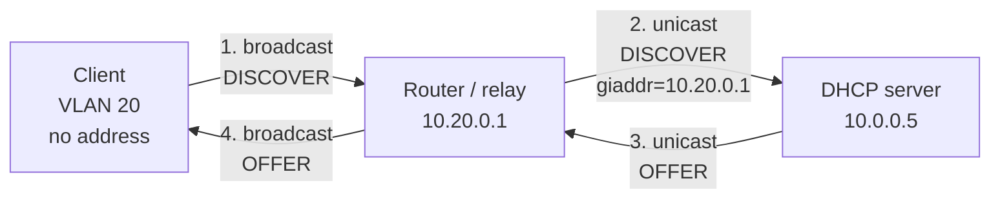
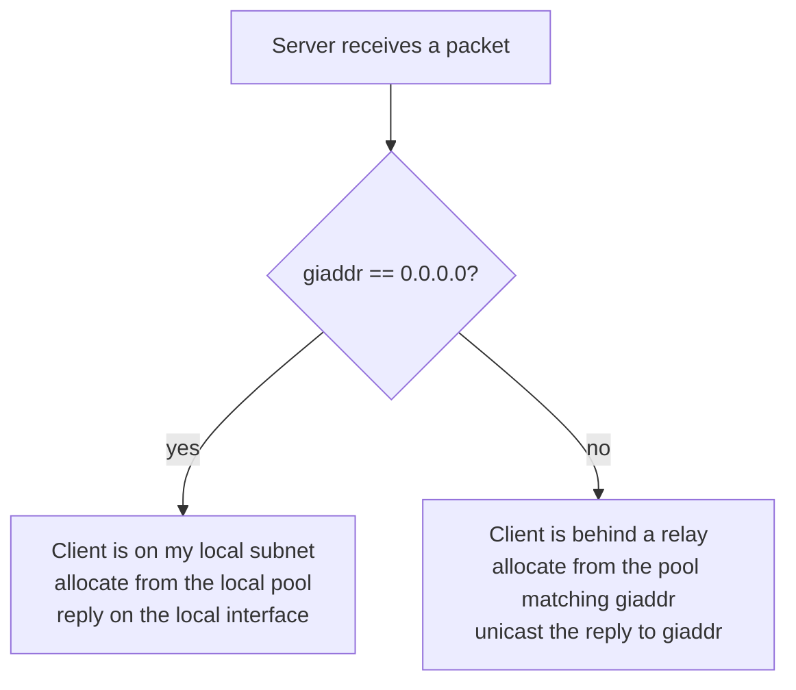

[Post 2](/blog/dhcp-02-the-network-underneath) ended on a problem. DHCP is a broadcast protocol, routers do not forward broadcasts, and no real network is one flat broadcast domain. A campus has hundreds of VLANs. A datacentre has thousands.

The obvious fix is a DHCP server in every VLAN. Nobody does that, because it means a thousand servers, a thousand config files, and a thousand lease databases to keep track of.

The actual fix is the **relay agent**: something already sitting on the boundary, which listens for DHCP broadcasts and forwards them as unicast to a central server.

## What a relay does

The relay is almost always the router itself — the same device that would otherwise drop the packet. On most switches and routers it is one line of config.



The client never knows a relay exists. It broadcasts, and something broadcasts back. From the server's side, the packet arrived as a normal unicast from a router, and the reply goes back the same way.

The relay is not a proxy in the HTTP sense. It does not terminate anything or make decisions. It picks the packet up on one side, modifies two fields, and puts it down on the other.

## The two fields it changes

This is the part that matters for debugging.

**`giaddr`** — the gateway address field. The relay writes its own IP address on the client's subnet into it. On the wire from client to relay, `giaddr` is `0.0.0.0`. From relay to server, it is `10.20.0.1`.

That single field is doing two jobs at once.

It tells the server **where to reply**. The server unicasts back to `giaddr`, and the relay handles getting it to the client.

It also tells the server **which subnet the client is on**, which is how the server knows which pool to allocate from. This is the part people miss. The server has no other way to know. The client's MAC says nothing about location. The source IP is the relay's. `giaddr` is the only signal, and it is why a server can serve a thousand subnets from one box — it is reading the pool selection out of one field.

**Hop count** — incremented on each relay. It exists to stop loops, and it is capped at 16. If you have a relay chain deeper than that you have other problems.



## Option 82, and why your ISP cares

`giaddr` identifies a subnet. Sometimes you need to identify a **port**.

Option 82, the Relay Agent Information option, is how a relay attaches that. It is added by the relay on the way in and stripped on the way out, so the client never sees it. It carries sub-options, and two matter:

| Sub-option | Name | Typically holds |
| --- | --- | --- |
| 1 | Circuit ID | The physical port the client is on — switch, slot, port, VLAN |
| 2 | Remote ID | Something identifying the relay or the subscriber |

The use case that drove it into existence is broadband access. An ISP has a DSLAM or an OLT with thousands of subscriber ports. Every subscriber is anonymous at layer 2 — a MAC address they control and can change. The circuit ID is not: it is written by the ISP's own equipment and says *this request came from the physical line into flat 4B*. That is how the ISP maps a DHCP request to a billing account.

In enterprise networks it shows up for the same reason in a different shape: pinning an address to a switch port rather than to a MAC, so that swapping a broken printer for a new one does not need a config change.

It is also the foundation of **DHCP snooping**, the switch feature from post 2 that drops server replies arriving on client ports. The switch has to insert option 82 to do its job, which is why enabling snooping sometimes breaks DHCP until you also tell the server to trust the relay.

## The failure modes

Relays fail in a small number of specific ways, and knowing them turns a confusing outage into a five-minute check.

**The relay is not configured on the VLAN.** Clients get nothing. Broadcasts die at the router exactly as they would with no relay at all. The tell is that the server logs show nothing — not a rejection, nothing. If the server has not seen a packet, the problem is before the server.

**The server has no pool matching `giaddr`.** The packet arrives, the server reads `10.20.0.1`, finds no subnet declaration containing it, and drops the request. Kea logs this clearly. ISC dhcpd logged it as `no free leases`, which sent a generation of engineers looking at pool sizes instead of subnet declarations.

**The relay's address is not the one you think.** A router with several addresses on a VLAN will use one of them as `giaddr`, and it may not be the one in your server config. This is the classic cause of "it works on VLAN 10 and not VLAN 20 and the configs look identical".

**Return path is broken.** The server replies by unicast to `giaddr`. If routing from the server's subnet back to the relay is missing or firewalled, the request goes out fine and the reply never arrives. You see DISCOVERs in the server log and OFFERs in the server log and nothing at the client. This one is worth checking early because it looks like a server problem and is not.

**Option 82 mismatch.** Snooping is on, the switch inserts option 82, and the server is configured to drop relayed packets from untrusted sources — or the reverse. Symptom is the same as the first case, but the server does log a rejection.

## Where to put the relay

Usually you do not choose: it goes on the default gateway for the subnet, because that is the device that already sees all the broadcast traffic and already has an address on both sides.

Where you do have a choice, the question is what else is on the path.

| Placement | When | Watch out for |
| --- | --- | --- |
| Router / L3 switch | The default, almost always | Nothing; this is the designed case |
| Firewall | The firewall is the subnet gateway | Reply path rules; firewalls drop asymmetric traffic |
| A dedicated relay host | Segments where the gateway cannot relay | One more thing to monitor and keep alive |

The relay is on the critical path for every client boot in its subnet. If it is a host rather than the router, it needs the same availability thinking as the server itself — [post 9](/blog/dhcp-09-where-it-lives).

## Seeing it

From the server side, the giveaway is the source. A relayed request arrives from the relay's IP, not from `0.0.0.0`:

```bash
tcpdump -i any -n port 67
```

A local client shows `0.0.0.0.68 > 255.255.255.255.67`. A relayed one shows `10.20.0.1.67 > 10.0.0.5.67` — note that both ends are port 67, because relay-to-server traffic is server-to-server.

That port detail is a useful filter when you are trying to work out whether a packet reached you directly or through a relay.

## What to take away

A relay turns a broadcast into a unicast and writes its own address into `giaddr`. That one field carries both the return path and the subnet identity, which is what lets a single server serve a thousand networks.

When relayed DHCP breaks, work out first whether the server saw the packet at all. That single question splits the failure modes cleanly in half.

Next: **[Options, and how a machine boots from the network](/blog/dhcp-05-options-and-netboot)**.
