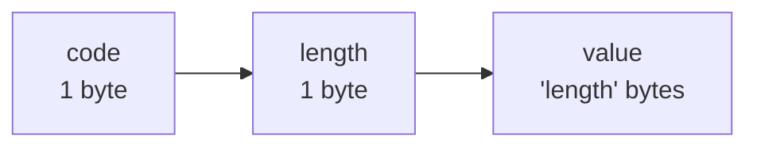
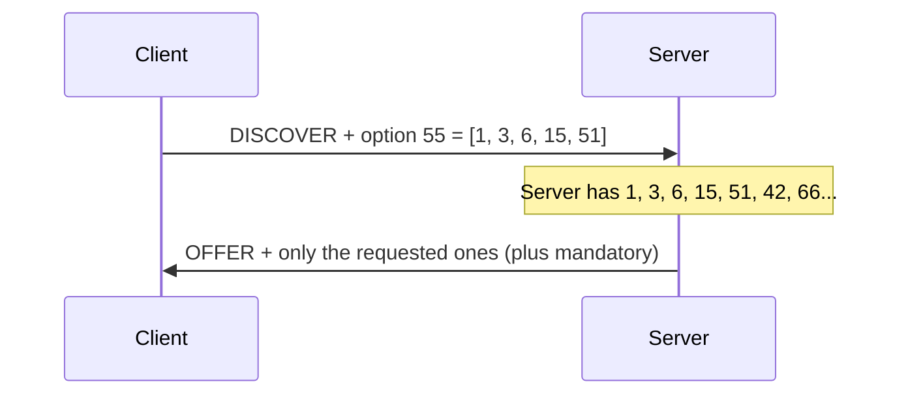
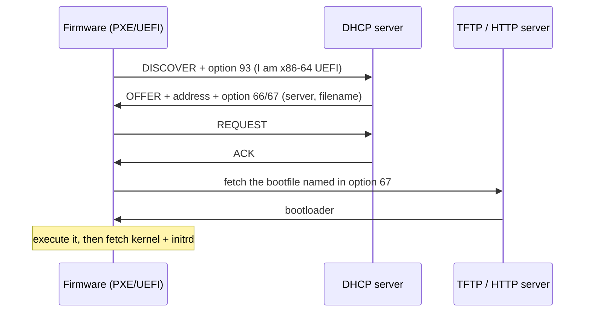
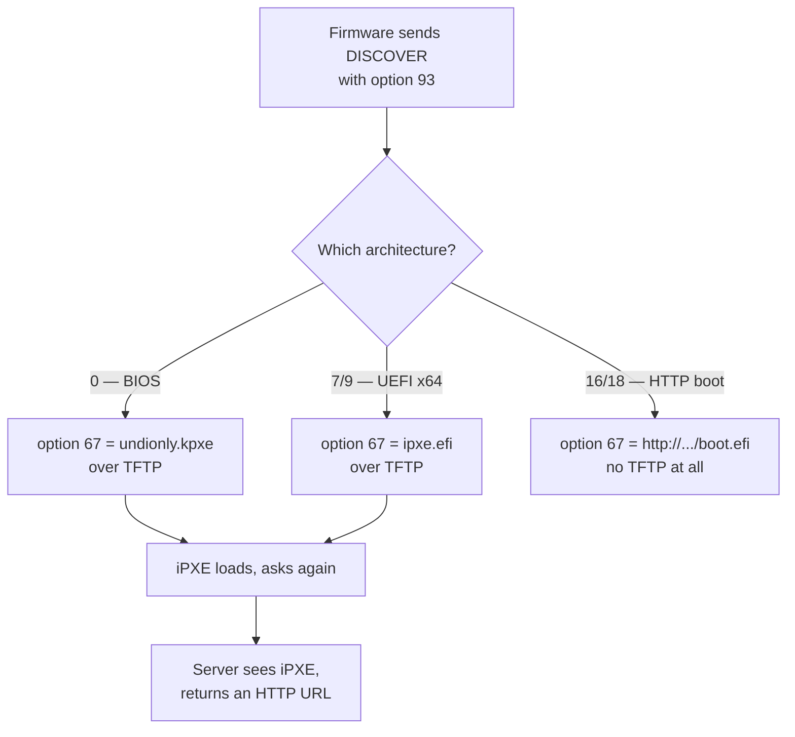

A DHCP header has a field for the client's new address and not much else. Everything that makes the address usable — the subnet mask, the gateway, DNS, the domain name — travels as **options**, in a type-length-value list after the magic cookie.

There are over two hundred registered options. You will use about eight. But among the ones you will not use every day is a small group that turns DHCP into the first step of booting a machine that has no operating system at all, and that is where this post ends up.

## The format

Each option is three parts: a one-byte code, a one-byte length, and that many bytes of value.

So option 1, the subnet mask, is `01 04 ff ff ff 00`. Code 1, four bytes long, `255.255.255.0`.

Two codes are special and have no length byte: `0` is padding, and `255` ends the list. Everything between the cookie and the `255` is options.

The one-byte length is a real constraint: no single option can carry more than 255 bytes. When something needs more — long boot URLs, big vendor blobs — it gets split across options and reassembled, which is a recurring source of interoperability bugs.

## The ones you will actually use

| Code | Name | What it does |
| --- | --- | --- |
| 1 | Subnet mask | Without it the client cannot tell local from remote |
| 3 | Router | The default gateway |
| 6 | Domain name server | DNS resolvers |
| 15 | Domain name | The search domain |
| 51 | Lease time | [Post 3](/blog/dhcp-03-leases) |
| 53 | Message type | Which of DISCOVER/OFFER/REQUEST/ACK this is |
| 54 | Server identifier | Which server this came from |
| 58 / 59 | T1 / T2 | Renewal and rebinding timers |

Option 53 and 54 are protocol machinery — the message would not work without them. The rest are configuration.

## The client asks for what it wants

A server does not send every option it knows. The client includes **option 55**, the parameter request list: a list of the codes it cares about.

This is the single most common reason for "I configured the option on the server and the client ignores it". The server is doing exactly what it was told: the client never asked.

On Linux with `dhclient`, the request list is in `/etc/dhcp/dhclient.conf` under `request`. With `systemd-networkd` it is largely implicit and controlled by settings like `UseDNS=` and `UseNTP=`. If an option is not arriving, check the request list before you check the server.

Servers can override this and push an option regardless. Kea calls it `always-send`. Use it sparingly — it is the right answer for things the client genuinely needs and did not know to ask for, and the wrong answer for papering over a client misconfiguration you have not diagnosed.

## Booting a machine that has no disk

Now the interesting part.

A server with an empty disk powers on. Its firmware has a network stack and nothing else. It needs to find, download and execute an operating system, and the only thing it can do is send a DHCP DISCOVER.

So DHCP has to answer a much bigger question than "what is your address". It has to answer "and where do you get your software".

The options that do this work:

| Code | Name | Holds |
| --- | --- | --- |
| 66 | TFTP server name | Where to fetch from |
| 67 | Bootfile name | What to fetch |
| 93 | Client system architecture | What kind of machine is asking |
| 94 | Client network interface identifier | The firmware's UNDI version |
| 97 | Client machine identifier | The machine's UUID |
| 43 | Vendor specific information | PXE's own sub-option namespace |

The `siaddr` header field also carries a next-server address, and predates option 66. Some firmware reads one, some the other, some both. Setting both is common and is not superstition.

### Option 93 is the one that makes it work in a mixed fleet

Different machines need different bootloaders. A legacy BIOS machine needs a 16-bit real-mode binary. A 64-bit UEFI machine needs a UEFI application. An ARM server needs a different one again. Hand the wrong one over and the firmware either refuses or hangs, with no useful error.

Option 93 is how the firmware says which it is, using a registered number.

| Value | Architecture |
| --- | --- |
| 0 | BIOS x86 |
| 7 | UEFI x86-64 |
| 9 | UEFI x86-64 (alternate encoding some firmware uses) |
| 11 | UEFI ARM64 |
| 16 | UEFI HTTP boot, x86-64 |
| 18 | UEFI HTTP boot, ARM64 |

A netboot-capable DHCP server branches on this and serves a different option 67 for each. Any real fleet config has this branch in it.

### TFTP, and why people move off it

Classic PXE fetches over **TFTP**: UDP, no authentication, no encryption, 512-byte blocks with an acknowledgement per block. It was designed to fit in firmware ROM in 1981 and it shows.

It works, and it is slow and fragile over anything but a clean LAN. One lost packet stalls the transfer. Block size negotiation helps and is not universally supported.

Two things improved it.

**iPXE** is a replacement network bootloader you chain-load over TFTP, after which it can fetch over HTTP, HTTPS or iSCSI. The pattern is: DHCP hands the firmware iPXE over TFTP, iPXE starts, does DHCP again, and this time the server recognises it and hands back an HTTP URL. That second round trip is the reason netboot configs have a conditional that looks like it is detecting its own bootloader — it is.

**UEFI HTTP Boot** removes the chain-load entirely. The firmware speaks HTTP itself, option 67 holds a URL, and TFTP is out of the picture. Option 93 values 16 and 18 are how the firmware announces it can do this.

## Where this is going

This is the generic shape of network boot, and it is why DHCP matters far beyond handing out addresses. In a datacentre, the DHCP server is not a convenience — it is the thing that decides what operating system a bare-metal machine runs.

That also makes it a serious piece of trust infrastructure. Everything above is unauthenticated. Whoever answers the DISCOVER chooses the bootloader, and whoever serves the bootloader chooses the kernel. Which is the actual reason network boot on an untrusted shared network is a hard problem, and why isolating it onto a private network is worth doing.

## What to take away

Options are a TLV list, capped at 255 bytes each, and the client only gets what it asked for in option 55.

The netboot options turn DHCP into the first stage of a boot chain: option 93 says what the machine is, options 66 and 67 say what to load, and iPXE or UEFI HTTP Boot get you off TFTP.

Next: **[DHCP and NTP: the cold clock problem](/blog/dhcp-06-ntp)**.
