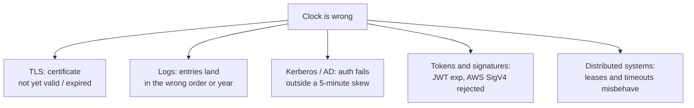
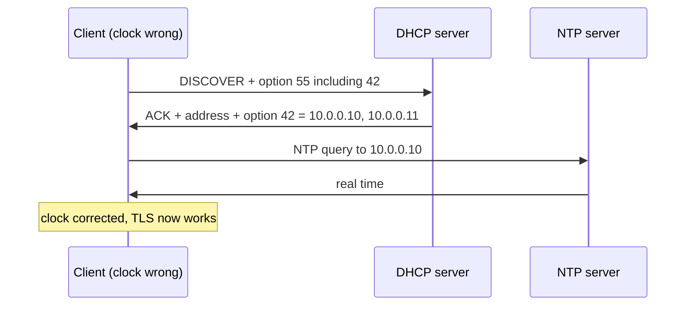
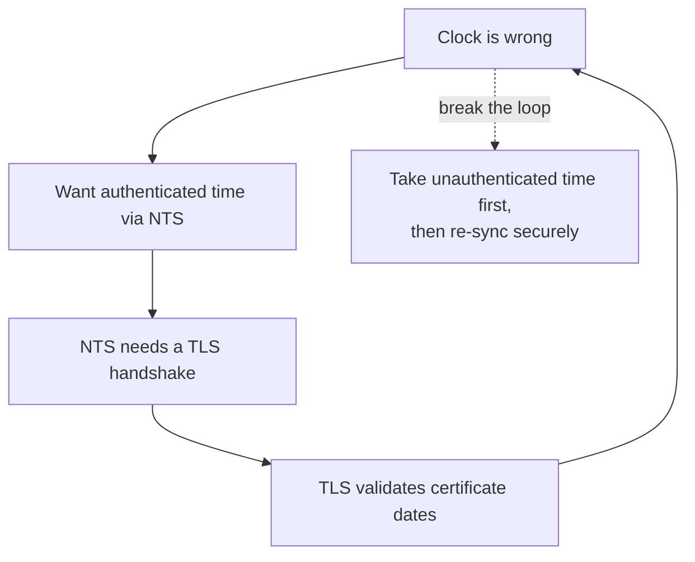

Here is a failure that wastes an afternoon the first time you meet it.

A freshly provisioned server comes up. It has an address, it has DNS, it can reach the internet. And every HTTPS request fails with a certificate error saying the certificate is not yet valid. The certificate is fine. The machine thinks it is 1970.

Time is configuration, the same as an address or a resolver. And like those, on a machine that just booted, it has to come from somewhere on the network.

## Why a booting machine has no clock

Most hardware has a real-time clock backed by a small battery, which is why your laptop knows the date after being off all weekend. Three situations break that assumption, and they are exactly the situations you hit in a datacentre.

**Virtual machines and containers** get their initial time from the hypervisor or host, which is usually right — until it is not, after a migration, a snapshot restore, or a paused VM resuming hours later.

**Bare metal that has been in storage** has a flat RTC battery. It comes up at whatever the firmware's epoch is.

**Anything that netboots** is running from a fresh image with no persisted state at all. There is no `/var` to have written a timestamp to.

So the machine boots with a clock that is wrong — sometimes by seconds, sometimes by decades.

## What a wrong clock breaks



The TLS one is the most common and the most confusing, because the error message points at the certificate rather than at you. Kerberos is the most unforgiving: Active Directory rejects authentication outside a default five-minute skew, so a machine two hours out cannot log anyone in and reports it as a credentials problem.

The logging one is the most insidious, because nothing fails. You just get an incident timeline that is quietly useless.

## The DHCP answer: option 42

DHCP already hands out DNS servers. It hands out NTP servers the same way.

| Protocol | Option | Name |
| --- | --- | --- |
| DHCPv4 | 42 | NTP servers |
| DHCPv4 | 4 | Time server — older, RFC 868 protocol, effectively dead |
| DHCPv6 | 56 | NTP server, with sub-options |

Option 42 is a list of IPv4 addresses, in preference order. Not hostnames — addresses. That is deliberate and it matters: resolving a hostname would require DNS, DNS increasingly means DNS over TLS, and TLS requires a working clock. Option 42 sidesteps the loop by carrying raw addresses.

Do not put hostnames in it. Some servers will let you and the client will not be able to use them.



## The client has to ask, and often does not

Same trap as [post 5](/blog/dhcp-05-options-and-netboot): option 42 only arrives if the client listed it in option 55, and whether it then *acts* on it depends on the client.

| Client | Uses option 42? |
| --- | --- |
| `systemd-networkd` + `systemd-timesyncd` | Yes, with `UseNTP=yes` — the default in most distros |
| `dhclient` | Writes it to a lease file; wiring it to the NTP daemon is a hook script |
| `chrony` | Reads DHCP-supplied servers via `sourcedir` on most distros, but the plumbing varies |
| `NetworkManager` | Depends on the backend and distro packaging |

The practical advice: do not assume. On a machine that should be getting NTP from DHCP, check what the time daemon actually thinks its sources are:

```bash
chronyc sources
# or
timedatectl show-timesync --all
```

If the servers there are `pool.ntp.org` rather than the ones in your option 42, the option arrived and nothing used it.

## The chicken and egg

Now the part that is genuinely awkward, and the reason this deserves its own post rather than a paragraph in the options one.

The obvious way to make sure a machine's time is right is to sign or authenticate the time source. NTP has authentication — symmetric keys, and NTS, which is NTP over TLS-derived keys.

NTS requires a TLS handshake. A TLS handshake validates a certificate. Certificate validation checks the current time. Which is the thing you do not have.



Everyone breaks the loop the same way: take an unauthenticated first sync to get roughly right, then do the secure thing. `chrony` has a specific flag for this, and it is worth knowing it exists rather than discovering it during an incident.

The consequence is that the first time sync on a cold machine is unauthenticated, and the source of it came from DHCP, which is also unauthenticated. If you can answer DHCP on that network, you can set the clock, and if you can set the clock you can make an expired certificate look valid.

That is not a reason to panic — it is the same trust model as the rest of DHCP, and it is another reason provisioning networks should be isolated rather than shared.

## What I would actually configure

Serve option 42 with **IP addresses** of NTP servers reachable from the provisioning network, before any firewall the machine has not been configured for yet. Two or three, not one.

Make sure the netboot image has a time client that uses them. This is the step that gets skipped: minimal images often ship without one, and then the option arrives and nothing reads it.

Do a **step, not a slew**, on first boot. Time daemons normally correct gradually to avoid jumping clocks backwards. A machine that is two years out will never converge that way. `chrony`'s `makestep` and `ntpd`'s `-g` exist for exactly this.

Check for the failure in your provisioning tests rather than in production. A machine whose clock is right because its RTC happened to be right is not evidence that option 42 works.

I have not built a controlled experiment for this one — it is operational experience rather than a measurement, and I would rather say so than dress it up.

## What to take away

A booting machine often has no idea what time it is, and that breaks TLS, Kerberos and your logs before it breaks anything obvious.

DHCP option 42 is the fix, it must carry addresses rather than names, and the client has to both request it and have something that uses it. Secure time cannot be the first time you get, so plan for one unauthenticated step.

Next: **[A DHCP server you can run in five minutes](/blog/dhcp-07-install-kea)**.
