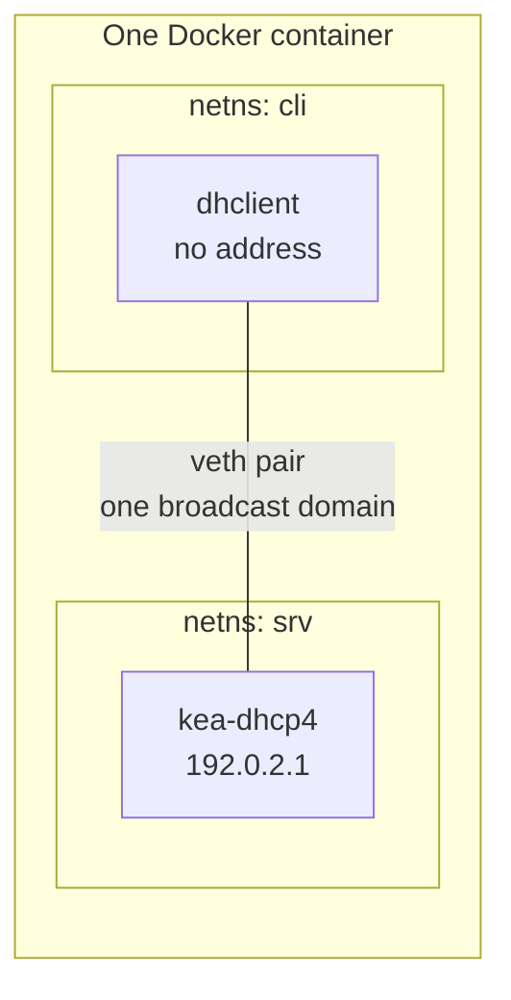

Everything in this series so far has been description. This post is a DHCP server you actually run.

The constraint that makes this awkward is that DHCP is a broadcast protocol. Starting one on your laptop means starting one on your office or home network, where it will race the real server and hand addresses to your colleagues. That is a bad afternoon.

So the lab is fully contained: one Docker container, two network namespaces inside it, and a virtual cable between them. Nothing reaches the host's network. When you are done you delete the container and nothing remains.



Everything below was run on Debian 12 with Kea 2.2.0. The output is copied from the run, not reconstructed.

## Start the container

```bash
docker run --rm -it --privileged debian:12 bash
```

`--privileged` is doing real work here: creating network namespaces and veth pairs needs `CAP_NET_ADMIN`, and binding a raw socket to send DHCP replies needs more. This is also why the container is disposable.

Inside it:

```bash
apt-get update
apt-get install -y --no-install-recommends \
  kea-dhcp4-server iproute2 isc-dhcp-client tcpdump
mkdir -p /var/lib/kea /run/kea
```

That `/run/kea` matters. Kea writes a PID file and a logger lockfile there, and if the directory is missing it exits with `Fatal error during start up: Unable to open PID file`. The package creates it; a bare container does not. I lost ten minutes to this, which is the only reason it gets its own sentence.

## Build the wire

Two namespaces, one veth pair between them. A veth pair is a virtual cable: two interfaces, whatever goes in one comes out the other.

```bash
ip netns add srv
ip netns add cli
ip link add veth-srv type veth peer name veth-cli
ip link set veth-srv netns srv
ip link set veth-cli netns cli

ip netns exec srv ip addr add 192.0.2.1/24 dev veth-srv
ip netns exec srv ip link set veth-srv up
ip netns exec srv ip link set lo up
ip netns exec cli ip link set veth-cli up
ip netns exec cli ip link set lo up
```

The client gets **no address**. That is the point — it is the machine from [post 1](/blog/dhcp-01-how-a-host-gets-an-ip) that has to shout for one.

`192.0.2.0/24` is a documentation range from RFC 5737, reserved so it can never collide with anything real.

## Configure Kea

```json
{
  "Dhcp4": {
    "interfaces-config": { "interfaces": [ "veth-srv" ] },
    "lease-database": {
      "type": "memfile", "persist": true,
      "name": "/var/lib/kea/leases4.csv"
    },
    "valid-lifetime": 600,
    "renew-timer": 300,
    "rebind-timer": 525,
    "subnet4": [{
      "id": 1,
      "subnet": "192.0.2.0/24",
      "pools": [ { "pool": "192.0.2.100 - 192.0.2.200" } ],
      "option-data": [
        { "name": "routers", "data": "192.0.2.1" },
        { "name": "domain-name-servers", "data": "192.0.2.1" },
        { "name": "ntp-servers", "data": "192.0.2.1" }
      ]
    }],
    "loggers": [{
      "name": "kea-dhcp4",
      "output_options": [ { "output": "stdout" } ],
      "severity": "INFO"
    }]
  }
}
```

Save it as `/etc/kea/kea-dhcp4.conf`. Every block maps to something earlier in the series:

`valid-lifetime`, `renew-timer` and `rebind-timer` are the lease, T1 and T2 from [post 3](/blog/dhcp-03-leases) — 600, 300 and 525 seconds, which is the 50% and 87.5% split written out.

`option-data` is [post 5](/blog/dhcp-05-options-and-netboot): option 3, option 6 and option 42. The last one is the NTP servers from [post 6](/blog/dhcp-06-ntp).

`memfile` is the lease database from post 3, in its simplest form.

## Start it, in the right namespace

```bash
ip netns exec srv kea-dhcp4 -t /etc/kea/kea-dhcp4.conf
ip netns exec srv kea-dhcp4 -c /etc/kea/kea-dhcp4.conf &
```

Note that the config *test* also runs inside `srv`. Run `-t` outside it and Kea checks the config against the wrong network stack and tells you `interface 'veth-srv' doesn't exist in the system`, which sends you looking for a typo that is not there. That one cost me a few minutes too.

## Ask for an address

```bash
ip netns exec cli dhclient -4 -v veth-cli
```

Real output:

```text
DHCPDISCOVER on veth-cli to 255.255.255.255 port 67 interval 8
DHCPOFFER of 192.0.2.100 from 192.0.2.1
DHCPREQUEST for 192.0.2.100 on veth-cli to 255.255.255.255 port 67
DHCPACK of 192.0.2.100 from 192.0.2.1
bound to 192.0.2.100 -- renewal in 274 seconds.
```

That is DORA, in order, with the details from post 1 visible: DISCOVER and REQUEST both go to `255.255.255.255`, and the REQUEST is broadcast even though the client now knows the server is `192.0.2.1`.

`renewal in 274 seconds` is T1. The lease is 600 and `renew-timer` is 300; the client is reporting what is left of it.

## Check all three sides

The client now has an address and a default route:

```text
veth-cli@if8     UP             192.0.2.100/24
default via 192.0.2.1 dev veth-cli
```

The server wrote a lease:

```text
address,hwaddr,client_id,valid_lifetime,expire,subnet_id,...
192.0.2.100,7a:6e:95:21:66:46,,600,1790330992,1,...
```

Note what identifies the client: the MAC address, exactly as [post 13](/blog/dhcp-13-dhcpv6) says DHCPv4 does and DHCPv6 does not.

And Kea logged the allocation:

```text
INFO [kea-dhcp4.leases] DHCP4_LEASE_ALLOC [hwtype=1 7a:6e:95:21:66:46],
  cid=[no info], tid=0x87a0413d: lease 192.0.2.100 has been allocated
  for 600 seconds
```

Three independent views of the same event: what the client believes, what the server persisted, and what the server logged. When DHCP misbehaves, the first useful question is which of those three disagree — which is [post 8](/blog/dhcp-08-debugging).

## Watch the packets

In a second shell into the same container:

```bash
ip netns exec cli tcpdump -i veth-cli -n -c 4 'port 67 or port 68'
```

```text
IP 0.0.0.0.68 > 255.255.255.255.67: BOOTP/DHCP, Request from 7a:6e:..., length 300
IP 192.0.2.1.67 > 192.0.2.100.68: BOOTP/DHCP, Reply, length 306
IP 0.0.0.0.68 > 255.255.255.255.67: BOOTP/DHCP, Request from 7a:6e:..., length 300
IP 192.0.2.1.67 > 192.0.2.100.68: BOOTP/DHCP, Reply, length 306
```

Two things worth pausing on.

tcpdump says **Request** and **Reply**, not DISCOVER and OFFER. Those are the BOOTP `op` values from post 1 — DHCP message types live in option 53, and you need `-v` to see them.

The reply goes to `192.0.2.100.68` — a **unicast to an address the client has not configured yet**. That is the last branch of the decision tree in [post 2](/blog/dhcp-02-the-network-underneath), and it only works because Kea wrote the destination MAC directly into the frame.

## Tear it down

```bash
exit
```

The container was started with `--rm`. Namespaces, leases, config and Kea all disappear with it.

## What to take away

A working DHCP server is a JSON file and one command. The hard part was never the server.

The lab is worth keeping around, because every concept in this series is now something you can watch rather than read about — and post 8 uses it to break things on purpose.

Next: **[Debugging DHCP](/blog/dhcp-08-debugging)**.
