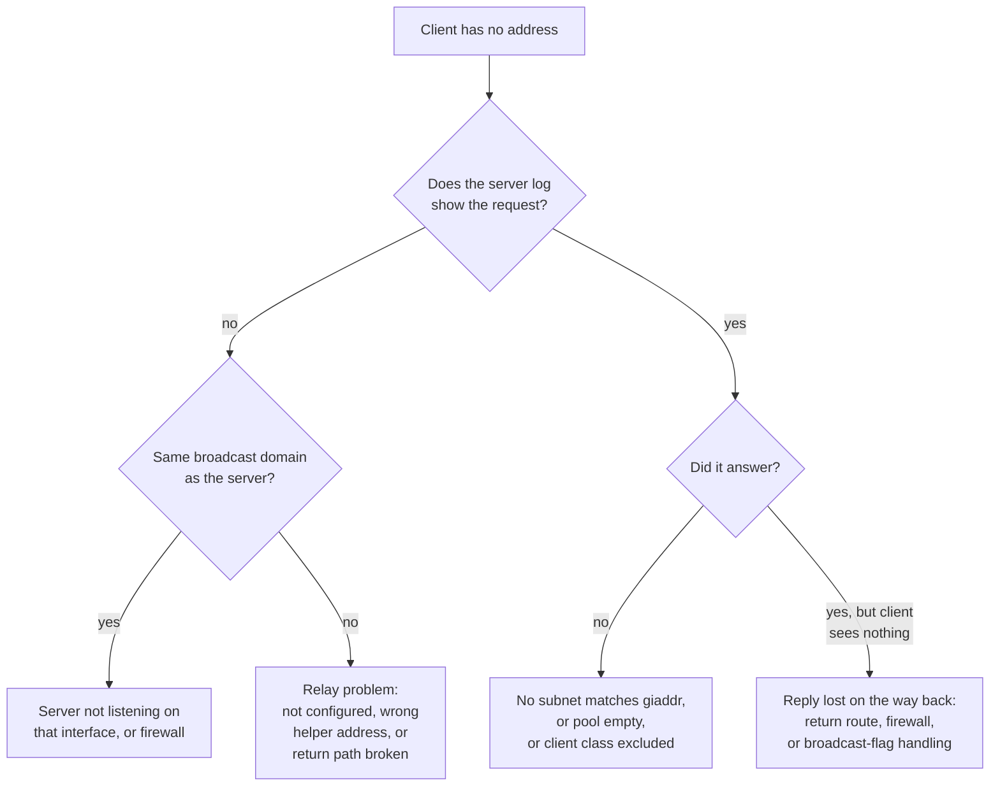

"DHCP is broken" is almost never the report you get. What you get is "the new machines will not come up", or "wifi works upstairs and not downstairs", or "it worked on Friday".

DHCP is unusually pleasant to debug once you have a method, because the protocol is short, unencrypted, and leaves evidence in three places. The method is one question asked first, then a tree.

Everything below was reproduced in the lab from [post 7](/blog/dhcp-07-install-kea), extended with a relay. The log lines are copied from the runs.

## Ask this first

**Did the server see the packet?**

Everything upstream of that is a network problem — a missing relay, a VLAN, a firewall. Everything downstream is a server problem — a pool, a subnet declaration, a class. They have nothing in common, and people waste hours because they start in the middle.



That first branch is worth more than any amount of packet-level cleverness.

## The three places evidence lives

| Where | Shows you | Command |
| --- | --- | --- |
| The wire | What was actually sent | `tcpdump -i <if> -n -v 'port 67 or port 68'` |
| The server log | What the server decided, and why | Kea logs to stdout or syslog |
| The lease database | What the server thinks it handed out | `cat /var/lib/kea/leases4.csv` |

When they disagree, the disagreement is the bug. A lease in the database that the client does not have means the reply was lost. A request on the wire with nothing in the log means the server dropped it before the logger.

## Reading a capture

Run tcpdump on the client side and you get the plain form:

```text
IP 0.0.0.0.68 > 255.255.255.255.67: BOOTP/DHCP, Request from 7a:6e:95:21:66:46
IP 192.0.2.1.67 > 192.0.2.100.68: BOOTP/DHCP, Reply
```

Two things to internalise, both from [post 1](/blog/dhcp-01-how-a-host-gets-an-ip).

`Request` and `Reply` are BOOTP op codes, not DHCP message types. You cannot tell DISCOVER from REQUEST at this level — both are "Request". Add `-v` to see option 53.

Source `0.0.0.0` means an unconfigured client. If you see a source that is a real address, the client already has a lease and is renewing.

### Spotting a relay instantly

Here is the same exchange captured on the **server** side, with a relay in the path:

```text
IP 198.51.100.1.67 > 198.51.100.10.67: BOOTP/DHCP, Request from e6:d5:75:24:ab:61
IP 198.51.100.10.67 > 192.0.2.1.67: BOOTP/DHCP, Reply
```

**Both ends are port 67.** Client-to-server traffic is 68→67; relay-to-server traffic is 67→67. That single detail tells you whether the packet in front of you arrived directly or through a relay, without reading any fields.

And with `-v`, the field that decides everything:

```text
Gateway-IP 192.0.2.1
```

That is `giaddr` from [post 4](/blog/dhcp-04-relays). It is how the server picks a pool. If it is wrong or missing, nothing downstream can work.

## Failure 1: no subnet matches giaddr

The relay works perfectly, the server receives everything, and the client gets nothing. This is the one that looks like a mystery.

Reproduced by pointing the relay at a server whose only subnet is `203.0.113.0/24` while clients live in `192.0.2.0/24`. The relay forwarded three requests. Kea allocated zero. The client stayed at no address.

The server log is completely explicit:

```text
ERROR [kea-dhcp4.bad-packets] DHCP4_PACKET_NAK_0001 [hwtype=1 a2:ea:3e:af:4e:a8],
  cid=[no info], tid=0x2474f727: failed to select a subnet for incoming packet,
  src 198.51.100.1, type DHCPDISCOVER
```

`failed to select a subnet`, and it even tells you the source is `198.51.100.1` — the relay. Take that address, compare it to your `subnet4` declarations, and you are done.

**The fix** is a subnet declaration whose range contains the relay's address on the client side, or an explicit `relay: { "ip-addresses": [...] }` when the relay's address is not inside the client subnet.

This is the failure worth memorising, because the symptom — total silence at the client — is identical to "the relay is not configured", and the two live on opposite sides of the decision tree.

## Failure 2: the pool is empty

Reproduced with a pool of exactly one address and two clients. The first got `192.0.2.100`. The second got nothing. Kea allocated one lease total.

```text
INFO [kea-dhcp4.leases] DHCP4_LEASE_ALLOC ...: lease 192.0.2.100 has been
  allocated for 600 seconds
WARN [kea-dhcp4.alloc-engine] ALLOC_ENGINE_V4_ALLOC_FAIL_SUBNET [hwtype=1
  de:c8:20:90:db:97], ...: failed to allocate an IPv4 lease in the subnet
  192.0.2.0/24, subnet-id 1, shared network (none)
WARN [kea-dhcp4.alloc-engine] ALLOC_ENGINE_V4_ALLOC_FAIL ...: failed to
  allocate an IPv4 address after 1 attempt(s)
WARN [kea-dhcp4.alloc-engine] ALLOC_ENGINE_V4_ALLOC_FAIL_CLASSES ...: Failed
  to allocate an IPv4 address for client with classes: ALL, UNKNOWN
```

Note these are **WARN**, not ERROR. A monitoring rule that only alerts on ERROR will not see your pool run out, which is [post 9](/blog/dhcp-09-where-it-lives)'s point that a DHCP server which is running and out of addresses is down.

The third line is a trap. `Failed to allocate ... for client with classes` reads like a client-classification problem, and it sends people into class configuration. It is printed on every allocation failure regardless of cause. The line that tells you the truth is the first one: `failed to allocate an IPv4 lease in the subnet`.

**The fix** is a bigger pool or a shorter lease — the trade-off from [post 3](/blog/dhcp-03-leases). The real fix is monitoring pool utilisation before it hits 100%.

## Failure 3: the server is not listening where you think

Kea only listens on the interfaces in `interfaces-config`. Put the wrong name there and the server starts cleanly, logs nothing unusual, and ignores every packet.

There is a variant that is nastier. Test your config from outside the namespace the server runs in and Kea says:

```text
ERROR DHCP4_PARSER_FAIL failed to create or run parser for configuration
  element interfaces-config: Failed to select interface: interface
  'veth-srv' doesn't exist in the system
```

The config is fine. You checked it from the wrong place. The general form of this on a real server is checking a config against a host whose interfaces have been renamed, or in a different netns, or before the interface is up at boot.

**The tell** for "not listening": tcpdump on the server's own interface shows the request arriving, and the server log shows nothing at all. Packets reaching the NIC but not the process means the process is not bound there.

## The checks, in order

```bash
# 1. Is the process alive and did it load the config you think?
ps aux | grep kea-dhcp4
kea-dhcp4 -t /etc/kea/kea-dhcp4.conf      # from the right namespace/host

# 2. Is it bound where you expect?
ss -ulnp | grep :67

# 3. Does the request arrive at all?
tcpdump -i <server-if> -n -v 'port 67'

# 4. If relayed — what is giaddr, and does a subnet contain it?
tcpdump -i <server-if> -n -v 'port 67' | grep -i gateway

# 5. What did the server decide?
grep -E "ALLOC|NAK|PACKET" /var/log/kea/kea-dhcp4.log

# 6. What does it think it handed out?
cat /var/lib/kea/leases4.csv
```

Turn up `severity` to `DEBUG` with a `debuglevel` when steps 3 and 5 disagree. Turn it back down afterwards — DHCP debug logging is loud.

## Two failures the lab cannot show you

Being honest about the limits of a contained lab.

**A rogue DHCP server** needs a second server answering faster than yours on a shared segment. You can simulate it in the lab, but the thing that makes it hard in reality is finding *which port* the rogue is on, and that is switch-side work: DHCP snooping logs and MAC address tables.

**Intermittent failures under load.** A mass reboot where thousands of clients DORA at once is a different regime from anything two namespaces reproduce. The fsync ceiling from post 9 lives there, and I have not measured it.

## What to take away

Ask whether the server saw the packet. That splits every failure cleanly.

Port 67 on both ends means a relay. `failed to select a subnet` means `giaddr` does not match any subnet declaration. Pool exhaustion logs at WARN and is easy to miss. And a server that is running is not necessarily a server that is listening.

That is the last of the practical posts. Back to the [map](/blog/dhcp-00-the-map), or on to [where the server lives](/blog/dhcp-09-where-it-lives).
