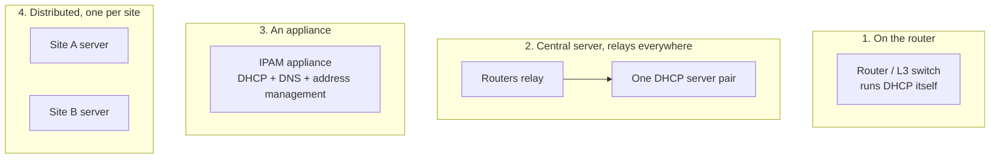
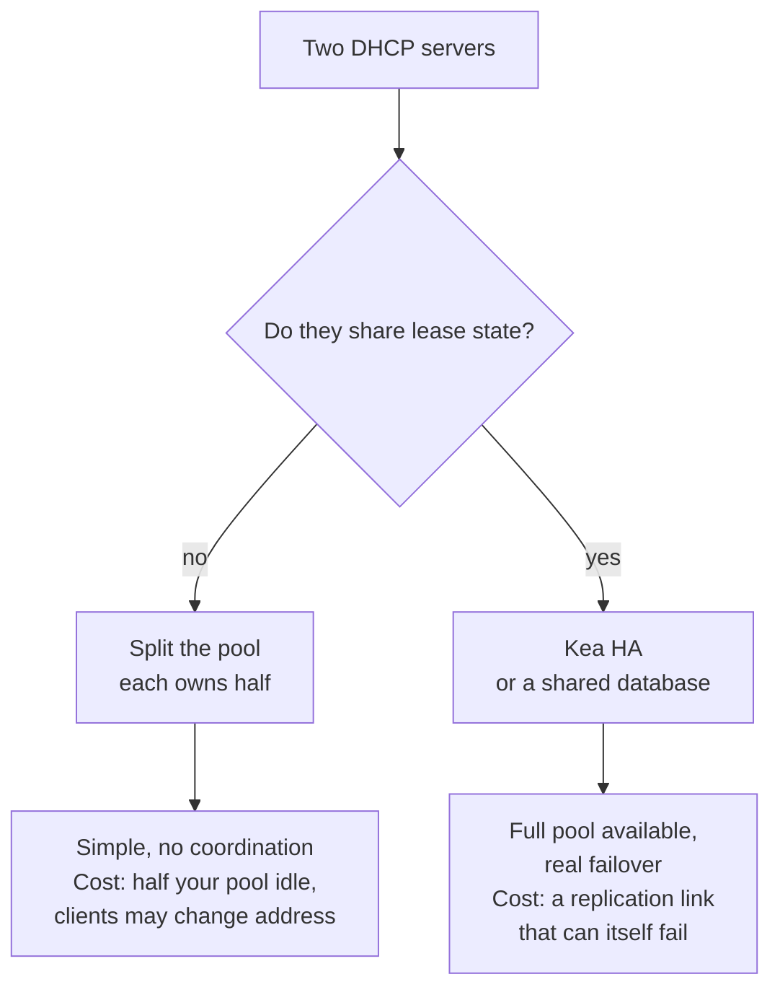

DHCP is the rare service where "where do we run it" is a more interesting question than "what do we run".

The software is not demanding. A DHCP server for ten thousand clients is a process using a few hundred megabytes of RAM that spends most of its life idle. The hard parts are all about position: which broadcast domains it can reach, what happens when it is down, and whether a second one can take over without handing out an address twice.

## Four placements

**On the router.** Every business-grade router and L3 switch can serve DHCP. It is one command, there are no extra machines, and it cannot be unreachable from its clients because it *is* their gateway.

It also does not scale organisationally. Fifty routers means fifty places to change a DNS server, no central view of who has which address, and lease tables that vanish on reboot. Fine for a branch office, a lab, or your home. Not fine for a campus.

**Central server plus relays.** The standard enterprise and datacentre answer, and the one [post 4](/blog/dhcp-04-relays) describes. One config, one lease database, one place to look. The router does nothing but relay.

The cost is that DHCP now depends on the network being up between every client subnet and the server. A routing problem becomes a DHCP problem.

**An appliance.** Commercial IPAM products — Infoblox, EfficientIP, BlueCat, and the open-source NetBox-plus-glue approach — bundle DHCP with DNS and address management. You are buying the database and the workflow, not the DHCP daemon.

Worth it when address management is a real organisational problem: multiple teams, audit requirements, thousands of subnets. Overkill when it is one team and one datacentre.

**Distributed, one per site.** Each site runs its own, so a WAN outage does not stop machines booting locally. The trade is configuration drift across sites, which you solve with the same tooling you use for everything else.

## What the hardware actually needs

Small. Consistently smaller than people provision for.

| Resource | What drives it | Reality |
| --- | --- | --- |
| CPU | Packets per second | A DORA is a few hundred microseconds of work. One core handles a lot |
| RAM | Leases held in memory | Roughly a few hundred bytes to a couple of KB per lease |
| Disk | Lease database writes | Small, but **latency-sensitive** — see below |
| Network | Packet volume | Trivial. DHCP traffic is noise next to anything else |

The one that bites is **disk latency**, and it is not obvious.

A correct DHCP server must commit a lease to durable storage *before* it sends the ACK. If it acknowledges first and crashes before writing, it comes back with no record of an address a client is now actively using. So every lease grant is a synchronous write, and your throughput ceiling is your storage's fsync latency, not your CPU.

This is the difference between a server that handles thousands of leases per second on an SSD and one that handles dozens on a network filesystem. If you are sizing a DHCP server, that is the number to care about.

The other thing that matters more than raw specs: **the server must be reachable when clients need it most**, which is a mass reboot. A power event brings a whole datacentre back at once, and every machine does DORA simultaneously. Steady-state load tells you nothing about that peak.

## High availability is genuinely hard here

Most services scale by putting a load balancer in front of identical stateless copies. DHCP cannot, for two reasons.

Clients broadcast. There is nothing to point at a load balancer.

And the service is stateful in the worst way: the whole job is guaranteeing that two clients never get the same address. Two servers that cannot see each other's leases will violate that the moment they both answer.

### Split-scope

The oldest approach and still the most robust: two independent servers, each configured with part of the range. Server A owns `.100`–`.150`, server B owns `.151`–`.200`. They never talk.

A client broadcasts, both answer, it takes whichever arrives first. If one server dies, the other keeps serving from its half.

It is hard to break because there is nothing to break. The costs are that you can only ever use part of your pool, and that a client whose server dies gets a different address after its lease expires.

### Kea HA

ISC Kea's high-availability hook runs two servers that replicate lease updates to each other over HTTP.

**Hot-standby**: one serves everything, the other takes over on failure. **Load-balancing**: both serve, splitting clients by a hash of the client identifier, each replicating to the other.

Either way both servers know every lease, so the full pool is usable and a failover does not change anyone's address.

The complexity moves into the replication link and the failure detection. Two servers that cannot reach each other but can both reach clients is the split-brain case, and how a given configuration handles it is worth reading carefully before you rely on it.

### The older failover protocol

ISC's original `dhcpd` implemented a DHCP failover protocol, defined in a draft that never became an RFC. It worked and it was notoriously fiddly to operate.

It matters mainly as context: **ISC DHCP (`dhcpd`) reached end of life** and Kea is its replacement. If you are standing up something new, this is not a choice you have to make. If you are inheriting a `dhcpd` pair, its retirement is the reason the migration is on someone's roadmap.

## What I would actually do

For a small site or a lab: on the router. The simplicity is worth more than the features you give up.

For a datacentre or campus: a central pair running Kea with HA, relays on every L3 boundary, leases in a real database, and monitoring on **pool utilisation** rather than just on whether the process is alive. A DHCP server that is running and out of addresses is down, and only one of those two shows up in a health check.

For anything with a WAN in the middle: local servers per site. A site that cannot boot machines because a link to head office is down is a bad outcome, and it is avoidable.

I have not built and load-tested all four of these. The fsync point and the mass-reboot point are the two I would most want to measure before committing to a design, and they are the two least likely to appear in a vendor datasheet.

## What to take away

The software is cheap; the placement is the design. Central-plus-relays is the default for anything bigger than one site.

HA cannot use a load balancer, so it is either split-scope or replicated state. And the resource that actually limits you is fsync latency, not CPU.

Next: **[DHCP outside the cloud: on-prem and hybrid](/blog/dhcp-10-on-prem-and-hybrid)**.
