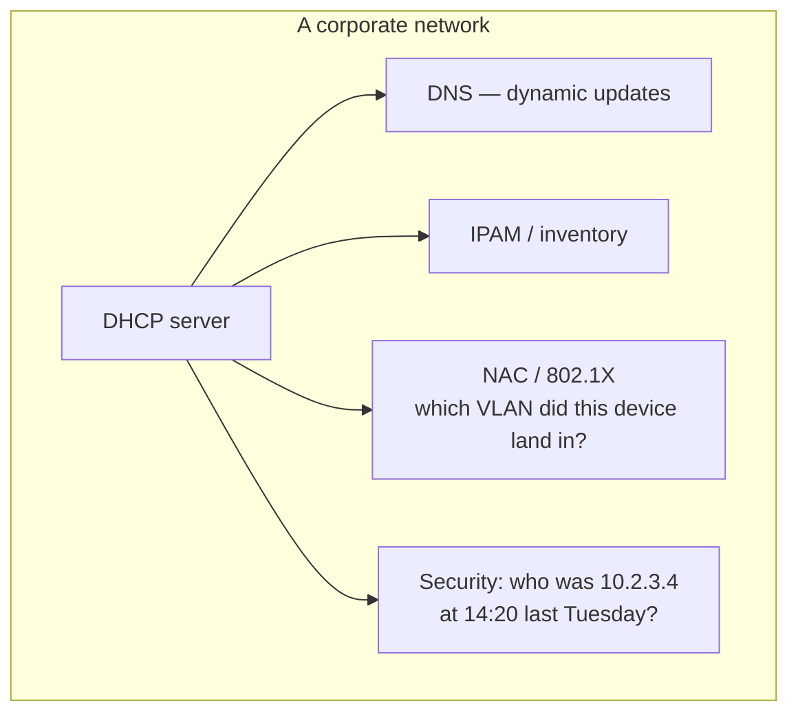
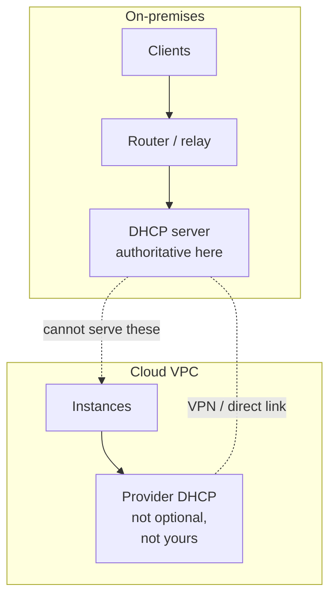

The cloud-native framing of DHCP is that it is an implementation detail of the virtual network, hidden behind an API. That is true inside a provider, and it is a small fraction of where DHCP actually runs.

The larger fraction is corporate and industrial networks: an office with printers and badge readers and VoIP phones, a factory floor with PLCs, a hospital with medical devices that were certified in 2011 and cannot be touched. These networks have properties a datacentre does not, and they change what a DHCP server is for.

## What is different on-premises

**The clients are not yours.** In a datacentre you control every machine. In an office you have laptops, phones, printers, cameras, thermostats, and a contractor's tablet. They have different DHCP client implementations of wildly different quality, and you cannot fix any of them.

**Devices move.** A laptop is in the meeting room, then at a desk, then on wifi, then gone for a week. Every move is a DHCP transaction, sometimes a subnet change, sometimes a NAK and a fresh DORA. Churn is the normal state.

**DHCP is a source of truth.** In a datacentre, inventory comes from the provisioning system. In an office, the lease table is often the only record of what is on the network. Security teams read it. Audits ask for it.

**Some devices must never change address.** The label printer in the warehouse is hardcoded in a system nobody can rebuild. That becomes a reservation, and reservations accumulate for years.

That last arrow is the one that surprises people coming from cloud. Lease logs are forensic evidence. Retention of them is often a compliance requirement, and "we rotate them daily" is the wrong answer in a regulated environment.

## The Active Directory shape

In a Windows-centric organisation, DHCP is usually part of a trio with DNS and Active Directory, and they are wired together.

**Dynamic DNS updates.** When the DHCP server grants a lease it registers the client's name in DNS. This is how `laptop-4417.corp.example.com` resolves without anyone editing a zone file. It also means the DHCP server needs credentials to write to DNS, and that DNS records become stale when DHCP and DNS disagree.

**DHCP server authorisation.** Windows DHCP servers must be authorised in Active Directory before they will serve. It is a partial answer to the rogue-server problem from [post 2](/blog/dhcp-02-the-network-underneath) — partial, because it only constrains servers that care about AD. A home router plugged into a wall port has never heard of Active Directory and will happily answer.

**Option 43 and 60 for vendor devices.** VoIP phones and wireless access points find their controllers through DHCP. A phone sends a vendor class identifier in option 60, and the server replies with option 43 containing the controller address. When someone says "the phones came up but cannot find the PBX", this is where to look.

If you are coming from Linux and cloud, the thing to internalise is that in these environments DHCP is not standalone. Changing it touches DNS and directory services, and the blast radius is wider than the protocol suggests.

## The hybrid case

Now the genuinely hard one: part of the network is on-premises and part is in a cloud provider, joined by a VPN or a dedicated link.

The instinct is to extend the on-prem DHCP server to cover cloud subnets, the same way you extended it to cover a branch office. It does not work, and the reasons are worth being precise about.

**You do not own DHCP in the VPC.** Cloud providers run it themselves, tied to their address management. In most VPC designs you cannot replace it — the address is allocated when the interface is created, and DHCP just informs the guest of a decision already made. [Post 11](/blog/dhcp-11-cloud) is why.

What you *can* usually change is the options: a DHCP option set lets you push your own DNS servers, domain name, and sometimes NTP. That is the integration point, and it is normally the one you actually want — you wanted cloud instances to use corporate DNS, not to get their addresses from head office.

**The link is not reliable enough to be on the boot path.** Even if you could relay across a VPN, you would have made every instance boot depend on a tunnel. A link flap becomes an outage in a place with no console access.

**Address space has to be planned as one.** This is the part that causes long-term pain. On-prem `10.0.0.0/8` used liberally for twenty years, and someone creates a VPC as `10.0.0.0/16`. It works until the link comes up, and then the overlap is both a routing problem and a migration project. Whatever IPAM you use has to cover both sides before the first VPC exists.

### What to actually do

| Concern | On-prem | Cloud side |
| --- | --- | --- |
| Address allocation | Your DHCP server | The provider's, not negotiable |
| DNS resolvers | Your DHCP options | Provider DHCP option set → your resolvers |
| Domain name | Your DHCP options | Same |
| Name resolution across the link | Conditional forwarders both ways | Same |
| Address planning | One IPAM covering both | Same IPAM |

The pattern that works: let each side do its own allocation, and use the option sets to make both sides agree on DNS and domain. Do not try to make one DHCP server authoritative across the boundary.

## The migration failure I would warn about

The one that keeps happening: a team lifts an application from on-prem to cloud, and it depends on a fixed address that was a DHCP reservation nobody documented as a dependency.

In the cloud the instance gets an address from the VPC, the hardcoded peer never connects, and the failure surfaces as an application bug days later. The DHCP reservation was load-bearing infrastructure and nothing recorded it as such.

Before a migration, the reservation list is worth reading as a dependency graph. Every static mapping is something, somewhere, assuming an address will not change.

## What to take away

On-premises, DHCP is not just address allocation — it is inventory, DNS registration, forensic logging, and the place device quirks get worked around. It is wired into Active Directory more deeply than the protocol suggests.

In hybrid, do not try to extend one server across the boundary. Let each side allocate, use option sets to agree on DNS, and plan address space as a single problem from the start.

Next: **[DHCP in a cloud provider](/blog/dhcp-11-cloud)**.
