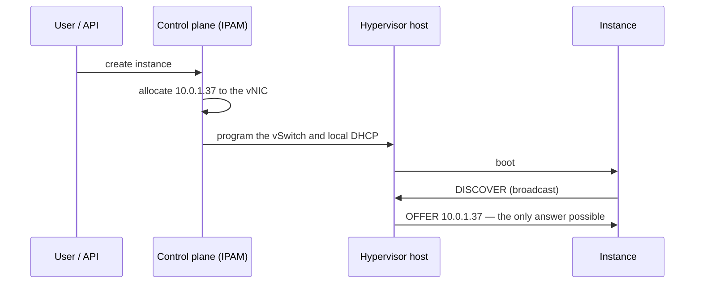
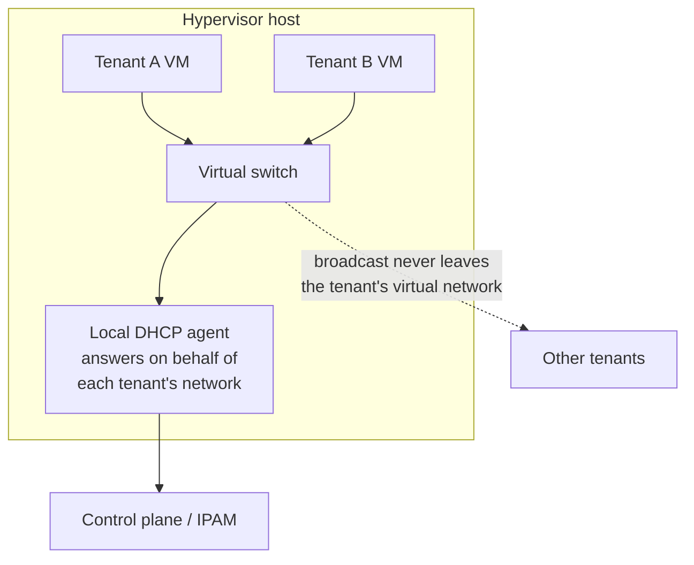

Inside a cloud provider, DHCP still exists and still speaks the protocol from [post 1](/blog/dhcp-01-how-a-host-gets-an-ip). An instance boots, broadcasts a DISCOVER, and gets an address.

Almost nothing else is the same. The server is not a server, the broadcast is not a broadcast, and the address was decided before the instance existed.

This post is what changes and why. It is the general shape across providers, not any one of them.

## The inversion: allocation happens first

On a corporate network, DHCP decides. A client asks, the server picks a free address from a pool, and that decision *is* the allocation.

In a cloud provider it is backwards. When you create an instance, the control plane allocates an address from the subnet's range and records it against the virtual interface. That happens at API time, before anything boots. The instance's address exists in the database while the instance is still being scheduled.

By the time DHCP runs, there is nothing to decide.

So DHCP is not an allocator. It is a **delivery mechanism** for a decision already made — the compatibility layer that lets an unmodified guest OS learn its configuration using the protocol it already speaks.

That reframing explains most of the restrictions people find surprising. You cannot choose your own address in the DORA, because the answer is already fixed. You cannot run your own DHCP server for the subnet, because it would be answering a question that is not open.

## Broadcast does not survive multi-tenancy

[Post 2](/blog/dhcp-02-the-network-underneath) established that DHCP needs a broadcast domain. A cloud network cannot have real ones.

If a thousand tenants' VMs shared a broadcast domain, every DISCOVER would reach every tenant. Any of them could answer. That is the rogue server problem from post 2, except now it is a multi-tenant security boundary rather than somebody's misplugged router.

So providers do not bridge tenants together. Each virtual network is isolated — usually by encapsulating tenant traffic in an overlay such as VXLAN or Geneve — and broadcast is not flooded but intercepted.

The DHCP responder usually runs **on the hypervisor host**, or in a namespace dedicated to that tenant's network. It is close to the VM by design: the broadcast travels a few microseconds of virtual switching and is answered locally, without ever touching a physical network where another tenant could see it.

This is also why cloud DHCP is effectively immune to the pool-exhaustion failure from [post 3](/blog/dhcp-03-leases). There is no shared pool being raced for. Each interface's address was reserved at creation.

## The security properties you get for free

Because the address is known in advance and the vSwitch is under the provider's control, a set of protections become cheap that are hard on physical networks.

**Anti-spoofing.** The vSwitch knows interface X has address `10.0.1.37` and MAC `fa:16:3e:...`. Frames with any other source are dropped at the port. On a physical network this needs 802.1X or port security and constant maintenance; here it is a consequence of the design.

**Rogue server prevention.** A tenant VM that tries to answer DHCP is sending a server message from a client port. The vSwitch drops it. This is DHCP snooping, implemented once in software instead of configured on every switch.

**Stable identity.** The address is bound to the virtual interface, not to a lease timer. Reboot the instance and it comes back with the same address, because nothing about it was ever temporary.

## What the tenant can control

Not allocation. Usually the options.

Providers expose something like a DHCP option set: DNS resolvers, domain name, sometimes NTP servers, sometimes arbitrary option codes. That is the integration point discussed in [post 10](/blog/dhcp-10-on-prem-and-hybrid) — how you make cloud instances use corporate DNS.

The limits on which options you can set are worth checking early in a design, because "we will push option 43 to configure the appliance" is an assumption that fails late.

## Bare metal is the hard case

Everything above depends on a hypervisor sitting between the guest and the network. Take it away and the properties go with it.

A bare-metal server is a physical machine on a physical port. There is no vSwitch to enforce anti-spoofing, no agent to intercept broadcast, and the machine runs a firmware stack the provider did not write. It must be given an address, and often an entire operating system, over the network — [post 5](/blog/dhcp-05-options-and-netboot).

| | Virtual machine | Bare metal |
| --- | --- | --- |
| Where DHCP is answered | Host agent, microseconds away | A real server, over a real network |
| Isolation enforced by | The virtual switch | Physical VLANs or fabric configuration |
| Anti-spoofing | Free, at the vSwitch port | Switch port security, or nothing |
| Trust in the client | None needed — it cannot misbehave | The machine is the customer's |
| Boot chain | Provider-supplied image | Netboot, unauthenticated by default |

The last two rows are where the real problems are. The boot chain from post 5 is unauthenticated: whoever answers the DISCOVER chooses the bootloader. On a shared provisioning network with other customers' machines on it, that is a genuine risk rather than a theoretical one.

The structural answer is the same one post 5 arrived at: isolate provisioning onto a network where only the provider's own infrastructure can answer, and keep the customer's machines from seeing each other during boot. That is the general problem behind a lot of bare-metal provisioning work, including the one that prompted this series.

## What to take away

In cloud, DHCP delivers a decision rather than making one. Allocation happens in the control plane at API time.

Broadcast is intercepted per tenant rather than flooded, which is what makes multi-tenancy safe and makes pool exhaustion a non-issue. And every property that comes free from having a virtual switch has to be rebuilt explicitly for bare metal.

Next: **[The market, and what Go has to offer](/blog/dhcp-12-the-market-and-go)**.
