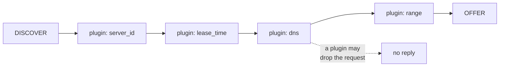
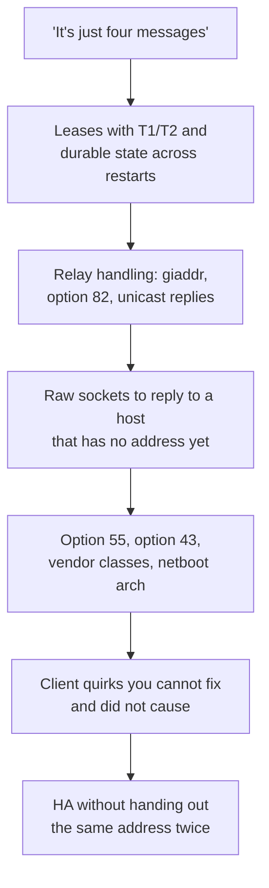
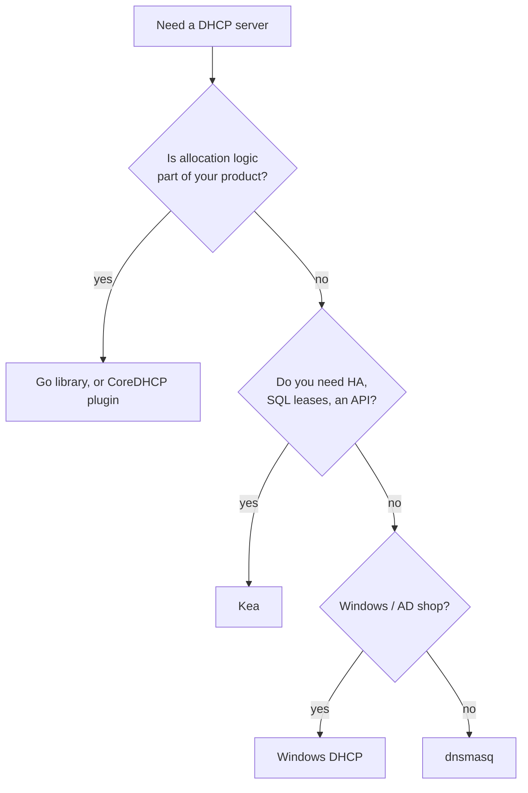

There are maybe six DHCP server implementations that matter, and they are not competing for the same job. Picking one is mostly a question of what else you need it to do.

Then there is the question a Go backend engineer eventually asks: should I just write this myself? The protocol is four messages. How hard can it be?

## The established options

| Server | Language | Best at | Not for |
| --- | --- | --- | --- |
| **ISC Kea** | C++ | Datacentre and enterprise scale, HA, SQL lease storage, a REST API | Small setups — it is a lot of moving parts |
| **dnsmasq** | C | Small networks, labs, routers. DHCP + DNS + TFTP in one binary | Large scale, HA, anything needing an API |
| **systemd-networkd** | C | A DHCP server you already have installed on a Linux box | Anything beyond a single simple subnet |
| **Windows Server DHCP** | C++ | Active Directory environments, dynamic DNS, GUI management | Non-Windows shops |
| **udhcpd** (BusyBox) | C | Embedded, tiny footprint | Everything else |
| **CoreDHCP** | Go | Programmable, plugin-driven, embedding in your own service | Turnkey deployment |

### Kea is the default answer at scale

ISC DHCP — the `dhcpd` that ran the internet for twenty years — **reached end of life**, and Kea is ISC's replacement. If you are building something new and you need a serious DHCP server, this is the boring correct choice.

What you get over `dhcpd`: JSON configuration, lease storage in MySQL or PostgreSQL, a REST control API, runtime reconfiguration without a restart, and the HA hook from [post 9](/blog/dhcp-09-where-it-lives).

What it costs: it is genuinely more complex to stand up. Separate daemons for DHCPv4, DHCPv6 and the control agent, a hook library system, and a configuration language with real depth.

### dnsmasq is the right answer more often than people admit

One binary, one config file, and it does DHCP, DNS and TFTP together — which, after [post 5](/blog/dhcp-05-options-and-netboot), you will notice is exactly the set you need for network boot.

For a lab, a branch office, a home network, or a small netboot setup, dnsmasq is a config file and you are done. It is on every OpenWrt router in the world for a reason.

It stops being right when you need HA, a shared lease database, or an API.

## The Go landscape

Two projects, and it is worth being clear that one is the foundation of the other.

**[`insomniacslk/dhcp`](https://github.com/insomniacslk/dhcp)** is the library: DHCPv4 and DHCPv6 packet encoding and decoding, plus client and server scaffolding. If you are writing Go that touches DHCP, this is what you import. As of this writing it is at 843 stars with commits this month.

**[CoreDHCP](https://github.com/coredhcp/coredhcp)** is a server built on top of it, structured the way CoreDNS is: almost everything is a plugin, and a request walks the plugin chain in configuration order until one answers it or drops it.

That design is the reason to reach for it. If your DHCP logic needs to consult your own inventory database, or make an allocation decision based on something only your system knows, writing a CoreDHCP plugin is a much smaller job than bending Kea's hook API to the same shape.

One honest note on project health: CoreDHCP sits at around 1,100 stars, but its last commit at the time of writing was several months ago, while the library underneath it is actively maintained. That is a normal pattern for a stable modular server, and it is also the kind of thing worth checking yourself before you build on it rather than taking a blog post's word for it.

## Should you write your own?

The four-message exchange really is simple. You could implement DISCOVER and OFFER in an afternoon.

Then you meet everything else in this series.

Each of those is a post in this series, and each is where a naive implementation breaks in production rather than in testing.

My actual position:

**Do not write a general-purpose DHCP server.** Kea exists, it is maintained by the organisation that wrote the reference implementation, and your version will be worse in ways you discover during an incident.

**Do write a DHCP component** when allocation is genuinely part of your system's logic — a provisioning system where the address, the boot image and the machine's identity are one decision made in your database. At that point you are not writing a DHCP server; you are writing an adapter that speaks DHCP to a decision your system already made. That is exactly the shape of cloud DHCP in [post 11](/blog/dhcp-11-cloud), and it is a legitimate reason to use the Go library.

**Always use a library for the wire format.** Parsing DHCP by hand is where the bugs are: the option length limits, the magic cookie, option overloading into the `file` and `sname` fields, the broadcast-flag logic from [post 2](/blog/dhcp-02-the-network-underneath). None of that is interesting and all of it is already solved.

## How I would choose

I have not benchmarked these against each other. The numbers that would matter — leases per second under a mass-reboot burst, failover time, memory at a million leases — depend so much on storage and configuration that a generic comparison would be close to meaningless, and I would rather point at that than publish a table I could not defend.

## What to take away

Kea at scale, dnsmasq for everything small, Windows DHCP if you live in Active Directory. `insomniacslk/dhcp` if you are writing Go that speaks the protocol, CoreDHCP if you want a server you can extend in it.

Write your own only when the allocation decision genuinely belongs to your system — and even then, do not write the parser.

Next: **[DHCPv6 is not DHCPv4 with bigger addresses](/blog/dhcp-13-dhcpv6)**.

Sources: [insomniacslk/dhcp](https://github.com/insomniacslk/dhcp), [coredhcp/coredhcp](https://github.com/coredhcp/coredhcp)
