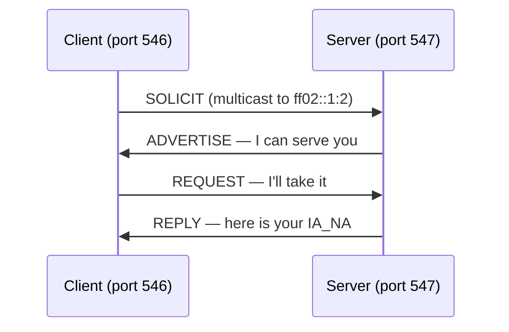
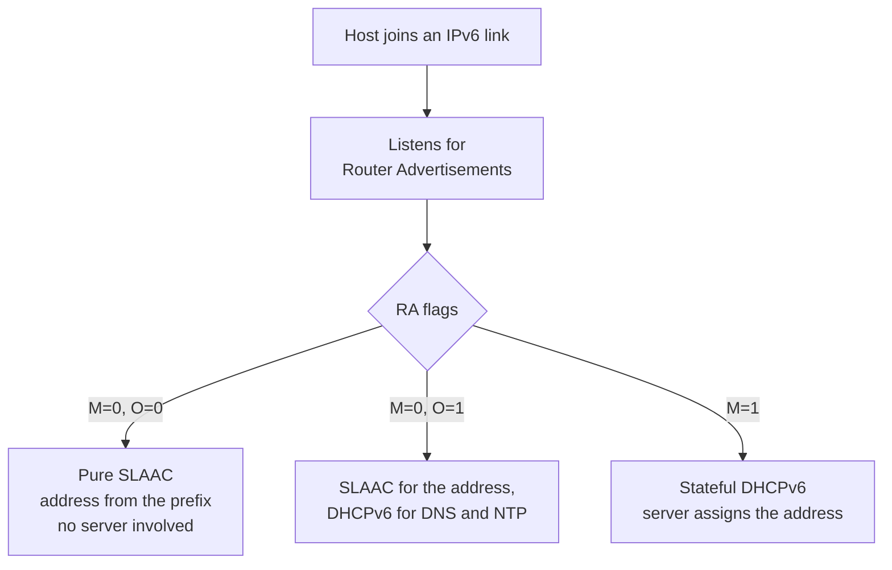

The name is misleading. DHCPv6 is not DHCPv4 carrying 128-bit addresses — it is a separate protocol, specified separately, with its own ports, message types, client identifiers and option namespace. A DHCPv4 server does not become a DHCPv6 server by changing a config flag. Kea ships two different daemons.

It also has something DHCPv4 never had: a competitor that does the same job with no server at all.

This is the last post in the series, and the only one that ends in a recommendation.

## What is actually different

| | DHCPv4 | DHCPv6 |
| --- | --- | --- |
| Ports | 67 server / 68 client | 547 server / 546 client |
| Transport | Broadcast to 255.255.255.255 | Multicast to `ff02::1:2` |
| Exchange | DISCOVER, OFFER, REQUEST, ACK | SOLICIT, ADVERTISE, REQUEST, REPLY |
| Client identity | MAC address (`chaddr`) | DUID — a generated, persistent identifier |
| Address in the header | `yiaddr` field | No such field; addresses live in options |
| Gateway | Option 3 | Not provided — comes from Router Advertisements |
| Option namespace | Its own | Completely separate, same numbers mean different things |

Two of these change how you think.

**There is no `yiaddr`.** Addresses are carried in Identity Association options: `IA_NA` for a normal address, `IA_PD` for a delegated prefix. A single client can hold several at once, which is a genuine improvement and also why the packet structure is more nested.

**DHCPv6 does not hand out a default gateway.** This catches everyone. In IPv6 the router announces itself through Router Advertisements, and that is the only mechanism. A machine configured purely by DHCPv6, on a link with no RAs, gets an address and cannot reach anything. IPv6 always needs the router to be talking.

Same shape as DORA, different names. The renewal pair is RENEW and REBIND, matching T1 and T2 from [post 3](/blog/dhcp-03-leases) exactly.

## DUID: the part that causes real operational pain

DHCPv4 identifies a client by its MAC address. It is imperfect — MACs can be spoofed and change with the hardware — but it is right there in the packet, and reservations are trivial to write.

DHCPv6 uses a **DUID**, a DHCP Unique Identifier, which the client generates once and is supposed to keep forever, across reinstalls and across network cards.

There are several kinds: based on link-layer address plus a timestamp, based on an enterprise number, based on link-layer address alone, and based on the machine's UUID.

The operational consequences are real:

**Reservations get harder.** You cannot write a reservation from a MAC address on a sticker. You need the DUID, which means booting the machine first and reading it out.

**DUIDs change when you did not expect.** A reinstall that regenerates the DUID makes the machine a stranger. Cloned VM images that share a DUID make several machines the same client.

**The DUID is per-machine, not per-interface.** A host with two NICs presents one DUID and distinguishes interfaces with an IAID. This is more correct than DHCPv4's model, and it is not what tooling built around MAC addresses expects.

## The competitor: SLAAC

Here is what has no DHCPv4 equivalent. In IPv6, a host can configure itself with no server at all.

The router multicasts a Router Advertisement containing a prefix. The host takes the prefix, generates its own interface identifier, and has a working address. That is **SLAAC** — stateless address autoconfiguration.

Those two flags in the Router Advertisement decide which world you are in, and they are set on the router, not the DHCP server. A common confusion: DHCPv6 is configured and working, and no client uses it, because nobody set the M flag.

The middle case — SLAAC plus stateless DHCPv6 — is very common and worth knowing by name. The host self-configures its address and asks a DHCPv6 server only for DNS resolvers and NTP.

### When you need stateful DHCPv6

SLAAC is simpler, so the question is what it cannot do.

It cannot give you a **record of which host has which address**. The host picks its own. For any environment that needs that mapping for audit, security forensics or troubleshooting — which is most enterprises, [post 10](/blog/dhcp-10-on-prem-and-hybrid) — SLAAC is disqualifying on its own.

It cannot do **reservations**. If a device must always have the same address, SLAAC is not the mechanism.

And **Android does not support stateful DHCPv6 at all**. This is a long-standing, deliberate position by its maintainers, and it means an IPv6-only network built on stateful DHCPv6 will not serve Android devices. If you have phones on your network, this decides the design for you.

## Is it worth investing in?

The number that changed the answer: in **March 2026, IPv6 crossed 50% of traffic to Google for the first time**, and it has kept climbing. France, Germany and India run the majority of their traffic over it. The United States is around 57%.

That is not "the future is IPv6". That is the majority, now.

What it does *not* mean is that your internal network needs DHCPv6 tomorrow. Those numbers are client-to-internet traffic, mostly mobile and residential broadband — networks run by carriers who had no choice because they ran out of IPv4 addresses.

So I would split the decision:

| Situation | My answer |
| --- | --- |
| Carrier, ISP, mobile network | Already done, or you are behind. `IA_PD` prefix delegation is the core of this |
| Cloud provider | Yes. Customers ask for it, and IPv4 address costs are real money now |
| Large enterprise internal network | Plan it, pilot it, do not rush it. Dual-stack for years |
| Small office | IPv4 with NAT is genuinely sufficient. Revisit when something forces you |
| Datacentre with address pressure | Yes — this is where IPv6 pays off fastest internally |

The honest framing for most readers: **IPv4 is not running out on your internal network.** RFC 1918 gives you 17 million addresses in `10.0.0.0/8`. The pressure is external — the cost of public IPv4, and reaching an internet that is increasingly IPv6-native.

What I would not do is treat learning DHCPv6 and deploying it as the same decision. Understanding it is cheap and increasingly necessary. Deploying it into a working IPv4 network is a multi-year dual-stack project with its own failure modes, and it needs a reason beyond "we should".

The reason usually arrives on its own: an address shortage, a customer requirement, or a regulator. When it does, the thing that makes it survivable is that you already understood DUIDs and RA flags before you were under pressure.

## What to take away

DHCPv6 is a different protocol. Different ports, different messages, DUIDs instead of MACs, no default gateway, and a serverless alternative in SLAAC that is often the right answer.

IPv6 passed half the internet in March 2026. That makes learning it urgent and deploying it a decision you should still make on your own evidence.

That is the end of the series. Back to the [map](/blog/dhcp-00-the-map).

Sources: [Google IPv6 statistics](https://www.google.com/intl/en/ipv6/statistics.html), [Google hits 50% IPv6 — APNIC](https://blog.apnic.net/2026/04/28/google-hits-50-ipv6/), [18 Years Later, IPv6 Reaches Majority — ISOC Pulse](https://pulse.internetsociety.org/en/blog/2026/04/18-years-later-ipv6-reaches-majority/)
