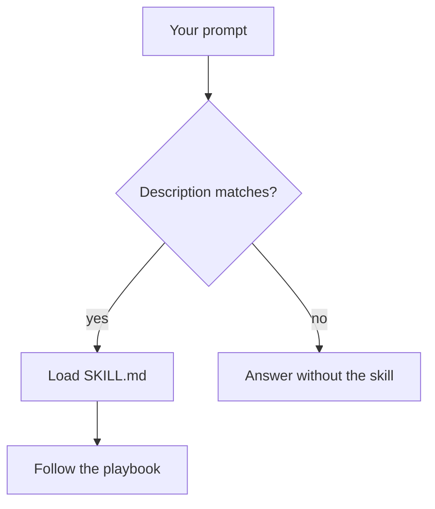
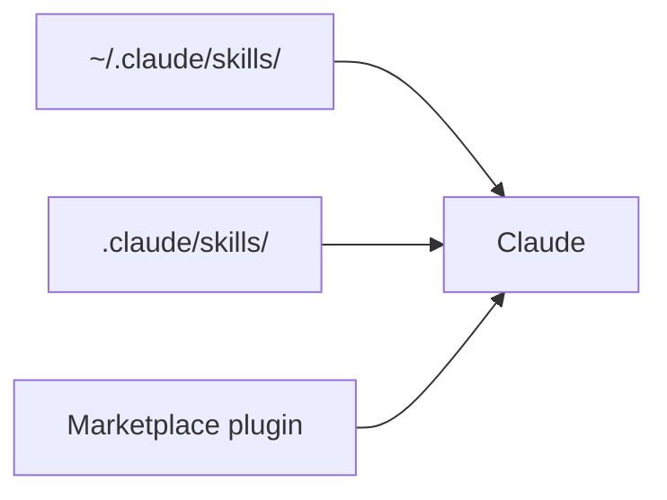

Claude can write Go. That is not the problem.

The problem is getting it to write Go the way your team expects.

Every new session I found myself repeating the same review comments: propagate `context.Context`, wrap errors, keep handlers off the database, do not invent a `utils` package, write tests the way this repo already writes them, run the project's linters. The code was often technically correct. It was not necessarily code I wanted to merge.

Skills gave me a way to turn those repeated comments into reusable instructions Claude can load when the task matches.

This is part 1 of a short series. Here I stay on the floor: what a skill is, when it beats `CLAUDE.md`, how to write a small one for a Go service, and how to tell if it actually helped. The next part is the denser setup — more skills, then agents, then something I would ship.

**Skills are not about making Claude a better Go developer. They are about making your engineering decisions reusable.**

## Claude knows Go. It does not know your project.

If you already use Claude Code on a backend, you have seen some version of this:

- The function compiles, but it ignores the package boundaries you spent a year defending.
- You paste the same "please wrap errors / please take a context" paragraph into the next chat.
- A new dependency shows up because it was fashionable in training data, not because this repo uses it.
- Tests exist, and they test nothing you care about.
- You spend more time reviewing generated code than you would have spent writing the change.

A model already knows the language. What it does not know is **how this team ships Go**. That gap is not a prompt-writing problem you should solve from scratch every Monday. It is a playbook problem.

The model is not the senior in the room. You are. The question is whether the agent spends the session fighting that, or following it.

## What is a skill?

A skill is a folder of instructions the agent loads when the task matches. The [Agent Skills](https://code.claude.com/docs/en/skills) format is a directory with a `SKILL.md`: YAML frontmatter so Claude knows *when* to use it, and markdown so it knows *what to do*. Extra files (`references/`, scripts) stay off the context window until they are needed.

```md
---
name: go-http-endpoint
description: Use when adding or reviewing an HTTP endpoint in this Go service.
---

Handlers live in internal/httpapi. They do not query the database.
Domain errors live in the service package. Map them to HTTP only in the transport layer.
```


That is the whole idea. Not a plugin that patches the model. Not a fine-tune. Procedural knowledge on disk, loaded on demand.

Claude sees the **name** and **description** up front. The body of `SKILL.md` is read only when the skill fires.



Two ways to fire it:

1. **Automatically.** You ask for something that matches the description.
2. **Explicitly.** You type `/skill-name` in Claude Code. Custom commands and skills have been merged; `.claude/skills/deploy/SKILL.md` is `/deploy`.

Where you put the folder decides who sees it:

| Location | Path | Scope |
| --- | --- | --- |
| Personal | `~/.claude/skills/<name>/SKILL.md` | Every project on your machine |
| Project | `.claude/skills/<name>/SKILL.md` | This repo |
| Plugin | a marketplace plugin's `skills/` | Wherever that plugin is enabled |



A generic Go skill that only says "use `%w`" is usually a weak one. Any current model already knows that. The skill worth writing encodes **this repo**.

## Skills vs CLAUDE.md

If you already use Claude Code, this is the first question: why not put everything in `CLAUDE.md`?

Because they solve different jobs.

| CLAUDE.md | Skills |
| --- | --- |
| Always in context | Loaded when the task matches |
| What this repo *is* | How to do a *kind of change* |
| Layout, stack, always-on commands | A procedure: endpoint, migration, review |
| Short, stable facts | Longer checklists you do not want on every YAML tweak |

`CLAUDE.md`:

```md
This is a Go service with PostgreSQL.

Keep the current package layout: internal/user for domain, internal/httpapi for HTTP.
Run golangci-lint before you consider the change done.
```

A skill:

```md
---
name: go-http-endpoint
description: Use when adding or reviewing an HTTP handler or its service method.
---

When adding an endpoint:

1. Put the handler in internal/httpapi. It may read the request, call a service, write the response.
2. Do not open a database handle in the handler.
3. I/O methods take context.Context as the first argument.
4. Domain errors belong in the service package (ErrNotFound, ErrConflict).
5. Translate those errors to HTTP status codes only in the transport layer.
6. Tests use testify/require, not t.Fatal directly.
7. Run golangci-lint on the packages you touched.
```

Facts that should always be true go in `CLAUDE.md`. A procedure you run ten times a month goes in a skill. If you dump the procedure into `CLAUDE.md`, you pay for it on every prompt, including the ones that are not about HTTP.

Triggering is not a type system. Descriptions misfire. You still glance at whether the skill actually loaded. That is a reason to keep skills few and the `description` specific, not a reason to put the whole playbook in `CLAUDE.md`.

## A small Go skill, from scratch

I am not going to demo "Claude discovered `%w`." That does not need a skill. I am going to demo a skill that knows **how this service is shaped**.

Imagine a boring user service:

```text
internal/user/      # domain, service, SQL
internal/httpapi/   # HTTP only
```

House rules, the kind you leave as review comments:

- Handlers never touch the database.
- Domain errors live next to the service.
- HTTP mapping happens only at the edge.
- Anything that does I/O takes `context.Context`.
- Tests use `testify/require`.
- Touched packages must pass `golangci-lint`.

Drop this in `.claude/skills/go-http-endpoint/SKILL.md` (project skill, so the next person on the repo gets it too):

```md
---
name: go-http-endpoint
description: "Use when adding, changing, or reviewing an HTTP endpoint in this Go service. Covers handler vs service boundaries, domain errors, context on I/O, testify tests, and golangci-lint."
---

You are implementing a change in this repository, not writing a Go tutorial.

## Layout

- internal/user: User, Service, SQL, domain errors (ErrNotFound, ErrConflict).
- internal/httpapi: HTTP handlers and status mapping only.

## Rules

1. Handlers do not import database/sql or run queries.
2. Service methods that do I/O take ctx context.Context as the first parameter.
3. Wrap errors with fmt.Errorf("verb noun: %w", err). Lowercase, no trailing punctuation.
4. sql.ErrNoRows becomes ErrNotFound in the service. The handler maps ErrNotFound to 404.
5. Log or return, never both. Logging HTTP happens in middleware, not in the handler.
6. Tests live next to the code and use github.com/stretchr/testify/require.
7. After edits, run: golangci-lint run ./internal/user/... ./internal/httpapi/...
```

That file is the senior review comment, reusable.

## Putting it to work

Ask for an endpoint with no extra ceremony:

```text
Add GET /users/{id} that returns a user from Postgres.
```

A typical first draft — valid Go, wrong shape for this repo — looks like this:

```go
func GetUser(w http.ResponseWriter, r *http.Request) {
    id := r.PathValue("id")
    row := db.QueryRow(`select id, email from users where id = $1`, id)
    var u User
    if err := row.Scan(&u.ID, &u.Email); err != nil {
        log.Printf("failed to get user: %v", err)
        http.Error(w, err.Error(), http.StatusInternalServerError)
        return
    }
    _ = json.NewEncoder(w).Encode(u)
}
```

It compiles. It also:

- queries from the handler
- ignores `r.Context()`
- leaks the driver error to the client
- logs and returns the same failure
- has no `ErrNotFound`, so "missing user" and "postgres is down" are both 500

Then invoke the skill on purpose:

```text
/go-http-endpoint

Add GET /users/{id}.
Follow the skill. Do not query from the handler.
```

The playbook produces two packages, not one clever function. Service first — note `QueryRowContext` plus `Scan`, which is where `sql.ErrNoRows` actually appears:

```go
package user

var ErrNotFound = errors.New("user not found")

func (s *Service) Get(ctx context.Context, id string) (*User, error) {
    var u User
    err := s.db.QueryRowContext(ctx, queryUserByID, id).Scan(&u.ID, &u.Email)
    if err != nil {
        if errors.Is(err, sql.ErrNoRows) {
            return nil, fmt.Errorf("get user %s: %w", id, ErrNotFound)
        }
        return nil, fmt.Errorf("get user %s: %w", id, err)
    }
    return &u, nil
}
```

Handler only translates:

```go
package httpapi

func (h *Handler) GetUser(w http.ResponseWriter, r *http.Request) {
    u, err := h.users.Get(r.Context(), r.PathValue("id"))
    if err != nil {
        writeError(w, err)
        return
    }
    writeJSON(w, http.StatusOK, u)
}

func writeError(w http.ResponseWriter, err error) {
    switch {
    case errors.Is(err, user.ErrNotFound):
        http.Error(w, "not found", http.StatusNotFound)
    default:
        http.Error(w, "internal error", http.StatusInternalServerError)
    }
}
```

A test that matches the repo, not a `t.Fatal` tutorial:

```go
func TestGet_notFound(t *testing.T) {
    svc := newTestService(t) // empty db
    _, err := svc.Get(context.Background(), "missing")
    require.ErrorIs(t, err, ErrNotFound)
}
```

Five minutes, copy-paste:

```bash
mkdir -p .claude/skills/go-http-endpoint
# paste the SKILL.md from above
```

```text
claude
```

```text
/go-http-endpoint

Review internal/httpapi and internal/user for GET /users/{id}.
Focus on handler vs service, domain errors, and duplicated logging.
Do not modify unrelated code.
```

If you would rather start from a public pack instead of writing the first file, this is enough:

```bash
npx skills add samber/cc-skills-golang --skill golang-error-handling
```


Use that pack for language mechanics. Use a **project** skill for architecture. They are not the same job.

## Did it actually help?

A generic model can suggest `context`, `%w`, and `errors.Is` without any skill. If that is all you needed, do not install one.

What the model cannot guess — because it is not in Go, it is in *this* repo — is the table below.

| Decision | Without a project skill | With `go-http-endpoint` |
| --- | --- | --- |
| Where does SQL live? | Often in the handler | `internal/user` |
| Missing row | `http.Error(..., 500)` or raw `err.Error()` | `ErrNotFound` → 404 at the edge |
| Context | Easy to drop | First argument on I/O |
| Logging | `log` in the handler | middleware; handler does not log-and-return |
| Tests | `testing` helpers at random | `require.ErrorIs` |
| Lint | Maybe | `golangci-lint run` on touched packages |

I did not A/B two logged Claude Code sessions for this post. I am not going to invent a transcript. The comparison that matters is cheaper than that: **read the diff against the house rules.** If Claude still opens `database/sql` in `httpapi`, the skill did not fire or the description is wrong. If the SQL moved and the 404 mapping sat in the handler, the skill is too vague.

Triggering is not a type system. After a change, check that the skill was actually applied — in Claude Code you can see it load — then judge the diff the way you judge a junior's PR.

If that diff is not cheaper than writing the comment yourself, the skill is the wrong one.

## Finding existing skills

You do not have to write the first one. [skills.sh](https://skills.sh) is a directory; GitHub is where the files live. For Go language mechanics I would look at [samber/cc-skills-golang](https://github.com/samber/cc-skills-golang). Install one skill, not the whole tree, until you have seen it fire.

```bash
npx skills add samber/cc-skills-golang --skill golang-error-handling
```

Or, in Claude Code:

```text
/plugin marketplace add samber/cc
/plugin install cc-skills-golang@samber
```

Anthropic's examples are at [github.com/anthropics/skills](https://github.com/anthropics/skills). They show the format. They are not a substitute for your package layout.

Skills are not limited to backend work. Hugging Face publishes the same `SKILL.md` format for models, datasets, and the Hub. Useful if that is the task. Irrelevant if you are trying to keep handlers off SQL.

Clone works too: copy the skill directory so `SKILL.md` and `references/` stay together, into `~/.claude/skills/` or `.claude/skills/`.

## When not to use a skill

A skill is instructions for an agent. It is not enforcement. `gofmt` still formats. `golangci-lint` still fails the CI. `go test` still runs.

| Need | Tool |
| --- | --- |
| Format Go | `gofmt` / `gofumpt` |
| Static checks | `golangci-lint` |
| Tests | `go test` |
| What this repo is | `CLAUDE.md` |
| A repeatable review or implementation procedure | Skill |
| A deterministic operation | Script or Makefile |

Do not create a skill to replace a linter. Do not create a skill for a one-off. Do not create a skill that restates the Go spec. Create one when you are tired of pasting the same architectural review comment.

The cons, if you ignore that:

- A vague skill makes the agent confidently wrong, faster.
- Skills rot when the layout changes and the file does not.
- You still own the diff.

## What comes next

You should be able to leave this page and, tomorrow, put one project skill next to a handler you actually maintain.

Part 2 is the rest of the stack: several skills in the same repo, then agents that use them to build a service rather than a snippet. This part is the floor — one playbook, one endpoint, a diff you can judge.
