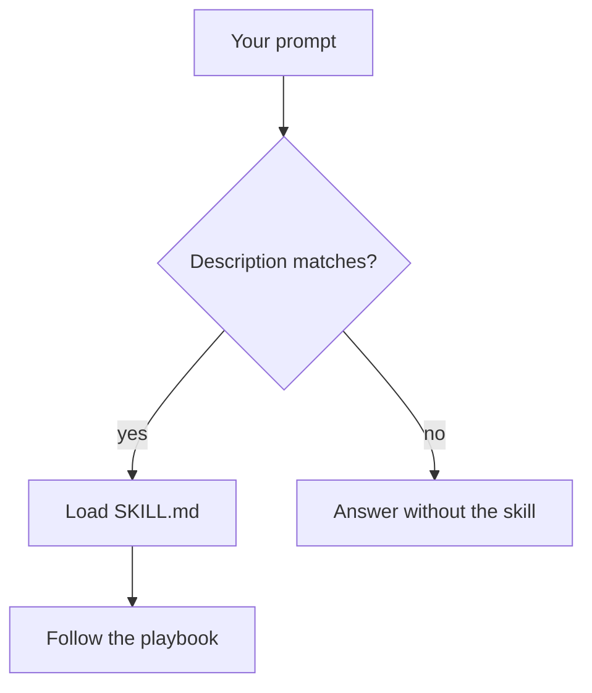

> **What this is.** How to encode a repo's conventions as a Claude Code skill, and how to decide what belongs in one.
>
> **What it is not.** Evidence that skills work. That is [part 2](/blog/go-skills-part-2), which runs the same change with and without the file and compares the diffs.
>
> **Assumed.** Working Go, a repo that already has conventions, Claude Code installed.
>
> **You leave with.** One project skill, and a rule for what to keep out of it.

Claude can write Go. That is not the problem.

The problem is getting it to write Go the way this repo already does.

One generated function wraps errors so `errors.Is` still works. The next one returns `err` bare. One handler uses `r.Context()`. The next one calls `context.Background()`. One change stays inside the packages you already have. The next one invents a `utils` folder and a store interface nobody asked for.

Those are not failures of language knowledge. They are failures of consistency. The model does not remember last week's review comments.

Skills gave me a way to turn those comments into instructions Claude can load when the task matches.

**The goal is not to make Claude a better Go developer. It is to make the engineering decisions I already made reusable.**

The skill in this post is a first encoding of those decisions: architecture, layout, and Go implementation rules. [Part 2](/blog/go-skills-part-2) evaluates which of those instructions actually add value once Claude already has the codebase and `CLAUDE.md`. I did not go back and trim the file to make that run look better.

## Claude knows Go. It does not know your project

If you already use Claude Code on a backend, you have seen some version of this:

- The function compiles, but it ignores the package boundaries you spent a year defending.
- You paste the same "please wrap errors / please take a context" paragraph into the next chat.
- A new dependency shows up because it was fashionable in training data, not because this repo uses it.
- Tests exist, and they test nothing you care about.
- You spend more time reviewing generated code than you would have spent writing the change.

It helps to keep four jobs separate:

1. Knowing the language. The model already does this.
2. Following this project's conventions. Layering, error mapping, how tests are written here.
3. Generating code that compiles and does what you asked.
4. Producing software you would merge.

A skill is useful for the second job. It does not replace judgment, tests, or review, and it does not guarantee the third or the fourth. Following a playbook is not the same as shipping maintainable software.

The model is not the senior in the room. You are. The question is whether the agent spends the session fighting that, or following it.

## What is a skill?

A skill is a folder of instructions the agent loads when the task matches. The [Agent Skills](https://code.claude.com/docs/en/skills) format is a directory with a `SKILL.md`: YAML frontmatter so Claude knows *when* to use it, and markdown so it knows *what to do*. Extra files (`references/`, scripts) stay off the context window until they are needed.

The format is not exclusive to Claude Code — the same folder works through the API and the Agent SDK. Everything below uses Claude Code because that is where I ran it, and because the slash-command ergonomics matter to the workflow.

```md
---
name: go-http-endpoint
description: Use when adding or reviewing an HTTP endpoint in this Go service.
---

Handlers live in internal/httpapi. They do not query the database.
Domain errors live in the service package. Map them to HTTP only in the transport layer.
```


That is the whole idea. Not a plugin that patches the model. Not a fine-tune. Procedural knowledge on disk, loaded on demand.

Claude sees the **name** and **description** up front. The body of `SKILL.md` is read only when the skill fires. In a project skill, the slash command comes from the folder name. `name` in the frontmatter is a label.



Two ways to fire it:

1. **Automatically.** You ask for something that matches the description.
2. **Explicitly.** You type `/go-http-endpoint`. Custom commands and skills have been merged; `.claude/skills/deploy/SKILL.md` is `/deploy`. (True as of Claude Code 2.x. This is the kind of detail that rots — check the docs if your version disagrees.)

One frontmatter field the minimal example above leaves out: `allowed-tools`. A skill whose last step is "run `golangci-lint`" needs `Bash` to be available, and constraining the list is how you stop a formatting playbook from editing files.

Where you put the folder decides who sees it:

| Location | Path | Scope |
| --- | --- | --- |
| Personal | `~/.claude/skills/<name>/SKILL.md` | Every project on your machine |
| Project | `.claude/skills/<name>/SKILL.md` | This repo |
| Plugin | a marketplace plugin's `skills/` | Wherever that plugin is enabled |

A generic Go skill that only says "use `%w`" is usually a weak one. Any current model already knows that. The skill worth writing encodes **this repo**.

## Skills vs CLAUDE.md

If you already use Claude Code, this is the first question: why not put everything in `CLAUDE.md`?

Because they solve different jobs.

| Need | Where it goes | Loaded |
| --- | --- | --- |
| Describe the architecture of the repo | `CLAUDE.md` | Always |
| State conventions that should always hold | `CLAUDE.md` | Always |
| Apply a procedure for a kind of change | Skill | When the description matches |
| Do a big read-only sweep without flooding the main context | Subagent | When delegated |
| Enforce something mechanically, every time, no matter the prompt | Hook | On the tool event |
| Reach a system the model cannot read from disk | MCP server | On tool call |
| Run a deterministic check | Scripts, tests, linters | In CI, and in the skill's last step |

The row people skip is the hook. If an instruction must hold *every single time* — "never commit to main", "always `gofmt` after an edit" — a skill is the wrong tool, because a skill is advice the model can decline. A hook is the harness doing it. Put determinism in hooks and CI; put judgement in skills.

`CLAUDE.md` is always in context. A skill is loaded when the task matches. Dump the HTTP playbook into `CLAUDE.md` and you pay for it on every prompt, including the ones that are not about HTTP.

Facts that should always be true belong in `CLAUDE.md`:

```md
This is a Go service with PostgreSQL.

Keep the current package layout: internal/user for domain, internal/httpapi for HTTP.
Run golangci-lint before you consider the change done.
```

The procedure for adding an endpoint belongs in a skill: put the handler in `internal/httpapi`, keep SQL in the service, take `context.Context` on I/O, map domain errors to HTTP only at the edge, write tests the way this repo already writes them.

Triggering is not a type system. Descriptions misfire. You still glance at whether the skill actually loaded. That is a reason to keep skills few and the `description` specific, not a reason to put the whole playbook in `CLAUDE.md`.

## A small Go skill, from scratch

I am not going to demo "Claude discovered `%w`." That does not need a skill. I am going to demo a first attempt at encoding **how this service is shaped**. Whether every bullet is worth keeping is a later measurement, not a claim I get to make from the file itself.

Imagine a boring user service:

```text
internal/user/      # domain, service, SQL
internal/httpapi/   # HTTP only
```

House rules, the kind you leave as review comments:

- Handlers never touch the database.
- Domain errors live next to the service.
- HTTP mapping happens only at the edge.
- Anything that does I/O takes `context.Context`.
- Wrap errors so they stay inspectable.
- Log or return, never both.
- Tests use `testify/require`.
- Touched packages must pass `golangci-lint`.

Drop this in `.claude/skills/go-http-endpoint/SKILL.md` (project skill, so the next person on the repo gets it too):

```md
---
name: go-http-endpoint
description: "Use when adding, changing, or reviewing an HTTP endpoint in this Go service. Covers handler vs service boundaries, domain errors, context on I/O, testify tests, and golangci-lint."
---

You are implementing a change in this repository, not writing a Go tutorial.

## Layout

- internal/user: User, Service, SQL, domain errors (ErrNotFound, ErrConflict).
- internal/httpapi: HTTP handlers and status mapping only.

## Rules

1. Handlers do not import database/sql or run queries.
2. Service methods that do I/O take ctx context.Context as the first parameter.
3. Wrap errors with fmt.Errorf("verb noun: %w", err). Lowercase, no trailing punctuation.
4. sql.ErrNoRows becomes ErrNotFound in the service. The handler maps ErrNotFound to 404.
5. Log or return, never both. Logging HTTP happens in middleware, not in the handler.
6. Tests live next to the code and use github.com/stretchr/testify/require.
7. After edits, run: golangci-lint run ./internal/user/... ./internal/httpapi/...
```

That file is the senior review comment, reusable. It is also a first encoding, not a proof that every bullet will move the next PR.

### Keep `SKILL.md` short, put the long part in `references/`

`SKILL.md` is loaded whole when the skill fires. Everything in it is context you pay for on that task, so the file should be the procedure and nothing else. Detail that is only needed sometimes goes next to it:

```text
.claude/skills/go-http-endpoint/
  SKILL.md              # the 7 steps, always read when the skill fires
  references/
    testing.md          # the full test matrix, read only when writing tests
    errors.md           # every sentinel in the repo and its status code
```

Then point at them from the body, and let the agent decide:

```md
6. Tests live next to the code. For the full matrix of cases this repo
   expects, read references/testing.md before writing them.
```

This is the mechanism people miss. A 400-line `SKILL.md` is not a thorough skill, it is a skill that spends its budget before the agent writes a line.

## Putting it to work

These snippets show the conventions the skill is trying to communicate. They are not a transcript, and they do not claim Claude necessarily produces the first version. Part 2 is the measured comparison.

### The task

```text
Add GET /users/{id} that returns a user from Postgres.
```

### A draft that ignores the house rules

Valid Go, wrong shape for this repo. This is the kind of design the playbook exists to name, not a claim about what every session without a skill produces:

```go
func GetUser(w http.ResponseWriter, r *http.Request) {
    id := r.PathValue("id")
    row := db.QueryRow(`select id, email from users where id = $1`, id)
    var u User
    if err := row.Scan(&u.ID, &u.Email); err != nil {
        log.Printf("failed to get user: %v", err)
        http.Error(w, err.Error(), http.StatusInternalServerError)
        return
    }
    _ = json.NewEncoder(w).Encode(u)
}
```

It compiles. It also:

- queries from the handler
- ignores `r.Context()` (`QueryRow` has no `context.Context`; `QueryRowContext` does)
- leaks the driver error to the client
- logs and returns the same failure
- has no `ErrNotFound`, so "missing user" and "postgres is down" are both 500

That is the interesting failure mode the skill is encoding. Not a syntax error. A design that `database/sql` does not forbid, and that this repo does.

### Following the playbook

Invoke it on purpose:

```text
/go-http-endpoint

Add GET /users/{id}.
Follow the skill. Do not query from the handler.
```

The playbook describes two packages, not one clever function. `s.db` here is `*sql.DB`. `QueryRowContext` returns `*sql.Row`, not `(*sql.Row, error)`. The error shows up on `Scan`, which is also where `sql.ErrNoRows` appears:

```go
package user

var ErrNotFound = errors.New("user not found")

func (s *Service) Get(ctx context.Context, id string) (*User, error) {
    var u User
    err := s.db.QueryRowContext(ctx, queryUserByID, id).Scan(&u.ID, &u.Email)
    if err != nil {
        if errors.Is(err, sql.ErrNoRows) {
            return nil, fmt.Errorf("get user %s: %w", id, ErrNotFound)
        }
        return nil, fmt.Errorf("get user %s: %w", id, err)
    }
    return &u, nil
}
```

Mapping `sql.ErrNoRows` to `ErrNotFound` is the convention. The handler can then use `errors.Is` without importing `database/sql`. The original driver error is not in that chain. That is a choice this repo made, not something Go requires.

It is also a choice worth making on purpose, because Go gives you both. Since 1.20 `fmt.Errorf` accepts more than one `%w`:

```go
return nil, fmt.Errorf("get user %s: %w: %w", id, ErrNotFound, err)
```

Now `errors.Is(err, ErrNotFound)` is true *and* `errors.Is(err, sql.ErrNoRows)` is true. The handler still maps one sentinel to 404; the log still has the driver error. The cost is that "not found" is permanently welded to one storage failure, so a future in-memory implementation returns an error that claims `sql.ErrNoRows`.

Pick one and write it down. This repo drops the driver error, because `sql.ErrNoRows` carries nothing a 404 needs. That sentence is exactly the kind of decision a skill exists to stop re-litigating.

Handler only translates:

```go
package httpapi

func (h *Handler) GetUser(w http.ResponseWriter, r *http.Request) {
    u, err := h.users.Get(r.Context(), r.PathValue("id"))
    if err != nil {
        writeError(w, err)
        return
    }
    writeJSON(w, http.StatusOK, u)
}

func writeError(w http.ResponseWriter, err error) {
    switch {
    case errors.Is(err, user.ErrNotFound):
        http.Error(w, "not found", http.StatusNotFound)
    default:
        http.Error(w, "internal error", http.StatusInternalServerError)
    }
}
```

A test that matches the repo, not a `t.Fatal` tutorial. `newTestService` is a stand-in for whatever helper this package already uses:

```go
func TestGet_notFound(t *testing.T) {
    svc := newTestService(t) // empty db
    _, err := svc.Get(context.Background(), "missing")
    require.ErrorIs(t, err, ErrNotFound)
}
```

### What the playbook is communicating

| Decision | Draft that ignores the house rules | Draft that follows `go-http-endpoint` |
| --- | --- | --- |
| Where does SQL live? | In the handler | `internal/user` |
| Missing row | `http.Error(..., 500)` or raw `err.Error()` | `ErrNotFound` → 404 at the edge |
| Context | Absent | First argument on I/O; `r.Context()` at the edge |
| Error wrapping | Bare `err`, or a string that `errors.Is` cannot inspect | `fmt.Errorf("…: %w", err)` |
| Logging | `log` in the handler | middleware; handler does not log-and-return |
| Tests | `testing` helpers at random | `require.ErrorIs` |
| Lint | Missing | `golangci-lint run` on touched packages |

The table is a map of the conventions, not a measured before-and-after. Whether Claude needed the file for any of it is an empirical question, and the answer turns out to be uncomfortable: on a tidy repo, most of this column is free.

The examples also do not prove the query is correct, that the handler is safe to expose, or that the tests cover a closed database. That is still review.

If you do invoke the skill and Claude still opens `database/sql` in `httpapi`, the skill did not fire or the description is wrong. If the SQL moved and the 404 mapping sat in the handler, the skill is too vague. After a change, check that the skill was actually applied, then judge the diff the way you judge a junior's PR.

If that diff is not cheaper than writing the comment yourself, the skill is the wrong one.

## What belongs in a skill

A skill is worth writing when you keep pasting the same instructions, and those instructions need domain knowledge or a repeatable workflow.

The most useful question for an experienced engineer is not how to create `SKILL.md`. It is which recurring engineering decisions deserve one.

[Part 2](/blog/go-skills-part-2) is a concrete case. The baseline agent followed the repository's architecture from the existing code and `CLAUDE.md`. What it skipped was a persistence-failure test for the new endpoint. Repeating the whole layout in a skill would have duplicated knowledge the agent already used. A small implementation playbook that includes the missing verification procedure is the skill worth keeping.

Before writing the file, read `CLAUDE.md` and the last two similar diffs. Whatever those already communicate does not belong in the skill. The comments you still leave after that — the closed-database test, the SQL fixture `Create` cannot produce, the sentinel that has to be mapped in `writeError` — those are the skill. The skill should complement what the repository already shows, not copy it.

Typical candidates:

- Project-specific error handling: wrap with `%w`, map `sql.ErrNoRows` at the service boundary, do not log and return.
- How this repo adds an HTTP endpoint, when that procedure is not obvious from the last handler.
- How this repo writes tests, including the cases people skip.
- Observability: where logs live, what not to log, which metrics already exist.
- A code-review checklist you already apply by hand.

A single instruction for one task belongs in the prompt. Standing facts about the repo belong in `CLAUDE.md`. General knowledge the model already handles — "use `%w`", "accept `context.Context`" as slogans with no project shape behind them — does not justify a skill.

Do not create a skill to replace a linter. `golangci-lint` already fails the build. The skill can remind the agent to run it. It cannot be the check.

The point is not to have more skills. It is to stop re-teaching the comments you still leave.

## Install it

Recommended path for this: a project skill, committed with the repo.

```bash
mkdir -p .claude/skills/go-http-endpoint
```

Paste the `SKILL.md` from above. Start Claude Code in the repo (`claude`), then run `/skills`. The skill should appear in the list. If it does not, the usual mistake is a file at `.claude/skills/go-http-endpoint.md` instead of `.claude/skills/go-http-endpoint/SKILL.md`.

Invoke it once on purpose with `/go-http-endpoint`. Then see whether it fires on its own from the description.

### When it does not fire

This is the first real friction, and "check that it loaded" is not advice. Work down this list:

1. **Is it listed?** Run `/skills`. If the skill is absent, it is a path problem, not a description problem. Stop here.
2. **Did it load on this turn?** Claude Code shows the skill in the transcript when it fires. If you asked for an endpoint and nothing loaded, the description did not match.
3. **Read your description as the only thing the model sees.** Until the skill fires, the body does not exist. `description: "Go conventions"` matches nothing, because the model is matching your prompt against that sentence alone. Name the trigger in the user's words: the paths, the verbs, the route prefix.
4. **Invoke it explicitly and compare.** If `/go-http-endpoint` produces the diff you wanted and the plain prompt does not, the file is fine and the description is wrong. Those are different bugs with different fixes.
5. **Check for competition.** Two skills with overlapping descriptions will trade off unpredictably. Fewer, sharper skills beat more, vaguer ones.

The description is the API of a skill. It is the part you will rewrite most, and the part that gets the least attention.

The [Agent Skills docs](https://code.claude.com/docs/en/skills) cover the rest of the layout. If you want a public pack for language mechanics, [samber/cc-skills-golang](https://github.com/samber/cc-skills-golang) exists. Use that for `%w`. Use a **project** skill for architecture. They are not the same job.

## Skills can make things worse

A skill is an engineering aid, not a validation mechanism.

It can encode last year's layout. It can fight `CLAUDE.md`, or fight another skill. It can demand an interface this package does not need. It can assume tables, driver, or error names this repo does not have. The agent can follow the file and still produce code that does not compile. It can produce code that compiles and still does the wrong thing: a 404 for a down database, a query that ignores the request context you thought you had propagated, a test that asserts a string instead of `ErrNotFound`.

**Following instructions is not equivalent to producing correct software.** You still own the diff.

That is also why skills rot.

If `internal/httpapi` moves, the skill that names it is now lying. If the team drops `testify`, the skill will keep generating `require.ErrorIs` until someone notices. There is no compiler for `SKILL.md`. A dependency bump, a new logging library, a layout change — none of that updates the file.

Who reviews them? Whoever reviews the code they produce. Treat a project skill as you would a Makefile: it lives in the repo, it changes in a PR, and if it starts shipping the wrong shape, you fix the file. You do not keep pasting a correction into chat.

How do you know it went stale? The diffs stop matching the house rules. Handler SQL comes back. You hear yourself explaining the same comment again. That is the signal. Update the skill or delete it.

A vague skill makes the agent confidently wrong, faster. An unused skill is a file. A rotting skill is a machine that re-teaches the wrong architecture.

## Leave with one file

Creating a skill is iterative:

1. Identify the recurring engineering decisions.
2. Encode them.
3. Evaluate whether they change the diff.
4. Remove anything that only duplicates what the repository already communicates.

Pick a recurring change in a repo you actually maintain. Write down what the last two similar diffs and `CLAUDE.md` already show. Put only the rest in a project skill and invoke it on purpose once.

That is how you create the file. It is not how you know the file is worth keeping. The skill in this post is step 2. [Part 2](/blog/go-skills-part-2) is step 3: the same kind of change, measured, with the codebase and `CLAUDE.md` already in context.

For the record, this is what step 4 did to the file above once the measurement was in. Six of the eight rules were already in the code and `CLAUDE.md`, so they went:

```md
---
name: go-http-endpoint
description: "Use when adding or changing a route in this Go service — handlers in internal/httpapi, service methods in internal/user, or a new domain error that needs an HTTP status."
allowed-tools: Read, Edit, Bash(go test:*), Bash(golangci-lint:*)
---

Read the most recent handler in internal/httpapi before writing anything.
The layout, the wrapping style, and the logging rule are in the code and CLAUDE.md.
This file is only the part the code does not show you:

1. New sentinel goes next to the existing ones in internal/user, and is mapped
   in writeError. Nowhere else.
2. Every new service method gets a closed-database test. Copy the shape of
   TestGetDatabaseFailure. This is the one that gets skipped.
3. States Create cannot produce must be inserted with SQL in the test package.
4. Run golangci-lint run ./internal/user/... ./internal/httpapi/... and report
   the real output. Do not claim a pass you did not run.
```

Shorter, and the only file I would still be maintaining a year from now. Get there by deleting, not by drafting it right the first time.

On a tidy repo the architecture may already be in the code. A skill that restates it will not move the PR. The instructions worth maintaining are the ones that still change the work.

The goal is not to make Claude write better Go. It is to make those decisions reusable, so you stop explaining them every time you start a new session.
