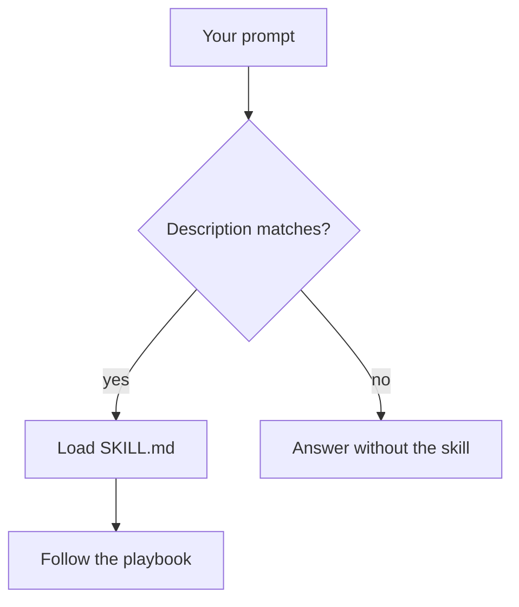
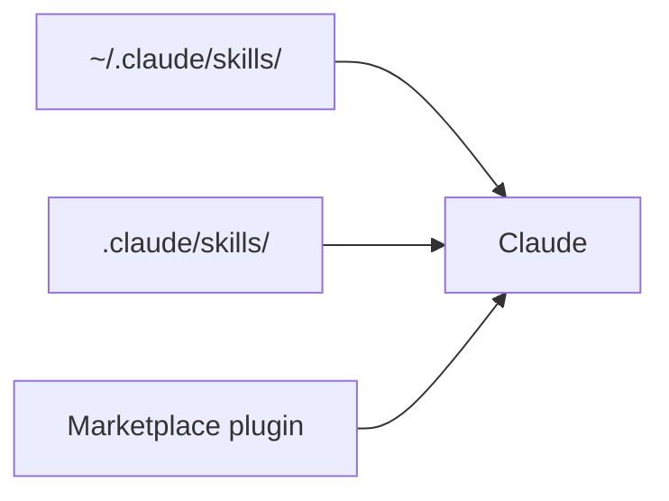
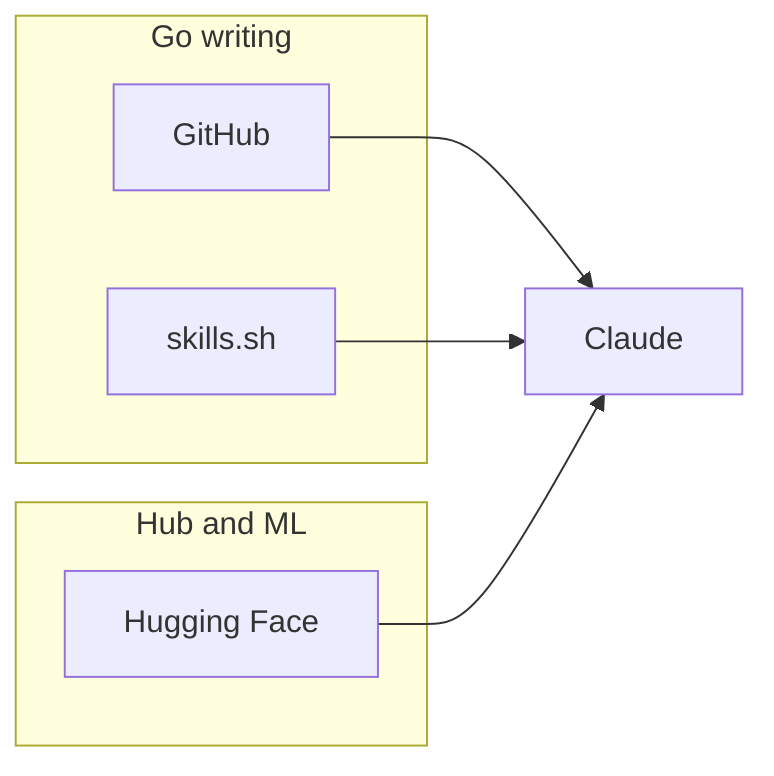
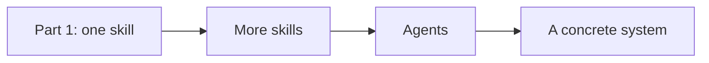

I am a backend developer. Most of my day is still Go, APIs, and the systems around them. At some point, **understanding and using skills stopped being a curiosity and became a practice I need** if I want to deliver fast and without repeating myself every session.

A model already knows the language. What it does not know is how I want the work done: error wrapping, `context.Context` through the stack, tests that fail for the right reason, `golangci-lint` instead of a random set of nits. Skills are how I put that into the loop.

This is the first article. The goal is the **base**: what a skill is, how to use it with Claude, and where to download one. Later I want to go further — a denser ecosystem, more skills talking to each other, and agents that can actually build something concrete. Not yet. First the mechanics.

## What a skill is

A skill is a small folder of instructions the agent can load when the task matches. The Agent Skills standard is a directory with a `SKILL.md`: YAML frontmatter so the agent knows *when* to use it, and markdown so it knows *what to do*. Optional `references/`, scripts, and configs sit next to that file and stay off the context window until they are needed.

```md
---
name: golang-error-handling
description: Go error wrapping, sentinels, and panic recovery. Use when writing or reviewing error paths in Go.
---

Prefer fmt.Errorf with %w. Check with errors.Is / errors.As.
Do not panic in library code.
```


That is the whole idea. Not a plugin that patches the model. Not a fine-tune. Procedural knowledge on disk, loaded on demand.

Without a skill, Claude improvises from training data. With one, it follows a checklist you (or someone who writes a lot of Go) already paid for. The official Claude Code docs put it simply: if you keep pasting the same procedure into chat, it belongs in a skill.



For this post, one skill is enough to understand the shape. A later post is where I want several of them — and agents — to work as a system.

## How to use it with Claude

In [Claude Code](https://code.claude.com/docs/en/skills), skills live in a few places. Where you put them decides who sees them. That is the base you need before you start composing a larger setup.

| Location | Path | Scope |
| --- | --- | --- |
| Personal | `~/.claude/skills/<name>/SKILL.md` | Every project on your machine |
| Project | `.claude/skills/<name>/SKILL.md` | This repo, shareable with the team |
| Plugin | a marketplace plugin's `skills/` | Wherever that plugin is enabled |



Claude sees the **name** and **description** up front. The body of `SKILL.md` is read only when the skill fires. Two ways to fire it:

1. **Automatically.** You ask for something that matches the description — "wrap these errors properly", "add a table test for this package" — and Claude loads the skill.
2. **Explicitly.** You type `/skill-name` in Claude Code. Same as a slash command. Custom commands and skills have been merged; `.claude/skills/deploy/SKILL.md` is `/deploy`.

Once this is boring, the interesting part starts: an orchestrator plus focused skills. [samber/cc-skills-golang](https://github.com/samber/cc-skills-golang) ships `golang-how-to` for that. On a Go task it decides whether you need `golang-grpc` plus testing, or `golang-troubleshooting` plus safety, instead of dumping every guideline into context. That is already a small ecosystem. I will come back to it when I wire several skills — and agents — around a real service.

You can also write a tiny personal skill. If you always want `errgroup` with a derived context, or you never want a helper package called `utils`, put that in `~/.claude/skills/` and stop repeating it. House rules first. Composition later.

On claude.ai the same format applies: zip the skill folder and upload it under Customize → Skills.

## Why an experienced developer would bother

A skill does not teach you Go. If you already know how you want errors wrapped, where `context` belongs, and what a bad test looks like, the model is not the senior in the room. You are. The question is whether the agent will spend the session fighting that, or following it.

The **pros** are mostly about speed without lowering the bar:

- **Your judgment survives the session.** The expensive part is not generating code. It is restating the same standard every time: no `utils` package, `%w` on wrap, table tests, no hidden `context.Background()` in a library. A skill is that standard on disk.
- **You review instead of re-teaching.** Reading a diff that already follows your playbook is faster than rewriting a clever-but-wrong helper. That is the actual time save for someone who can already write the code.
- **It loads only when it matches.** Unlike dumping a style guide into every prompt, the body of `SKILL.md` stays out of context until the task hits. You can keep a sharp Go skill without paying for it on a YAML change.
- **The bar is shareable.** A personal skill is for you. A project skill is for anyone (human or agent) touching the repo. That is closer to a linter than to a vibe.
- **It scales into the next step.** One skill is a playbook. Several skills plus agents is how you ship a service without the agent inventing a new architecture every hour. That is later. The base has to be worth it first.

The **cons** are real, just smaller if you stay picky:

- **A bad skill is worse than none.** A vague or trendy `SKILL.md` makes the agent confidently wrong, faster. Experienced people feel this immediately: the output looks "clean" and still fails the design.
- **Triggering is not a type system.** Descriptions misfire. The skill you wanted stays on disk; the one you did not want walks in. You still have to notice.
- **You still own the diff.** Skills do not replace review, `go test`, or production taste. They only change the first draft.
- **They rot.** Libraries move. Your house rules move. A skill you never re-read becomes folklore.

For me the trade is obvious if the skill is short, opinionated, and close to how I already work. If it reads like a tutorial for beginners, I would not install it.

## Using it: the prompt, and what comes back

The missing piece of "how to use it" is the output. A skill is not documentation you read. It is a playbook the agent applies to a concrete task. Here is a small one.

I installed `golang-error-handling` from [samber/cc-skills-golang](https://github.com/samber/cc-skills-golang) and pointed Claude at this function — the kind of first draft you get if you only say "load a user by id":

```go
func GetUser(id string) (*User, error) {
    user, err := db.Query(id)
    if err != nil {
        log.Printf("failed to get user: %v", err)
        return nil, err
    }
    return user, nil
}
```

Then I invoked the skill on purpose:

```text
/golang-error-handling
Review this GetUser function and rewrite the error path the way the skill would.
```

That is the whole loop: a file on disk, a slash command (or a prompt that matches the description), a pass over real code.

Without the skill, a model often leaves this as-is, or "cleans it up" in ways that still fail production: return the raw driver error, log and return the same error (duplicate lines in your aggregator), compare errors with `==`, panic if the id is empty.

With `golang-error-handling` loaded, the skill's own rules fire. The short version of that playbook:

1. Always check the error — never `_`
2. Wrap with context using `fmt.Errorf("...: %w", err)`
3. Lowercase error strings, no trailing punctuation
4. `errors.Is` / `errors.As` instead of `==`
5. Log **or** return, never both
6. Sentinels for expected cases (`not found`); no `panic` for those

The rewrite I got back looks like this:

```go
var ErrUserNotFound = errors.New("user not found")

func GetUser(ctx context.Context, id string) (*User, error) {
    user, err := db.QueryRowContext(ctx, queryUserByID, id)
    if err != nil {
        if errors.Is(err, sql.ErrNoRows) {
            return nil, fmt.Errorf("get user %s: %w", id, ErrUserNotFound)
        }
        return nil, fmt.Errorf("get user %s: %w", id, err)
    }
    return user, nil
}
```

What changed, and why it matters if you already know Go:

| First draft | After the skill |
| --- | --- |
| `db.Query` with no `context` | `QueryRowContext` — the call can be cancelled |
| `log` + `return err` | only return — the caller logs once, at the edge |
| bare `err` | wrapped with `%w` and the operation name |
| no notion of "missing user" | `ErrUserNotFound` + `errors.Is` on `sql.ErrNoRows` |

The review pass is as useful as the rewrite. On the first draft the skill would flag, in order: swallowed context, log-and-return, missing wrap, no sentinel for a condition the HTTP layer will want to turn into 404.

That is the result. Not a smarter model. A first draft that already matches the bar I would have written in the review comment.

Install one skill. Point it at a function you would actually merge. Read the diff. If that diff is not cheaper than writing the comment yourself, the skill is the wrong one.

## Where to download them

Skills are files. Anyone can host them. For the base, you only need to know which shelf is which: **Go writing** versus **Hub / ML**, and how to get a file onto disk.

### GitHub (the one I would start with)

For writing Go, a solid pack is **[samber/cc-skills-golang](https://github.com/samber/cc-skills-golang)**. It is Go-only: style, naming, errors, safety, testing, concurrency, `context`, databases, gRPC, observability, performance. There is a second, smaller collection at [jkeddari/go-skills](https://github.com/jkeddari/go-skills) if you prefer fewer, broader skills.

Install with the skills CLI (works with Claude Code, Cursor, Codex, Gemini, and similar):

```bash
npx skills add https://github.com/samber/cc-skills-golang --all
```

Or one skill — which is the right move while you are still learning the mechanics:

```bash
npx skills add https://github.com/samber/cc-skills-golang --skill golang-error-handling
```

In Claude Code you can also add it as a plugin:

```text
/plugin marketplace add samber/cc
/plugin install cc-skills-golang@samber
```


Anthropic's own examples live at [github.com/anthropics/skills](https://github.com/anthropics/skills) (`/plugin marketplace add anthropics/skills`). Those are documents, design, and generic workflows, not a Go style guide. Still worth knowing the repo exists — it is the reference implementation of the format.

### skills.sh

[skills.sh](https://skills.sh) is the public directory for the same ecosystem. Search, copy an install line, done:

```bash
npx skills add samber/cc-skills-golang
```

This is the least magical option: a leaderboard of skills, GitHub underneath, one command to drop `SKILL.md` files where your agent already looks.

### Hugging Face

Hugging Face **does** ship Agent Skills, and they work with Claude. That is not the same as "Hugging Face is where Go skills live."

Their catalog is for **Hub / ML work**: `hf-cli` (download and upload models, datasets, Spaces, jobs), dataset browsing, trainers, evals, Gradio. Docs: [Skills on the Hub](https://huggingface.co/docs/hub/en/agents-skills). GitHub: [huggingface/skills](https://github.com/huggingface/skills).

```text
/plugin marketplace add huggingface/skills
/plugin install hf-cli@huggingface/skills
```

After `hf-cli` is in, more Hub skills install with:

```bash
hf skills add <skill-name>
```

So: use Hugging Face when the agent needs the Hub. Use GitHub / skills.sh when the agent needs to write idiomatic Go. You can host your own `SKILL.md` on the Hub like any other repo, but I have not found a Go-writing pack there that replaces samber's.



That split will matter more later, when a project needs both a Go playbook and a Hub toolbox in the same agent setup. For now, pick one skill and make sure it actually fires.

### Just clone it

If you do not want a CLI in the middle, copy the skill directory into place:

```bash
mkdir -p ~/.claude/skills
# copy each skill folder so SKILL.md, references/, and scripts/ stay together
```

Claude Code watches the skills directories; a new file shows up without a restart.

## What this article is, and what comes next

A skill is not "make Claude better at Go" in the abstract. It is a on-disk playbook: when this kind of change shows up, follow these rules, load these references, run these commands.

If you only take one thing from this post: **install one skill, invoke it on purpose, then let Claude pick it up on its own.** That is the base. Without it, stacking more skills or standing up agents is just more prompt soup.



Next I want the denser version: several Go skills in the same project, then agents that can use them to build something I would actually ship — a service, not a demo. That is the series. This was the floor.
