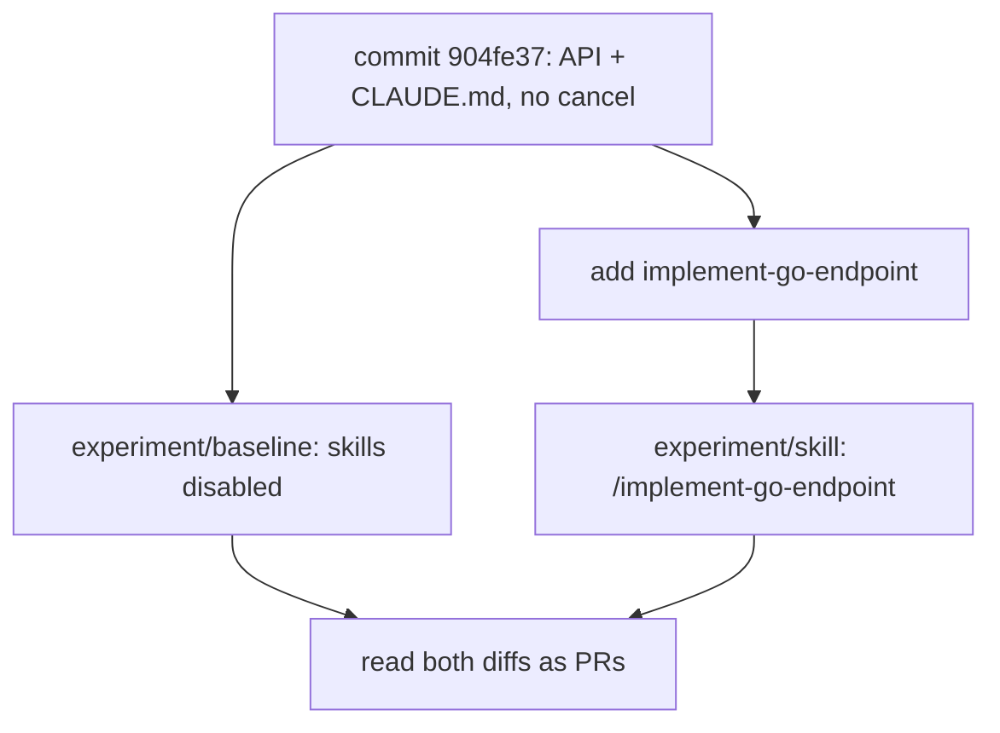

> **The question.** Does a skill improve the diff when Claude already has the codebase and a real `CLAUDE.md`?
>
> **The answer, n=1.** It did not save the architecture — the repo already had one. It changed which tests got written.
>
> **The caveat that matters.** One run per arm, and the two arms differ by more than the skill. Both are spelled out below.
>
> **You leave with.** A method for deciding which bullets of your own skill to delete.

[Part 1](/blog/go-skills-for-claude) encoded a first skill: architecture, layout, and Go implementation rules. This one asks which of those instructions were worth keeping once the repo already had conventions on disk.

Same model. Same feature. Same starting commit. One run with `CLAUDE.md` and the existing code. One run with a project skill on top. Then I read both diffs the way I would read two pull requests.

**The skill did not save the architecture. The repo already had one. It changed which tests got written.**

The fixture, both implementations, the skill, and the raw command output are in [tul1/go-skills-experiment](https://github.com/tul1/go-skills-experiment). I did not tidy either agent diff before recording it.

## The question

Part 1 treated a skill as a reusable review comment: handlers off the database, domain errors at the edge, context on I/O. That file was a first encoding. This article does not go back and trim it to flatter the results. It asks which of those instructions still add value when the repo already has conventions on disk.

So the experiment is narrower than "are skills good."

Does a skill actually improve the implementation when Claude already has an existing Go codebase and its conventions — and if it does, is that improvement the architecture, or a procedure the code never showed?

I did not try to make the baseline look bad. I did not change the feature request between runs. I did not compare different starting trees. I did not assume the skill version would win.

## The fixture

A small subscriptions API. Boring on purpose.

```text
cmd/api
internal/subscription   # domain, Service, SQL, sentinels
internal/httpapi        # handlers, writeError, slog middleware
```

`POST /subscriptions` and `GET /subscriptions/{id}` were already there. Statuses: `active`, `cancelled`, `expired`. Creates start `active`. `expired` exists so "already cancelled" and "this state cannot be cancelled" are two 409s.

`CLAUDE.md` states standing rules. It does **not** contain the endpoint playbook. That split is the whole point of [part 1](/blog/go-skills-for-claude): facts stay in `CLAUDE.md`, a procedure for one kind of change belongs in a skill.

Handlers already look like this:

```go
func (s *Server) getSubscription(w http.ResponseWriter, r *http.Request) {
    sub, err := s.subs.Get(r.Context(), r.PathValue("id"))
    if err != nil {
        writeError(w, err)
        return
    }
    writeJSON(w, http.StatusOK, sub)
}
```

`Get` already maps `sql.ErrNoRows` to `ErrNotFound`. Tests already cover a missing row and a closed database. The house rules are visible in the code, not only in a markdown file.

## The feature

Both agents got this exact request:

```text
Implement PATCH /subscriptions/{id}/cancel.

Follow the existing project conventions and architecture.

Add the necessary tests and verify the implementation.
```

Expected behaviour, frozen before either run:

- 404 if the subscription does not exist
- 409 if it is already cancelled
- 409 if it is `expired`
- cancel `active`, persist, return the updated row
- handle a database failure
- keep SQL out of the handler

## Two workflows, not two identical prompts

This is not a Cursor chat with a pasted prompt. Skills here are [Claude Code skills](https://code.claude.com/docs/en/skills). Pretending a Cursor rule is the same thing would be lying about the experiment.

It is also not an A/B of the same prompt with one boolean flipped. The baseline worktree sat on the fixture commit, which does not contain the skill at all — there was nothing on disk to load, and `--disable-slash-commands` was belt and braces on top of that. The skill session started with `/implement-go-endpoint`, which inlined the playbook before the agent wrote code. I am comparing two development workflows: codebase plus `CLAUDE.md`, versus that plus an explicit procedure.



Both runs: Claude Code 2.1.278, model `claude-sonnet-5`, isolated git worktrees, same machine. The skill file was authored from the fixture **before** I looked at the baseline diff, so it could not be tuned to "whatever the first agent got wrong."

Baseline:

```bash
claude -p --disable-slash-commands --model sonnet ...
```

Skill run, explicit invoke:

```text
/implement-go-endpoint

Implement PATCH /subscriptions/{id}/cancel.
...
```

Claude Code did load it. The session expanded `/implement-go-endpoint` into the `SKILL.md` body before the agent wrote code. If that had not happened, the run would have been invalid.

n = 1. Sampling noise is real. I am not going to pretend this is a benchmark.

### The control I did not run

Two things differ between these arms, not one: the skill **mechanism**, and the **twelve-step procedure** the skill happens to contain. This design cannot separate them. If the skill tree wins, I cannot tell you whether that is because skills work or because checklists work.

The arm that would settle it is cheap, and it is the first thing I would add:

| Arm | Prompt | Isolates |
| --- | --- | --- |
| A | feature request only | what the repo alone communicates |
| B | feature request, `/implement-go-endpoint` | what I actually ran |
| **C** | **feature request with the `SKILL.md` body pasted inline** | **the procedure, without the skill machinery** |

If B and C produce the same diff, a skill adds nothing a prompt could not — and its whole value is that you do not have to paste it, it is versioned with the repo, and the next person on the team gets it for free. That is still a real argument for skills. It is a much narrower one than "skills improve the output", and I would rather publish the narrow claim than imply the wide one.

I have not run C. Read everything below as measuring *the procedure plus the mechanism*, because that is what it measures.

## The skill

Not generic Go. The procedure for *this* repo: read `getSubscription` first, stay in the two packages, add a sentinel next to `ErrNotFound`, map it in `writeError`, copy `TestGetDatabaseFailure`, insert `expired` with SQL because `Create` cannot produce that state, run `go test`, do not reformat the rest of the tree.

The example name in the file was `ErrConflict`. That will matter.

Full file: [`.claude/skills/implement-go-endpoint/SKILL.md`](https://github.com/tul1/go-skills-experiment/blob/main/.claude/skills/implement-go-endpoint/SKILL.md).

## What both agents actually wrote

Same seven files. Same route. Same handler. I mean identical:

```go
func (s *Server) cancelSubscription(w http.ResponseWriter, r *http.Request) {
    sub, err := s.subs.Cancel(r.Context(), r.PathValue("id"))
    if err != nil {
        writeError(w, err)
        return
    }
    writeJSON(w, http.StatusOK, sub)
}
```

Neither imported `database/sql` from `httpapi`. Neither invented a store interface. Both cancelled with one atomic update:

```sql
UPDATE subscriptions
SET status = 'cancelled'
WHERE id = $1
  AND status = 'active'
RETURNING ...
```

That predicate matters. If you `SELECT`, see `active`, then `UPDATE` by id only, two concurrent cancellations can both succeed. The conditional `UPDATE` makes the state check and the transition one database operation: only a request that actually updates an active row gets the `RETURNING` tuple. A miss is `sql.ErrNoRows`. The follow-up read only classifies that miss as 404 or 409. It sees the row at the time of that query, not necessarily at the instant the `UPDATE` returned no rows. The mutation cannot double-cancel. The classification can still race. Neither agent wrapped the two statements in a transaction.

The skill did not teach this query. Both trees already have it. I am not going to credit a playbook for a decision the baseline already made.

On `sql.ErrNoRows`, both went back to the database to distinguish 404 from 409.

That is the result I did not want to fake: **the baseline was already a reasonable PR.** It followed the existing architecture and passed its tests. It still needed review comments. `CLAUDE.md` plus two existing endpoints were enough to keep SQL out of the handler. The skill did not have to rescue a `db.QueryRow` in `httpapi`. The failure mode illustrated in part 1 did not show up.

## Where they differed

| Decision | Without the skill | With `/implement-go-endpoint` |
| --- | --- | --- |
| Layers | `httpapi` / `subscription` | same |
| Cancel SQL | `UPDATE ... AND status = 'active'` | same |
| New sentinel | `ErrInvalidTransition` | `ErrConflict` |
| Not-found follow-up | reuse `Get` | extra `SELECT status`, then ignore `status` |
| Cancel tests after `db.Close()` | missing | service + HTTP |
| Expired fixture | `Create` then `UPDATE` | `INSERT` with `status = expired` |
| HTTP 400 on a bad id | tested | mapping exists, no HTTP test |
| HTTP 409 on `expired` | service only | service only |
| `go test` / `go vet` / `-race` | exit 0 | exit 0 |

`ErrConflict` is the name the skill used as an example. The baseline, without that hint, picked `ErrInvalidTransition`. That is the better domain name. `ErrConflict` is the HTTP status in domain clothing. `ErrInvalidTransition` names the rule: this status cannot become cancelled. Baseline also puts the current status in the wrap (`status %s`), so a log can tell expired from already-cancelled. Both still map to one 409. If the team later needs two conflict bodies, `ErrConflict` has already collapsed them. A skill that says "for example `ErrConflict`" will keep generating `ErrConflict`.

Reusing `Get` on the update miss keeps one "load by id" path and reuses UUID validation. The cost is a double wrap: `cancel subscription X: get subscription X: subscription not found`. The extra `SELECT status` wraps `ErrNotFound` once, then throws `status` away. I would reuse `Get` unless the wrap bothers you enough to flatten it. I would not invent a second query that ignores the column it scanned.

The skill's test checklist is the one place the playbook clearly moved the diff. Step 9 said: copy `TestGetDatabaseFailure`, and insert `expired` with SQL. Both show up only in the skill tree.

The baseline agent's final summary is the more useful miss. It claimed a persistence-failure test for Cancel. The tree does not contain one. **An agent's summary is not evidence that the described implementation or tests actually exist.** This experiment compares diffs and independently run tests, not how each session described its work. Inspect the diff. Run the tests. Do not grade the write-up.

`go test` was exit 0 on both. That is not the same as the frozen expected behaviour. Neither tree has an HTTP test for expired → 409, which was on the list before either run. The suites passed because that case was never asserted at the HTTP layer. Passing tests means the tests you wrote passed. It does not make the generated code production-ready.

I ran the suites myself after both agents finished. No silent fixes.

```text
# experiment/baseline @ ff4e9c5
# go test -p 1 -count=1 ./...
ok  .../internal/httpapi        0.420s
ok  .../internal/subscription   0.454s

# experiment/skill @ ff1d528
# go test -p 1 -count=1 ./...
ok  .../internal/httpapi        0.427s
ok  .../internal/subscription   0.475s
```

`go vet` and `go test -p 1 -race` were also exit 0 on both.

## Would I request changes before merge?

Comments. Not a rewrite. Not a reject.

Baseline: add the Cancel database-failure tests the fixture already shows how to write.

Skill: either reuse `Get` or stop discarding `status`; rename `ErrConflict` if the team does not use that word.

Neither PR is unfinished. Neither is production-ready just because the tests passed. Calling one "better Go" would overstate a naming difference and one extra test file section.

## What was useful in the skill

- Read a similar endpoint before writing.
- New sentinels live next to `ErrNotFound`; HTTP mapping lives only in `writeError`.
- Persistence-failure tests for the **new** method, not only for `Get`.
- SQL fixtures for states `Create` cannot produce.
- Report the test command you actually ran.

Those are procedures. The last two endpoints do not show you how to insert `expired`. `CLAUDE.md` says "cover meaningful failure scenarios"; it does not say "copy `TestGetDatabaseFailure` for every new method." That gap is what the skill moved.

## What was redundant

The baseline already followed these, because `CLAUDE.md` and the existing code already said them:

- handlers do not use `database/sql`
- I/O takes `context.Context`
- wrap with `fmt.Errorf("verb noun: %w", err)`
- do not add a store interface for one `*sql.DB`

Restating standing rules in the skill did not distinguish the two diffs. **A skill that duplicates what the repo already communicates is context you are paying for twice.** A skill that captures a procedure the code and `CLAUDE.md` do not already show — the forgotten test, the fixture `Create` cannot produce — is the one I would keep.

Part 1 asserted that cost without measuring it, so here it is for this repo:

| File | Bytes | Words | ≈ tokens |
| --- | --- | --- | --- |
| `CLAUDE.md` | 2 672 | 371 | ~670 |
| `.claude/skills/implement-go-endpoint/SKILL.md` | 3 705 | 534 | ~930 |

(Token column is bytes÷4, the usual English rule of thumb, not a tokenizer run.)

The playbook is 1.4× the size of `CLAUDE.md`. Folding it in would take the always-on budget from ~670 to ~1 600 tokens — on every prompt in the repo, including `go mod tidy` and "why is this test flaky". As a skill it costs that only on endpoint work. That is the actual trade, and it is smaller than people imply: ~900 tokens is not the reason to choose one over the other at this scale. The reason is that half those bullets were dead weight in *both* places.

## Would I keep this skill in a real repo?

For a service this small, barely. Two example endpoints already taught the architecture. The unique value on this run was a test checklist the baseline skipped.

Keep it if the team still pastes the same review comments after `CLAUDE.md` exists: "you forgot the closed-DB test", "expired has to be inserted, not created", "map the sentinel in `writeError`." Delete the bullets that only restate the house rules. Do not put `ErrConflict` in the file unless that is actually the name this package uses.

So: twelve steps in, four steps out. This is the whole file after the measurement, and the only version I would defend in a code review:

```md
---
name: implement-go-endpoint
description: "Use when adding or changing a route in this subscriptions API — handlers in internal/httpapi, service methods in internal/subscription, or a new domain error that needs an HTTP status."
allowed-tools: Read, Edit, Bash(go test:*), Bash(go vet:*)
---

Read internal/httpapi/subscriptions.go and internal/subscription/service.go first.
The layout, the error wrapping, and the logging rule are already in that code and in
CLAUDE.md. Do not restate them. This file is only what the code does not show you:

1. A new sentinel goes next to ErrNotFound in internal/subscription and is mapped in
   writeError. Name it after the rule it breaks, not after the HTTP status.
2. Every new service method gets a closed-database test. Copy TestGetDatabaseFailure.
   This is the one that gets skipped.
3. States Create cannot produce (expired) are inserted with SQL in the test package.
4. Assert the new status codes at the HTTP layer too, not only in the service.
5. Run `go test -p 1 ./internal/subscription ./internal/httpapi` and paste the real
   output. Do not claim a pass you did not run.
```

Step 1 lost its `ErrConflict` example on purpose — that example is what produced the worse name. Step 4 is new: it is the case both agents missed, and I only know it was missed because I froze the expected behaviour before the runs.

A rotting skill is worse than no skill. This one would keep teaching `ErrConflict` after the team had already picked `ErrInvalidTransition`.

## What I observed, and what I am not claiming

Observed, n = 1, this fixture:

- Both diffs were reasonable PRs. Neither put SQL in the handler. Both still needed review comments.
- The shared `UPDATE ... AND status = 'active'` was not a skill effect.
- The skill changed the sentinel name, the follow-up query, and which tests were written.
- The baseline summary claimed a Cancel database-failure test that is not in the tree.
- Independent `go test -p 1 -count=1 ./...`, `go vet ./...`, and `go test -p 1 -race ./...` exited 0 on both.

This suggests, for a tidy repo with a real `CLAUDE.md`, that a project skill behaves like a checklist, not like a compiler. Architecture may already be in the last two endpoints. Tests people skip may not.

It does not show that skills fail in a messy repo. The design illustrated in part 1 — SQL in the handler, `log` and return, raw driver error as 500 — is still a reason to write a skill when the agent has not seen the layout. This fixture was not messy. n = 1 cannot tell you the next session will look the same.

If you want the diffs, start here:

| What | Where |
| --- | --- |
| Fixture (no cancel) | commit [`904fe37`](https://github.com/tul1/go-skills-experiment/commit/904fe37) |
| Skill | [`.claude/skills/implement-go-endpoint/SKILL.md`](https://github.com/tul1/go-skills-experiment/blob/main/.claude/skills/implement-go-endpoint/SKILL.md) |
| Feature request | [`experiment/raw/feature-request.txt`](https://github.com/tul1/go-skills-experiment/blob/main/experiment/raw/feature-request.txt) |
| Skill prompt | [`experiment/raw/skill-prompt.txt`](https://github.com/tul1/go-skills-experiment/blob/main/experiment/raw/skill-prompt.txt) |
| How the runs were launched | [`experiment/README.md`](https://github.com/tul1/go-skills-experiment/blob/main/experiment/README.md) |
| Comparison | [`experiment/comparison.md`](https://github.com/tul1/go-skills-experiment/blob/main/experiment/comparison.md) |
| Baseline tree | branch [`experiment/baseline`](https://github.com/tul1/go-skills-experiment/tree/experiment/baseline) @ `ff4e9c5` |
| Skill tree | branch [`experiment/skill`](https://github.com/tul1/go-skills-experiment/tree/experiment/skill) @ `ff1d528` |

Verify either tree with:

```bash
go test -p 1 -count=1 ./...
go vet ./...
go test -p 1 -race ./...
```

`-p 1` is because the packages share one test database. That is in `CLAUDE.md`, not something I added after the fact.

To try the same method on your own service: write down what the last two endpoints and `CLAUDE.md` already show. Put only the rest in a project skill. Implement the next comparable feature twice — once without the skill, once with `/your-skill`. Compare the diffs, the behaviour, the tests, and the noise. Keep the file if the second review is cheaper. Simplify it if half the bullets did nothing. Delete it if it only restated the code.

## Leave with one measurement

Write the skill for the comment you still leave on generated tests. Do not write it to re-explain a layout the last two endpoints already show.

The practical test is the review queue. Look at the comments you keep leaving on AI-generated diffs:

- Which mistakes or omissions appear repeatedly?
- Which conventions are already documented but ignored?
- Which verification procedures are consistently forgotten?
- Which of those instructions would still be useful on the next comparable task?

If an instruction remains necessary across repeated tasks, it may be worth encoding in a skill. If the skill only repeats information the agent already follows, simplify or remove it.

The goal is still not to make Claude write better Go. It is to stop explaining the same engineering decisions every time you start a new session. After this run I would put the test checklist in the skill, and leave the architecture in `CLAUDE.md` and the code.

Both implementations pass their tests. That still does not tell me how they behave at runtime. [Part 3](/blog/go-skills-part-3) is that investigation.
