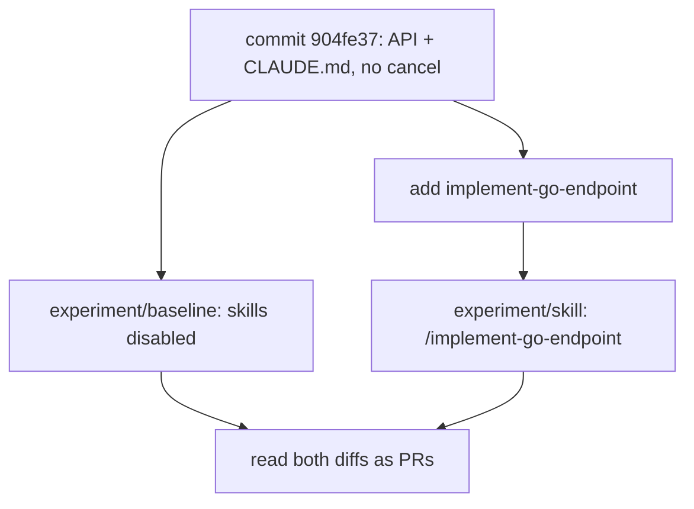

[Part 1](/blog/go-skills-for-claude) said I was not going to invent a transcript. This one is the transcript.

Same model. Same feature. Same starting commit. One run with `CLAUDE.md` and the existing code. One run with a project skill on top. Then I read both diffs the way I would read two pull requests.

**The skill did not save the architecture. The repo already had one. It changed which tests got written.**

The fixture, both implementations, the skill, and the raw command output are in [tul1/go-skills-experiment](https://github.com/tul1/go-skills-experiment). I did not tidy either agent diff before recording it.

## The question

Part 1 treated a skill as a reusable review comment: handlers off the database, domain errors at the edge, context on I/O. The interesting claim is not "Claude can write `fmt.Errorf("%w")"`. It is whether a **project** playbook changes the PR when the repo already has conventions on disk.

So the experiment is narrower than "are skills good."

Can a project-specific skill help an agent implement a Go API the way this codebase already ships?

I did not try to make the baseline look bad. I did not change the feature request between runs. I did not compare different starting trees. I did not assume the skill version would win.

## The fixture

A small subscriptions API. Boring on purpose.

```text
cmd/api
internal/subscription   # domain, Service, SQL, sentinels
internal/httpapi        # handlers, writeError, slog middleware
```

`POST /subscriptions` and `GET /subscriptions/{id}` were already there. Statuses: `active`, `cancelled`, `expired`. Creates start `active`. `expired` exists so "already cancelled" and "this state cannot be cancelled" are two 409s.

`CLAUDE.md` states standing rules. It does **not** contain the endpoint playbook. That split is the whole point of [part 1](/blog/go-skills-for-claude): facts stay in `CLAUDE.md`, a procedure for one kind of change belongs in a skill.

Handlers already look like this:

```go
func (s *Server) getSubscription(w http.ResponseWriter, r *http.Request) {
    sub, err := s.subs.Get(r.Context(), r.PathValue("id"))
    if err != nil {
        writeError(w, err)
        return
    }
    writeJSON(w, http.StatusOK, sub)
}
```

`Get` already maps `sql.ErrNoRows` to `ErrNotFound`. Tests already cover a missing row and a closed database. The house rules are visible in the code, not only in a markdown file.

## The feature

Both agents got this exact request:

```text
Implement PATCH /subscriptions/{id}/cancel.

Follow the existing project conventions and architecture.

Add the necessary tests and verify the implementation.
```

Expected behaviour, frozen before either run:

- 404 if the subscription does not exist
- 409 if it is already cancelled
- 409 if it is `expired`
- cancel `active`, persist, return the updated row
- handle a database failure
- keep SQL out of the handler

## Two isolated Claude Code sessions

This is not a Cursor chat with a pasted prompt. Skills here are [Claude Code skills](https://code.claude.com/docs/en/skills). Pretending a Cursor rule is the same thing would be lying about the experiment.



Both runs: Claude Code 2.1.278, model `claude-sonnet-5`, isolated git worktrees, same machine. The skill file was authored from the fixture **before** I looked at the baseline diff, so it could not be tuned to "whatever the first agent got wrong."

Baseline:

```bash
claude -p --disable-slash-commands --model sonnet ...
```

Skill run, explicit invoke:

```text
/implement-go-endpoint

Implement PATCH /subscriptions/{id}/cancel.
...
```

Claude Code did load it. The session expanded `/implement-go-endpoint` into the `SKILL.md` body before the agent wrote code. If that had not happened, the run would have been invalid.

n = 1. Sampling noise is real. I am not going to pretend this is a benchmark.

## The skill

Not generic Go. The procedure for *this* repo: read `getSubscription` first, stay in the two packages, add a sentinel next to `ErrNotFound`, map it in `writeError`, copy `TestGetDatabaseFailure`, insert `expired` with SQL because `Create` cannot produce that state, run `go test`, do not reformat the rest of the tree.

The example name in the file was `ErrConflict`. That will matter.

Full file: [`.claude/skills/implement-go-endpoint/SKILL.md`](https://github.com/tul1/go-skills-experiment/blob/main/.claude/skills/implement-go-endpoint/SKILL.md).

## What both agents actually wrote

Same seven files. Same route. Same handler. I mean identical:

```go
func (s *Server) cancelSubscription(w http.ResponseWriter, r *http.Request) {
    sub, err := s.subs.Cancel(r.Context(), r.PathValue("id"))
    if err != nil {
        writeError(w, err)
        return
    }
    writeJSON(w, http.StatusOK, sub)
}
```

Neither imported `database/sql` from `httpapi`. Neither invented a store interface. Both cancelled with one atomic update:

```sql
UPDATE subscriptions
SET status = 'cancelled'
WHERE id = $1 AND status = 'active'
RETURNING ...
```

On `sql.ErrNoRows`, both went back to the database to distinguish 404 from 409.

That is the result I did not want to fake: **the baseline was already a mergeable PR.** `CLAUDE.md` plus two existing endpoints were enough to keep SQL out of the handler. The skill did not have to rescue a `db.QueryRow` in `httpapi`. The failure mode from part 1 did not show up.

## Where they differed

| Decision | Without the skill | With `/implement-go-endpoint` |
| --- | --- | --- |
| Layers | `httpapi` / `subscription` | same |
| Cancel SQL | `UPDATE ... AND status = 'active'` | same |
| New sentinel | `ErrInvalidTransition` | `ErrConflict` |
| Not-found follow-up | reuse `Get` | extra `SELECT status`, then ignore `status` |
| Cancel tests after `db.Close()` | missing | service + HTTP |
| Expired fixture | `Create` then `UPDATE` | `INSERT` with `status = expired` |
| HTTP 400 on a bad id | tested | mapping exists, no HTTP test |
| `go test` / `go vet` / `-race` | exit 0 | exit 0 |

`ErrConflict` is the name the skill used as an example. The baseline, without that hint, picked `ErrInvalidTransition`, which is the better domain name. A skill that says "for example `ErrConflict`" will keep generating `ErrConflict`.

The baseline reused `Get` on the update miss, so a missing id wraps twice: `cancel subscription X: get subscription X: subscription not found`. The skill wrap is cleaner. It also scans a `status` it never puts in the error. Trade.

The skill's test checklist is the one place the playbook clearly moved the diff. Step 9 said: copy `TestGetDatabaseFailure`, and insert `expired` with SQL. Both show up only in the skill tree. The baseline agent *claimed* a persistence-failure test in its summary. The tree does not contain one for `Cancel`.

I ran the suites myself after both agents finished. No silent fixes.

```text
# experiment/baseline @ ff4e9c5
ok  .../internal/httpapi        0.420s
ok  .../internal/subscription   0.454s

# experiment/skill @ ff1d528
ok  .../internal/httpapi        0.427s
ok  .../internal/subscription   0.475s
```

`go vet` and `go test -race` were also exit 0 on both.

## Would I request changes before merge?

Comments. Not a rewrite. Not a reject.

Baseline: add the Cancel database-failure tests the fixture already shows how to write.

Skill: either reuse `Get` or stop discarding `status`; rename `ErrConflict` if the team does not use that word.

Neither PR is unfinished. Calling one "better Go" would overstate a naming difference and one extra test file section.

## What was useful in the skill

- Read a similar endpoint before writing.
- New sentinels live next to `ErrNotFound`; HTTP mapping lives only in `writeError`.
- Persistence-failure tests for the **new** method, not only for `Get`.
- SQL fixtures for states `Create` cannot produce.
- Report the test command you actually ran.

## What was redundant

The baseline already followed these, because `CLAUDE.md` and the existing code already said them:

- handlers do not use `database/sql`
- I/O takes `context.Context`
- wrap with `fmt.Errorf("verb noun: %w", err)`
- do not add a store interface for one `*sql.DB`

Restating standing rules in the skill did not distinguish the two diffs. That is the trap from part 1, measured: **a skill that duplicates `CLAUDE.md` is context you are paying for twice.**

## Would I keep this skill in a real repo?

For a service this small, barely. Two example endpoints already taught the architecture. The unique value on this run was a test checklist the baseline skipped.

Keep it if the team still pastes the same review comments after `CLAUDE.md` exists: "you forgot the closed-DB test", "expired has to be inserted, not created", "map the sentinel in `writeError`." Delete the bullets that only restate the house rules. Do not put `ErrConflict` in the file unless that is actually the name this package uses.

A rotting skill is worse than no skill. This one would keep teaching `ErrConflict` after the team had already picked `ErrInvalidTransition`.

## What I am not claiming

I am not claiming skills do not work. I am claiming that on n=1, with a tidy fixture and a real `CLAUDE.md`, **the playbook did not need to teach package boundaries.** The interesting miss was the one part 1 already warned about: tests that exist, and tests that cover what you care about, are not the same thing.

Part 1's scary first draft — SQL in the handler, `log` and return, raw driver error as 500 — is still the reason to write a skill when the repo is messy or the agent has not seen the layout. This fixture was not messy. The skill then behaves like a checklist, not like a compiler.

If you want the diffs, start here:

- [experiment/comparison.md](https://github.com/tul1/go-skills-experiment/blob/main/experiment/comparison.md)
- branch [`experiment/baseline`](https://github.com/tul1/go-skills-experiment/tree/experiment/baseline)
- branch [`experiment/skill`](https://github.com/tul1/go-skills-experiment/tree/experiment/skill)

## Leave with one measurement

Write the skill for the comment you still leave on generated tests. Do not write it to re-explain a layout the last two endpoints already show.

The goal is still not to make Claude write better Go. It is to stop explaining the same engineering decisions every time you start a new session. After this run I would put the test checklist in the skill, and leave the architecture in `CLAUDE.md` and the code.
