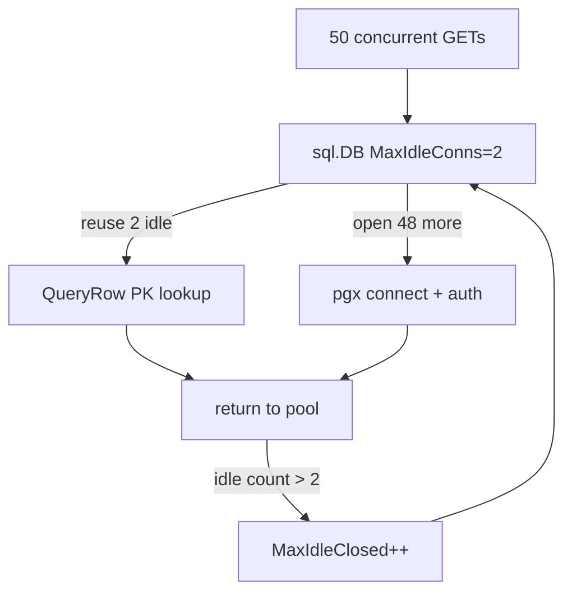

[Part 2](/blog/go-skills-part-2) ran the same cancel endpoint twice in Claude Code. Both diffs compiled. Both passed `go test`. I read them as pull requests. I did not run them as a service.

That was the hole. Passing tests means the tests you wrote passed. It does not tell you what the process does once it is answering requests.

**The code works. The tests pass. Do we understand how it behaves at runtime?**

The fixture, the Skill tree, the benches, the profiles, and the before/after load numbers are in [tul1/go-skills-experiment](https://github.com/tul1/go-skills-experiment) on branch [`experiment/part3`](https://github.com/tul1/go-skills-experiment/tree/experiment/part3). The Part 2 branches are untouched.

## Where we left off

The Skill implementation at [`ff1d528`](https://github.com/tul1/go-skills-experiment/commit/ff1d528) is the subject. I picked it because it is the tree the playbook produced, and because it has the extra Cancel tests the baseline skipped. I am not re-running the Skill comparison. I am taking one generated API and treating it as something I would have to operate.

The handler is still the one both agents wrote:

```go
func (s *Server) cancelSubscription(w http.ResponseWriter, r *http.Request) {
    sub, err := s.subs.Cancel(r.Context(), r.PathValue("id"))
    if err != nil {
        writeError(w, err)
        return
    }
    writeJSON(w, http.StatusOK, sub)
}
```

`cmd/api` opens Postgres with `sql.Open("pgx", dsn)`, pings, serves. No `pprof` endpoint. No metrics registry. Request logs come from middleware: method, path, status, duration. Handlers do not log the error they already mapped. That was a house rule in [part 1](/blog/go-skills-for-claude), and the generated server followed it.

This API is small on purpose. `GET /subscriptions/{id}` is a primary-key lookup. A successful cancel is one conditional `UPDATE … RETURNING`. If the interesting result is "there is nothing to profile," that is still a result. I did not plant a sleep, a JSON bomb, or an N+1 to give `pprof` something to point at.

## What I wanted to understand

I started from the code, not from a tool I wanted to demonstrate.

Cancel's miss path is the one place the implementation does extra work. On `sql.ErrNoRows` from the conditional update it runs a second query, scans `status`, and throws the value away:

```go
var status Status
getErr := s.db.QueryRowContext(ctx, `SELECT status FROM subscriptions WHERE id = $1`, id).Scan(&status)
if getErr != nil {
    if errors.Is(getErr, sql.ErrNoRows) {
        return nil, fmt.Errorf("cancel subscription %s: %w", id, ErrNotFound)
    }
    return nil, fmt.Errorf("cancel subscription %s: %w", id, getErr)
}
return nil, fmt.Errorf("cancel subscription %s: %w", id, ErrConflict)
```

That is a real behaviour. It is also a small one. The question was whether it shows up at runtime, and whether anything else shows up first.

The other things I refused to assume were problems, and therefore measured:

- `ValidUUID` is a compiled regexp on every Get/Cancel/Create. Cheap in theory. Still on the path.
- `sql.Open` is never followed by `SetMaxIdleConns` or `SetMaxOpenConns`. Go's default idle cap is 2.
- A 500 is logged with a status code and a duration. The wrapped driver error never reaches the log.

I did not add OpenTelemetry to find that out.

## Establishing a baseline

Apple M4, 10 cores, 16 GB, Go 1.26.0, `darwin/arm64`. Postgres 18.3 on `localhost:5433` — the embedded-postgres binary `internal/testdb` leaves behind, not a Docker Compose I could not start on this machine. Baseline revision `ff1d528`. Commands, raw output, and profiles: [experiment/part3](https://github.com/tul1/go-skills-experiment/tree/experiment/part3/experiment/part3).

Existing tests still passed on that revision before I added any benches:

```text
ok  .../internal/httpapi        0.650s
ok  .../internal/subscription   0.592s
```

Sequential service benches, `go test -count=5 -benchmem`, median of five:

| Bench | ns/op | B/op | allocs/op |
| --- | ---: | ---: | ---: |
| ValidUUID | 190 | 0 | 0 |
| Get | 69 053 | 1 496 | 39 |
| GetNotFound | 68 946 | 1 426 | 33 |
| CancelSuccess | 84 627 | 1 657 | 40 |
| CancelConflict | 134 270 | 2 443 | 54 |
| CancelNotFound | 133 366 | 2 395 | 52 |

A GET is about 69 µs. A cancel that hits an already-cancelled row is about 134 µs. Almost two times, not twenty. `ValidUUID` is 190 ns and does not allocate. It cannot be the story of a 69 µs call.

A pgx `QueryTracer` on a quiet connection counted the round trips: Get=1, CancelConflict=2, CancelNotFound=2, invalid UUID=0. The extra 65 µs is the extra query, plus the fact that a failing `UPDATE` is not a `SELECT`.

HTTP benches through `httptest` were the same shape, a few microseconds and a pile of recorder allocations on top. I am not going to interpret httptest's `ResponseRecorder` as production heap.

The existing logs, for a single request each:

```text
GET  /subscriptions/{id}           200  338µs
GET  /subscriptions/missing        404  247µs
PATCH /subscriptions/{id}/cancel   409  742µs
GET  /subscriptions/{id}           500   12µs   # db already closed
```

You can see that the 409 is slower. You cannot see that it ran two queries. The 500 is fast because it never left the process, and the log has no error field, so you also cannot see why. The house rule "log or return, never both" was followed. It leaves you with status and duration. That is enough to notice a slow 409. It is not enough to explain a 500.

32 goroutines cancelling the same id, `-race`: exactly one success, 31 `ErrConflict`, row ends `cancelled`. The conditional `UPDATE` does what Part 2 said it did. I am not going to spend the rest of this post on a race the tests already describe.

So far the API is what it looks like: a Postgres round trip, and a second one when cancel misses. That is the sequential picture. It is also the picture `go test` always sees, because the suite is not 50 clients.

## Following the evidence

I then ran 50 goroutines for 8 seconds against `httptest.NewServer`, four workloads: GET existing, GET missing, PATCH cancel on an already-cancelled row, PATCH cancel on a missing id. The HTTP client used `MaxIdleConnsPerHost=50`. That was not the first load I ran. The first one used `Server.Client()` defaults and CPU-profiled the GET at the same time. p95 was hundreds of milliseconds. I am not using those numbers as the baseline. They mixed the server with the client and with the profiler. The pair below holds the client pool at 50 and leaves CPU profiling off.

Default `sql.DB`. Same 50 goroutines, 8 seconds, zero HTTP errors:

| Workload | p50 | p95 | p99 | rps | peak open | MaxIdleClosed |
| --- | ---: | ---: | ---: | ---: | ---: | ---: |
| GET existing | 408 µs | 198 ms | 302 ms | 2 149 | 50 | 1 957 |
| GET missing | 383 µs | 206 ms | 329 ms | 2 198 | 50 | 1 718 |
| PATCH cancel conflict | 591 µs | 254 ms | 372 ms | 1 655 | 50 | 1 608 |
| PATCH cancel missing | 616 µs | 252 ms | 359 ms | 1 628 | 50 | 1 588 |

p50 still has the extra query: 408 µs versus 591 µs. p99 does not care. Three hundred milliseconds is not "the SELECT status threw the column away."

`WaitCount` was 0. The pool never made a goroutine wait for a connection. Peak open connections was 50. Open connections at the end of each run was 2. `MaxIdleClosed` was about two thousand in eight seconds.

`database/sql` defaults `MaxIdleConns` to 2. Under 50 in-flight requests it opens more. The extras are closed as soon as they go idle. The next burst opens them again. `WaitCount=0` is consistent with that: `MaxOpenConns` is unlimited, so nobody queues. They dial Postgres instead.

The CPU profile from the earlier GET load, the one I am not using for latency, is still useful as a picture of where time went while this was happening. 73% of samples were `syscall.rawsyscalln`. `-focus=connect` was 5.97% of the profile. The traces were not `ValidUUID` and not `json.Encoder`. They were:

```text
pgconn.connectOne
  → pgx.ConnectConfig
    → stdlib.(*driverConnector).Connect
      → database/sql.(*DB).conn
        → subscription.(*Service).Get
```

Some of those samples were in `pgpassfile.ReadPassfile`. The process was reading a password file in order to establish a brand-new connection on the GET hot path.

Allocations agreed. `pgx.connect` was 18.6% of allocated space. In-use heap after the load was 5.6 MB. Allocation rate is not retained heap. There was no leak to hunt. There was a connect/close cycle.



Cancel's second query is still there. Under this load it is a rounding error on p99.

## What Claude suggested

I pasted the sequential benches, the fair-client load, the `MaxIdleClosed` counts, and the connect-focused profile into a fresh Claude Code session. Model `sonnet`, `claude -p`, prompt in [claude-prompt.txt](https://github.com/tul1/go-skills-experiment/blob/experiment/part3/experiment/part3/claude-prompt.txt). I did not tell it the answer. I also did not ask it to "make it faster." I asked what was hurting the service, what single change to try first, and what not to touch yet.

It pointed at the idle cap. Quote from the recorded reply:

> Under 50 concurrent goroutines, connections constantly exceed that idle cap and get closed the moment they're returned to the pool: `MaxIdleClosed` is 1957/1718/1608/1588 — roughly one connection closed per 9-11 requests.

The change it wanted: `db.SetMaxIdleConns(50)` after `sql.Open`. Not `SetMaxOpenConns` — `WaitCount` was already 0, and a cap would invent the wait queue that did not exist. Not `ValidUUID`. Not collapsing Cancel to one query. Not treating `pgx.connect`'s alloc share as a separate bug.

Expected effect, in its words: `MaxIdleClosed` toward 0, `connectOne` gone from the profile, p95/p99 "toward roughly the sequential per-query cost plus scheduling overhead (tens to low hundreds of µs, not hundreds of ms)."

That last sentence is a hypothesis about magnitude. The rest is a hypothesis about mechanism. They are not the same claim. I measured both.

## Did it actually improve?

Same harness. Same 50 goroutines. Same 8 seconds. Same four paths. `PART3_DB_MAX_IDLE=50`. Then the same line in `cmd/api/main.go`, because that is the process that would actually run.

| Workload | p50 | p95 | p99 | rps | peak open | MaxIdleClosed |
| --- | ---: | ---: | ---: | ---: | ---: | ---: |
| GET existing | 2.41 ms | 3.92 ms | 5.37 ms | 19 258 | 50 | 0 |
| GET missing | 2.60 ms | 5.52 ms | 8.57 ms | 16 877 | 50 | 0 |
| PATCH cancel conflict | 4.34 ms | 8.24 ms | 12.0 ms | 10 490 | 50 | 0 |
| PATCH cancel missing | 4.44 ms | 8.35 ms | 12.5 ms | 10 224 | 50 | 0 |

`MaxIdleClosed` went to 0. Open connections at the end stayed at 50, not 2. GET p99 went from 302 ms to 5.4 ms. Throughput went from 2.1k to 19k requests per second. After the change, `-focus=connect` was 0.2% of the GET CPU profile. The mechanism matched.

Two things did not match the write-up.

p50 got worse. GET went from 408 µs to 2.4 ms. That is not a measurement error. Before the change, most requests reused one of the two warm connections and were fast; the ones that paid for `connectOne` became the tail. After the change, all 50 workers stay busy against Postgres. Little's law on the new throughput is `50 / 19258 ≈ 2.6 ms` mean, which is the new p50. The reconnect tax disappeared. The service now actually delivers 50 concurrent queries, and this Postgres on localhost is the thing they wait on.

p99 did not fall to "tens to hundreds of microseconds." It fell to a few milliseconds. Claude overstated the landing zone. It did not overstate the cause.

Cancel conflict stayed about 1.8× GET at p50 (4.3 ms vs 2.4 ms). Once the pool stopped lying, the extra query was visible again. It is still not why anyone would page. I did not collapse it. Claude said not to, and the numbers agreed.

I also did not add `SetMaxOpenConns`. `WaitCount` is still 0. Putting a cap in to look production-ready would be a different experiment.

50 idle connections is 50 Postgres backends. For this fixture, at this concurrency, that is the size that falsified the churn. On a real service I would set it from expected concurrency and `max_connections`, not from a blog-post load of 50. The line in `main.go` is the experiment's conclusion, not a universal constant.

Existing tests still pass after the change. Sequential benches were not re-run as a before/after: a single-goroutine `testing.B` never hit the idle cap, so it would have been theatre.

## What I would do differently tomorrow

I would still start with the code. The second Cancel query was the right thing to notice. It was the wrong thing to optimize first. Sequential benches told me it cost 65 µs. The concurrent load told me I had a different problem. I needed both. Either one alone would have produced a confident, wrong PR.

I would look at `sql.DB.Stats()` before I reached for a new telemetry pipeline. `MaxIdleClosed` named the bug. pprof confirmed it. Prometheus would have drawn a nicer graph of the same fact, after I had added a dependency this repo does not have.

I would not CPU-profile the run I intend to publish as latency. The first load mixed `Server.Client()` defaults, a profiler, and the server. I threw it out as a comparison and kept it as a stack trace. That is the correct use of a contaminated run.

I would not ask Claude to "make Cancel faster." I gave it the profile and the `MaxIdleClosed` counts and asked what not to touch. It declined the two-query cleanup and the regexp. That refusal was the useful part. I still remeasured, because an agent's explanation of p99 is not p99.

I would still want a better 500. Status plus duration told me the closed-database case was fast. It did not tell me it was a closed database. Logging the sentinel in middleware — not in the handler — would keep "log or return, never both" and make the next 500 cheaper to read. I did not do that here. It is not a performance fix. It is the other runtime question this service actually has.

And I would not treat `go test` as evidence that a generated API is ready to take traffic. Part 2 already said that about behaviour the suite never asserted. This one is the same sentence at a different layer. The Skill tree's tests never opened 50 connections. They could not have seen `MaxIdleConns`.

If you want the artifacts:

| What | Where |
| --- | --- |
| Skill tree (Part 2, unchanged) | branch [`experiment/skill`](https://github.com/tul1/go-skills-experiment/tree/experiment/skill) @ `ff1d528` |
| This investigation | branch [`experiment/part3`](https://github.com/tul1/go-skills-experiment/tree/experiment/part3) |
| How to rerun it | [`experiment/part3/README.md`](https://github.com/tul1/go-skills-experiment/blob/experiment/part3/experiment/part3/README.md) |
| Before/after tables | [`experiment/part3/results.md`](https://github.com/tul1/go-skills-experiment/blob/experiment/part3/experiment/part3/results.md) |
| Claude's prompt and reply | [`claude-prompt.txt`](https://github.com/tul1/go-skills-experiment/blob/experiment/part3/experiment/part3/claude-prompt.txt), [`claude-analysis.txt`](https://github.com/tul1/go-skills-experiment/blob/experiment/part3/experiment/part3/claude-analysis.txt) |

Verify the tree with:

```bash
go test -p 1 -count=1 ./...
go vet ./...
```

The goal is still not to make Claude write faster Go. It is to make the software Claude already wrote understandable enough that you can tell a 65 µs extra query from two thousand connections you are throwing away. The Skill did not encode `SetMaxIdleConns`. `CLAUDE.md` did not either. The tests passed anyway. That is the runtime half of the same review problem Part 2 started with.
